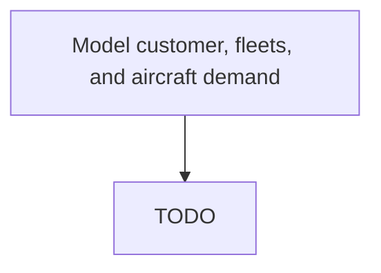

# Model customer, fleets, and aircraft demand

> TODO: Business-as-Code definition for model customer, fleets, and aircraft demand (aerospace-and-defense)

## Overview

Modeling of long-term customer, fleets, and aircraft demand. Strategic planning is carried out over a planning horizon of  3-10 years. It is linked to long term planning of facilities.  If the plan is to provide a full suite of services to business jet customers, the demand for these services must be predicted and a facility that is capable of handling this demand must be established. The key inputs include past customer demand for aircraft, aircraft types operated by the customers, market growth projections, etc. (The initial strategic demand plan baseline is periodically updated to reflect changing market conditions, new customers, etc. )

## Process Hierarchy



## GraphDL

```yaml
model:
  object: Customer, Fleets, And Aircraft Demand
  actor: TODO
  result: TODO
```

## Actions

| Action | Description |
|--------|-------------|
| TODO | TODO |

## Events

| Event | Description |
|-------|-------------|
| TODO | TODO |

## Searches

| Search | Description |
|--------|-------------|
| TODO | TODO |

## Process Flow


## RACI Matrix

| Activity | Responsible | Accountable | Consulted | Informed |
|----------|-------------|-------------|-----------|----------|
| TODO | TODO | TODO | TODO | TODO |

## Related Processes

| Process | Relationship |
|---------|-------------|
| TODO | TODO |

## Related Departments

| Department | Role |
|-----------|------|
| TODO | TODO |

## Related Occupations

| Occupation | Involvement |
|-----------|-------------|
| TODO | TODO |

## KPIs

| KPI | Description | Unit |
|-----|-------------|------|
| TODO | TODO | TODO |

## Usage

```typescript
import { TODO } from '@headlessly/model-customer,-fleets,-and-aircraft-demand'

const client = TODO()

// TODO: Example action calls
```
