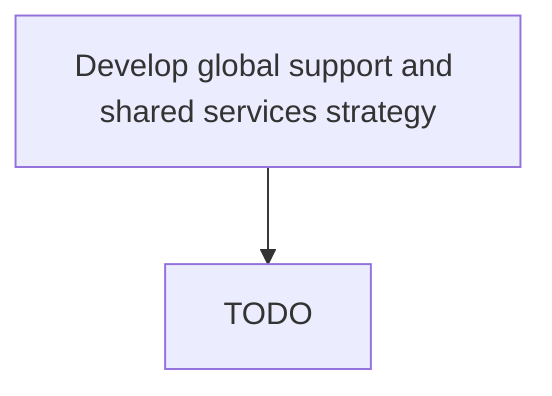

# Develop global support and shared services strategy

> TODO: Business-as-Code definition for develop global support and shared services strategy (airline)

## Overview

Charting a plan to optimize internal services and support functions throughout the organization. Delineate a framework of parameters and criteria to selectively filter service areas for inclusion among the organization's common resources. Arrange the organization's functional areas to create efficiencies of scale in the delivery of internal services, globally.

## Process Hierarchy



## GraphDL

```yaml
develop:
  object: Global Support And Shared Services Strategy
  actor: TODO
  result: TODO
```

## Actions

| Action | Description |
|--------|-------------|
| TODO | TODO |

## Events

| Event | Description |
|-------|-------------|
| TODO | TODO |

## Searches

| Search | Description |
|--------|-------------|
| TODO | TODO |

## Process Flow


## RACI Matrix

| Activity | Responsible | Accountable | Consulted | Informed |
|----------|-------------|-------------|-----------|----------|
| TODO | TODO | TODO | TODO | TODO |

## Related Processes

| Process | Relationship |
|---------|-------------|
| TODO | TODO |

## Related Departments

| Department | Role |
|-----------|------|
| TODO | TODO |

## Related Occupations

| Occupation | Involvement |
|-----------|-------------|
| TODO | TODO |

## KPIs

| KPI | Description | Unit |
|-----|-------------|------|
| TODO | TODO | TODO |

## Usage

```typescript
import { TODO } from '@headlessly/develop-global-support-and-shared-services-strategy'

const client = TODO()

// TODO: Example action calls
```
