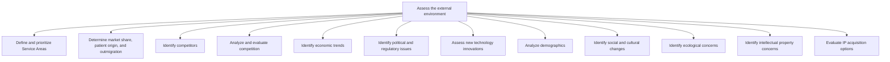

# Assess the external environment

> TODO: Business-as-Code definition for assess the external environment (healthcare-provider)

## Overview

TODO: Add process overview

## Process Hierarchy



## GraphDL

```yaml
assess:
  object: External Environment
  actor: TODO
  result: TODO
```

## Actions

| Action | Description |
|--------|-------------|
| TODO | TODO |

## Events

| Event | Description |
|-------|-------------|
| TODO | TODO |

## Searches

| Search | Description |
|--------|-------------|
| TODO | TODO |

## Process Flow


## RACI Matrix

| Activity | Responsible | Accountable | Consulted | Informed |
|----------|-------------|-------------|-----------|----------|
| TODO | TODO | TODO | TODO | TODO |

## Sub-Processes

| ID | Name | Description |
|----|------|-------------|
| 1.1.1.1 | Define and prioritize Service Areas | TODO |
| 1.1.1.2 | Determine market share, patient origin, and outmigration | TODO |
| 1.1.1.3 | Identify competitors | TODO |
| 1.1.1.4 | Analyze and evaluate competition | TODO |
| 1.1.1.5 | Identify economic trends | TODO |
| 1.1.1.6 | Identify political and regulatory issues | TODO |
| 1.1.1.7 | Assess new technology innovations | TODO |
| 1.1.1.8 | Analyze demographics | TODO |
| 1.1.1.9 | Identify social and cultural changes | TODO |
| 1.1.1.10 | Identify ecological concerns | TODO |
| 1.1.1.11 | Identify intellectual property concerns | TODO |
| 1.1.1.12 | Evaluate IP acquisition options | TODO |

## Related Processes

| Process | Relationship |
|---------|-------------|
| TODO | TODO |

## Related Departments

| Department | Role |
|-----------|------|
| TODO | TODO |

## Related Occupations

| Occupation | Involvement |
|-----------|-------------|
| TODO | TODO |

## KPIs

| KPI | Description | Unit |
|-----|-------------|------|
| TODO | TODO | TODO |

## Usage

```typescript
import { TODO } from '@headlessly/assess-external-environment'

const client = TODO()

// TODO: Example action calls
```
