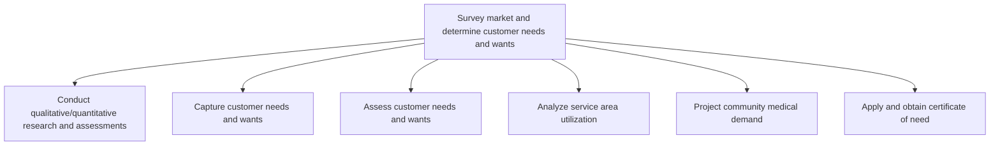

# Survey market and determine customer needs and wants

> TODO: Business-as-Code definition for survey market and determine customer needs and wants (healthcare-provider)

## Overview

TODO: Add process overview

## Process Hierarchy



## GraphDL

```yaml
survey:
  object: Market And Determine Customer Needs And Wants
  actor: TODO
  result: TODO
```

## Actions

| Action | Description |
|--------|-------------|
| TODO | TODO |

## Events

| Event | Description |
|-------|-------------|
| TODO | TODO |

## Searches

| Search | Description |
|--------|-------------|
| TODO | TODO |

## Process Flow


## RACI Matrix

| Activity | Responsible | Accountable | Consulted | Informed |
|----------|-------------|-------------|-----------|----------|
| TODO | TODO | TODO | TODO | TODO |

## Sub-Processes

| ID | Name | Description |
|----|------|-------------|
| 1.1.2.1 | Conduct qualitative/quantitative research and assessments | TODO |
| 1.1.2.2 | Capture customer needs and wants | TODO |
| 1.1.2.3 | Assess customer needs and wants | TODO |
| 1.1.2.4 | Analyze service area utilization | TODO |
| 1.1.2.5 | Project community medical demand | TODO |
| 1.1.2.6 | Apply and obtain certificate of need | TODO |

## Related Processes

| Process | Relationship |
|---------|-------------|
| TODO | TODO |

## Related Departments

| Department | Role |
|-----------|------|
| TODO | TODO |

## Related Occupations

| Occupation | Involvement |
|-----------|-------------|
| TODO | TODO |

## KPIs

| KPI | Description | Unit |
|-----|-------------|------|
| TODO | TODO | TODO |

## Usage

```typescript
import { TODO } from '@headlessly/survey-market-and-determine-customer-needs-and-wants'

const client = TODO()

// TODO: Example action calls
```
