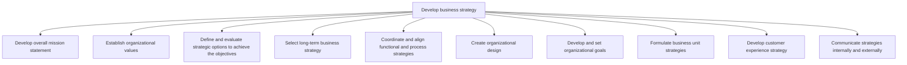

# Develop business strategy

> TODO: Business-as-Code definition for develop business strategy (healthcare-provider)

## Overview

TODO: Add process overview

## Process Hierarchy



## GraphDL

```yaml
develop:
  object: Business Strategy
  actor: TODO
  result: TODO
```

## Actions

| Action | Description |
|--------|-------------|
| TODO | TODO |

## Events

| Event | Description |
|-------|-------------|
| TODO | TODO |

## Searches

| Search | Description |
|--------|-------------|
| TODO | TODO |

## Process Flow


## RACI Matrix

| Activity | Responsible | Accountable | Consulted | Informed |
|----------|-------------|-------------|-----------|----------|
| TODO | TODO | TODO | TODO | TODO |

## Sub-Processes

| ID | Name | Description |
|----|------|-------------|
| 1.2.1 | Develop overall mission statement | TODO |
| 1.2.2 | Establish organizational values | TODO |
| 1.2.3 | Define and evaluate strategic options to achieve the objectives | TODO |
| 1.2.4 | Select long-term business strategy | TODO |
| 1.2.5 | Coordinate and align functional and process strategies | TODO |
| 1.2.6 | Create organizational design | TODO |
| 1.2.7 | Develop and set organizational goals | TODO |
| 1.2.8 | Formulate business unit strategies | TODO |
| 1.2.9 | Develop customer experience strategy | TODO |
| 1.2.10 | Communicate strategies internally and externally | TODO |

## Related Processes

| Process | Relationship |
|---------|-------------|
| TODO | TODO |

## Related Departments

| Department | Role |
|-----------|------|
| TODO | TODO |

## Related Occupations

| Occupation | Involvement |
|-----------|-------------|
| TODO | TODO |

## KPIs

| KPI | Description | Unit |
|-----|-------------|------|
| TODO | TODO | TODO |

## Usage

```typescript
import { TODO } from '@headlessly/develop-business-strategy'

const client = TODO()

// TODO: Example action calls
```
