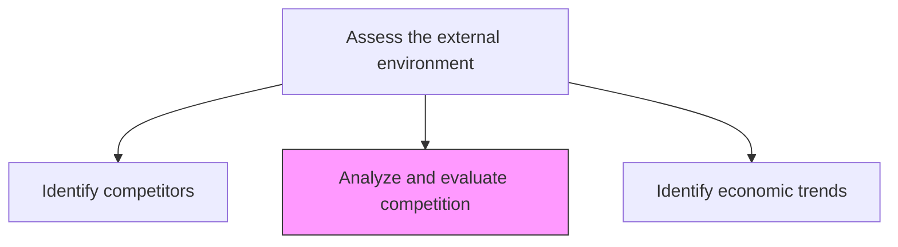
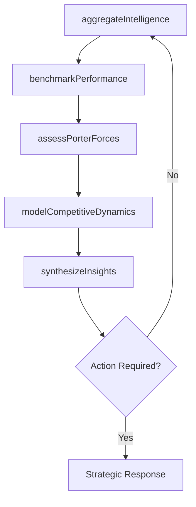

# Analyze and evaluate competition

> Business-as-Code definition for competitive force analysis and evaluation. Models the aggregation of competitive intelligence, benchmarking of processes and metrics, and synthesis of competitive insights for strategic decision-making.

## Overview

Assessing the competitive forces in the marketplace that could potentially affect the organization. Analyze various aspects of business competition including competing firms. Aggregate competitive intelligence, create benchmarks to juxtapose processes and performance metrics, and inject crucial information about the competition into management models to synthesize insights.

## Process Hierarchy



## GraphDL

```yaml
analyze:
  object: And Evaluate Competition
  actor: CompetitiveIntelligenceAnalyst
  result: CompetitiveAnalysisReport
```

## Actions

| Action | Description |
|--------|-------------|
| aggregateIntelligence | Collect and consolidate competitive intelligence from all sources |
| benchmarkPerformance | Compare organizational performance metrics against competitors |
| assessPorterForces | Evaluate the five competitive forces affecting the industry |
| modelCompetitiveDynamics | Build analytical models to predict competitive moves and responses |
| synthesizeInsights | Distill competitive analysis into actionable strategic insights |

## Events

| Event | Description |
|-------|-------------|
| intelligenceAggregated | Competitive intelligence consolidated from all sources |
| performanceBenchmarked | Organizational metrics compared against competitor baselines |
| porterForcesAssessed | Five-forces analysis completed for the industry |
| dynamicsModeled | Competitive dynamics model updated with latest data |
| insightsSynthesized | Strategic insights distilled and communicated |

## Searches

| Search | Description |
|--------|-------------|
| getBenchmarks | Retrieve competitive benchmarks by metric category |
| getCompetitiveForces | Access the latest five-forces analysis results |
| getIntelligenceSummary | Retrieve the aggregated competitive intelligence digest |
| getCompetitiveInsights | List actionable insights by relevance or business unit |

## Process Flow



## RACI Matrix

| Activity | Responsible | Accountable | Consulted | Informed |
|----------|-------------|-------------|-----------|----------|
| aggregateIntelligence | CompetitiveIntelligenceAnalyst | VP Strategy | Sales, Marketing | Product |
| benchmarkPerformance | StrategyAnalyst | VP Strategy | Finance, Operations | Executive |
| assessPorterForces | StrategyAnalyst | VP Strategy | Industry Experts | Board |
| synthesizeInsights | VP Strategy | ChiefStrategyOfficer | BusinessUnitLeads | Executive |

## Related Processes

| Process | Relationship |
|---------|-------------|
| 1.1.1.1 Identify competitors | Upstream - competitor profiles feed analysis |
| 1.1.1.10 Monitor external opportunities and threats | Parallel - competitive insights inform threat monitoring |
| 1.2.2 Define and evaluate strategic options | Downstream - analysis informs strategic decision-making |

## Related Departments

| Department | Role |
|-----------|------|
| Strategy | Leads competitive analysis and benchmarking |
| Marketing | Provides market positioning and share data |
| Sales | Contributes competitive win/loss intelligence |
| Product | Uses analysis for roadmap prioritization |

## Related Occupations

| Occupation | Involvement |
|-----------|-------------|
| Competitive Intelligence Analyst | Primary executor of analysis |
| Strategy Analyst | Builds models and synthesizes insights |
| Market Research Analyst | Provides quantitative competitive data |

## KPIs

| KPI | Description | Unit |
|-----|-------------|------|
| Benchmark Coverage | Percentage of key metrics benchmarked against competition | % |
| Intelligence Cycle Time | Time from data collection to published competitive insight | Days |
| Win Rate vs. Competition | Percentage of competitive deals won | % |

## Usage

```typescript
import { analyzeAndEvaluateCompetition } from '@headlessly/analyze-and-evaluate-competition'

const competition = analyzeAndEvaluateCompetition()

// Aggregate competitive intelligence
const intel = await competition.aggregateIntelligence({
  sources: ['win-loss-reports', 'industry-reports', 'public-filings'],
  period: 'trailing-12-months'
})

// Benchmark performance
const benchmarks = await competition.benchmarkPerformance({
  metrics: ['revenue-growth', 'market-share', 'NPS', 'time-to-market'],
  peerGroup: 'direct-competitors'
})

// Synthesize into actionable insights
const insights = await competition.synthesizeInsights({
  intelligenceId: intel.id,
  benchmarkId: benchmarks.id
})
```
