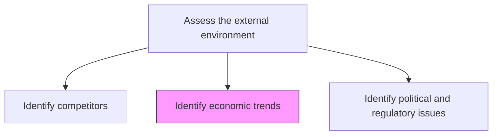
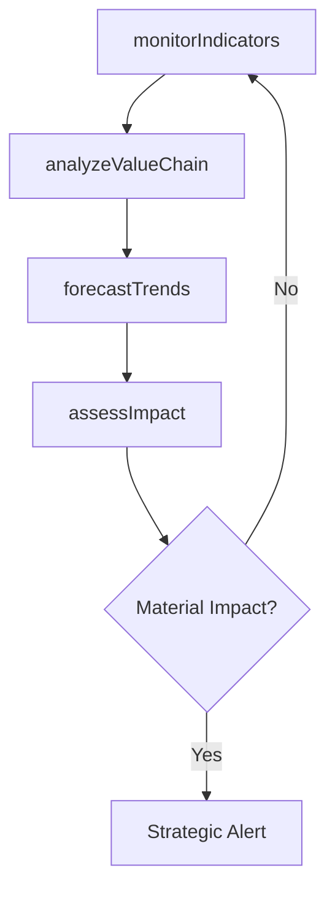

# Identify economic trends

> Business-as-Code definition for macroeconomic trend identification. Models the monitoring, analysis, and forecasting of economic indicators that influence organizational strategy and planning.

## Overview

Determining large-scale macroeconomic shifts and trends, with medium to long-term relevance for the organization. Vet the immediate and the larger economic ecosystem to identify broad-based movements that affect the organization. In the immediate vicinity, for example, examine the stock price of key vendors/suppliers in the organizational value-chain. In the larger economic ecosystem, analyze according to geographical distribution where factors such as interest rates, taxation structures, oil prices, and unemployment rates are explored.

## Process Hierarchy



## GraphDL

```yaml
identify:
  object: Economic Trends
  actor: Economist
  result: EconomicTrendReport
```

## Actions

| Action | Description |
|--------|-------------|
| monitorIndicators | Track key macroeconomic indicators across relevant geographies |
| analyzeValueChain | Examine economic health of suppliers and partners in the value chain |
| forecastTrends | Model medium to long-term economic trajectories and scenarios |
| assessImpact | Evaluate the potential business impact of identified economic shifts |

## Events

| Event | Description |
|-------|-------------|
| indicatorsMonitored | Key macroeconomic indicators updated and reviewed |
| valueChainAnalyzed | Value chain economic health assessment completed |
| trendsForecasted | Economic trend forecasts and scenarios published |
| impactAssessed | Business impact of economic shifts evaluated and documented |

## Searches

| Search | Description |
|--------|-------------|
| getEconomicIndicators | Retrieve current macroeconomic indicator values by region |
| getTrendForecasts | Access economic trend forecasts and scenario models |
| getValueChainHealth | Retrieve financial health data for value chain partners |

## Process Flow



## RACI Matrix

| Activity | Responsible | Accountable | Consulted | Informed |
|----------|-------------|-------------|-----------|----------|
| monitorIndicators | Economist | VP Strategy | Finance | Executive |
| analyzeValueChain | FinancialAnalyst | CFO | Procurement | SupplyChain |
| forecastTrends | Economist | VP Strategy | DataScience | BoardOfDirectors |
| assessImpact | StrategyAnalyst | VP Strategy | Operations | BusinessUnits |

## Related Processes

| Process | Relationship |
|---------|-------------|
| 1.1.1.4 Identify political and regulatory issues | Parallel - economic and regulatory factors intersect |
| 1.1.3.5 Analyze financial health | Complementary - macro trends affect internal financial position |
| 1.2.9 Develop financial strategies | Downstream - economic forecasts inform financial strategy |

## Related Departments

| Department | Role |
|-----------|------|
| Strategy | Leads economic trend monitoring and analysis |
| Finance | Provides financial modeling and scenario analysis |
| Procurement | Monitors supply chain economic indicators |

## Related Occupations

| Occupation | Involvement |
|-----------|-------------|
| Economist | Primary executor of trend identification |
| Financial Analyst | Models economic impact on business performance |
| Strategy Analyst | Integrates economic insights into strategic planning |

## KPIs

| KPI | Description | Unit |
|-----|-------------|------|
| Indicator Coverage | Number of tracked macroeconomic indicators | Count |
| Forecast Accuracy | Variance between forecasted and actual economic outcomes | % |
| Alert Response Time | Time from trend detection to strategic response initiated | Days |

## Usage

```typescript
import { identifyEconomicTrends } from '@headlessly/identify-economic-trends'

const economics = identifyEconomicTrends()

// Monitor macroeconomic indicators
const indicators = await economics.monitorIndicators({
  regions: ['US', 'EU', 'APAC'],
  metrics: ['GDP', 'inflation', 'unemployment', 'interest-rates']
})

// Forecast trends over a planning horizon
const forecast = await economics.forecastTrends({
  indicatorIds: indicators.map(i => i.id),
  horizon: '3-year',
  scenarios: ['base', 'optimistic', 'pessimistic']
})
```
