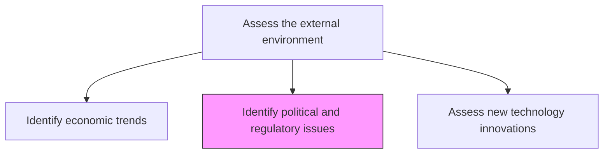
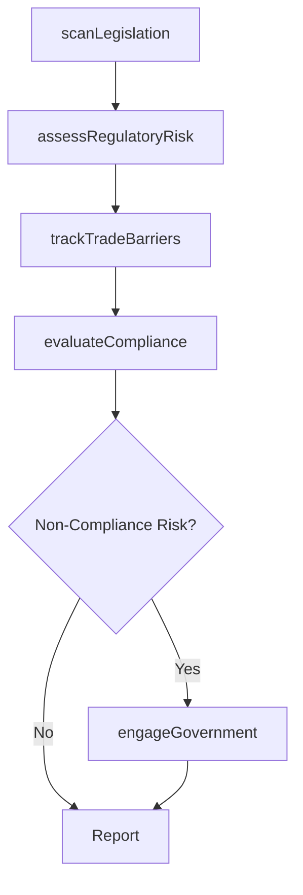

# Identify political and regulatory issues

> Business-as-Code definition for political and regulatory risk identification. Models the scanning, assessment, and tracking of public policy, legislative changes, and regulatory developments across jurisdictions.

## Overview

Identifying areas of concern pertaining to public policy and regulation, established by sovereign or multinational authorities. Examine various regions and geopolitical formations to identify those political and regulatory issues-present or developing-that can potentially affect the organization. Plan for an iterative process, partitioned across regional and geopolitical entities that have a direct bearing on the organization's activities. Assess changes in environmental compliance, product standards, trade barriers, etc.

## Process Hierarchy



## GraphDL

```yaml
identify:
  object: Political And Regulatory Issues
  actor: RegulatoryAffairsSpecialist
  result: RegulatoryRiskRegister
```

## Actions

| Action | Description |
|--------|-------------|
| scanLegislation | Monitor pending and enacted legislation across operating jurisdictions |
| assessRegulatoryRisk | Evaluate the likelihood and impact of regulatory changes on the business |
| trackTradeBarriers | Monitor tariffs, sanctions, and trade policy shifts |
| evaluateCompliance | Assess organizational readiness for new or changing regulations |
| engageGovernment | Participate in regulatory consultations and public policy discussions |

## Events

| Event | Description |
|-------|-------------|
| legislationScanned | Legislative landscape review completed for operating jurisdictions |
| regulatoryRiskAssessed | Regulatory risk assessment updated with impact ratings |
| tradeBarriersTracked | Trade policy and tariff data refreshed |
| complianceEvaluated | Compliance readiness assessment completed |
| governmentEngaged | Regulatory consultation or public comment submitted |

## Searches

| Search | Description |
|--------|-------------|
| getRegulatoryRisks | List identified regulatory risks by jurisdiction, severity, or domain |
| getLegislationTracker | Access the status of pending legislation affecting the organization |
| getTradeBarriers | Retrieve current trade barriers by geography or product category |

## Process Flow



## RACI Matrix

| Activity | Responsible | Accountable | Consulted | Informed |
|----------|-------------|-------------|-----------|----------|
| scanLegislation | RegulatoryAffairsSpecialist | GeneralCounsel | GovernmentRelations | VP Strategy |
| assessRegulatoryRisk | RegulatoryAffairsSpecialist | GeneralCounsel | Compliance | Executive |
| trackTradeBarriers | TradeComplianceAnalyst | GeneralCounsel | SupplyChain | Operations |
| engageGovernment | GovernmentRelationsManager | CEO | Legal | BoardOfDirectors |

## Related Processes

| Process | Relationship |
|---------|-------------|
| 1.1.1.3 Identify economic trends | Parallel - political and economic factors are interrelated |
| 1.1.1.11 Identify intellectual property concerns | Related - IP regulation is a subset of regulatory landscape |
| 11.0 Manage Business Risk | Downstream - regulatory risks feed enterprise risk management |

## Related Departments

| Department | Role |
|-----------|------|
| Legal | Leads regulatory scanning and compliance assessment |
| Government Relations | Manages engagement with regulators and policymakers |
| Compliance | Ensures organizational adherence to regulatory requirements |
| Strategy | Integrates regulatory insights into strategic planning |

## Related Occupations

| Occupation | Involvement |
|-----------|-------------|
| Regulatory Affairs Specialist | Primary executor of regulatory scanning |
| Government Relations Manager | Engages with policymakers and regulatory bodies |
| Compliance Officer | Assesses organizational compliance readiness |

## KPIs

| KPI | Description | Unit |
|-----|-------------|------|
| Regulatory Coverage | Percentage of operating jurisdictions actively monitored | % |
| Compliance Readiness | Percentage of identified regulations with compliance plans in place | % |
| Regulatory Alert Timeliness | Average lead time between regulatory alert and organizational response | Days |

## Usage

```typescript
import { identifyPoliticalAndRegulatoryIssues } from '@headlessly/identify-political-and-regulatory-issues'

const regulatory = identifyPoliticalAndRegulatoryIssues()

// Scan legislation across jurisdictions
const legislation = await regulatory.scanLegislation({
  jurisdictions: ['US-Federal', 'EU', 'UK'],
  domains: ['data-privacy', 'environmental', 'trade']
})

// Assess regulatory risk
const risks = await regulatory.assessRegulatoryRisk({
  legislationIds: legislation.map(l => l.id),
  impactThreshold: 'medium'
})

// Evaluate compliance readiness
const compliance = await regulatory.evaluateCompliance({
  riskIds: risks.highRisks.map(r => r.id),
  assessmentDepth: 'detailed'
})
```
