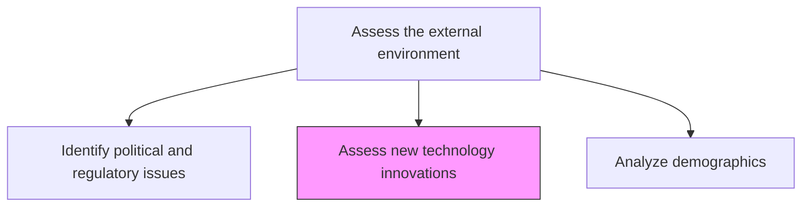
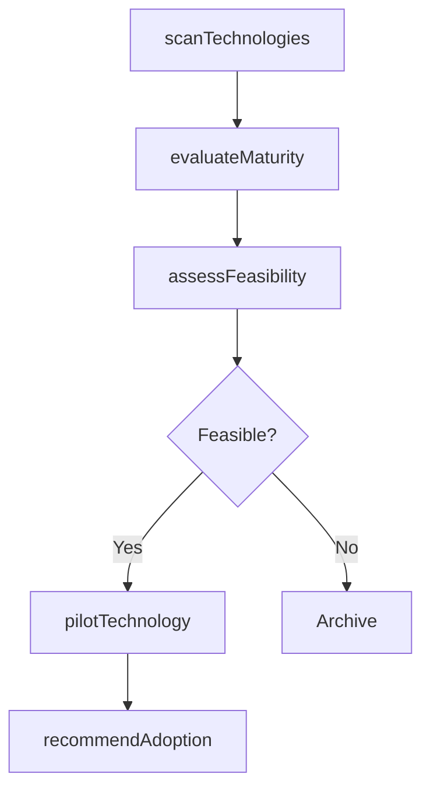

# Assess new technology innovations

> Business-as-Code definition for technology innovation assessment. Models the scanning, evaluation, and feasibility analysis of emerging, disruptive, and currently deployed technologies relevant to the business.

## Overview

Assessing developments in technologies presently being used by the business, new technologies that have a potential for the business, and any disruptive innovations. Conduct a survey of advancement in technologies that are already deployed with inputs from the personnel closely working with them, tracking utility and feasibility for deployment. Arrange for mid- to senior-level management personnel who explore contingent uses to assess new and disruptive technologies. Follow up with desk research, involving physical scoping and viability assessment.

## Process Hierarchy



## GraphDL

```yaml
assess:
  object: New Technology Innovations
  actor: TechnologyScout
  result: TechnologyRadarReport
```

## Actions

| Action | Description |
|--------|-------------|
| scanTechnologies | Survey emerging and disruptive technologies across relevant domains |
| evaluateMaturity | Assess technology readiness level and adoption maturity |
| assessFeasibility | Determine technical and commercial feasibility of deployment |
| pilotTechnology | Conduct proof-of-concept or pilot evaluation of promising technologies |
| recommendAdoption | Formalize adoption recommendations with business case and roadmap |

## Events

| Event | Description |
|-------|-------------|
| technologiesScanned | Emerging technology landscape survey completed |
| maturityEvaluated | Technology readiness assessment finalized |
| feasibilityAssessed | Technical and commercial feasibility analysis completed |
| technologyPiloted | Proof-of-concept or pilot evaluation concluded |
| adoptionRecommended | Technology adoption recommendation submitted with business case |

## Searches

| Search | Description |
|--------|-------------|
| getTechnologyRadar | Retrieve the current technology radar with maturity classifications |
| getFeasibilityReport | Access feasibility analysis for a specific technology |
| listPilots | List active and completed technology pilots |

## Process Flow



## RACI Matrix

| Activity | Responsible | Accountable | Consulted | Informed |
|----------|-------------|-------------|-----------|----------|
| scanTechnologies | TechnologyScout | CTO | R&D, Engineering | VP Strategy |
| evaluateMaturity | TechnologyScout | CTO | EnterpriseArchitect | Operations |
| assessFeasibility | EnterpriseArchitect | CTO | Finance, Operations | VP Strategy |
| pilotTechnology | R&DLead | CTO | Engineering | ProductDevelopment |

## Related Processes

| Process | Relationship |
|---------|-------------|
| 2.2.1 Perform discovery research | Downstream - technology insights feed product R&D |
| 1.1.3.4 Analyze systems and technology | Complementary - external tech scan paired with internal tech audit |
| 6.0 Manage Enterprise IT | Supporting - IT infrastructure enables technology adoption |

## Related Departments

| Department | Role |
|-----------|------|
| Technology | Leads technology scouting and feasibility assessment |
| Research and Development | Evaluates emerging technologies for product integration |
| Engineering | Assesses implementation complexity and resource requirements |
| Strategy | Integrates technology insights into strategic planning |

## Related Occupations

| Occupation | Involvement |
|-----------|-------------|
| Technology Scout | Primary executor of technology scanning |
| Enterprise Architect | Evaluates technology fit with existing architecture |
| R&D Engineer | Conducts pilots and proof-of-concept evaluations |

## KPIs

| KPI | Description | Unit |
|-----|-------------|------|
| Technologies Scanned | Number of emerging technologies evaluated per quarter | Count |
| Pilot Conversion Rate | Percentage of pilots that lead to full adoption | % |
| Time to Pilot | Average elapsed time from technology identification to pilot start | Weeks |

## Usage

```typescript
import { assessNewTechnologyInnovations } from '@headlessly/assess-new-technology-innovations'

const techInnovation = assessNewTechnologyInnovations()

// Scan for emerging technologies
const radar = await techInnovation.scanTechnologies({
  domains: ['artificial-intelligence', 'quantum-computing', 'edge-computing'],
  sources: ['academic-research', 'patent-filings', 'vendor-briefings']
})

// Assess feasibility for top candidates
const feasibility = await techInnovation.assessFeasibility({
  technologyId: radar.topCandidates[0].id,
  criteria: ['cost', 'complexity', 'time-to-value', 'strategic-fit']
})
```
