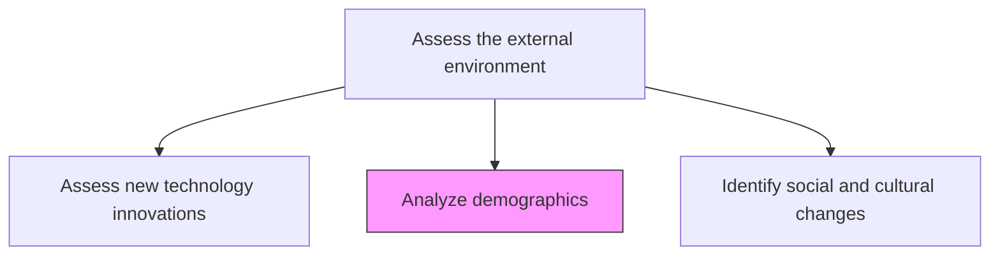
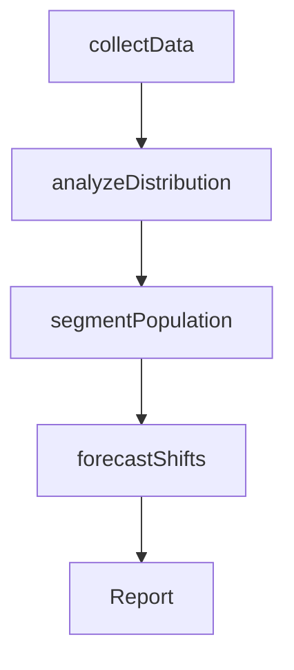

# Analyze demographics

> Business-as-Code definition for demographic analysis. Models the collection, statistical analysis, and interpretation of population data to inform market segmentation and strategic planning.

## Overview

Analyzing statistical data relating to the size, distribution, and composition of relevant populations, as well as their characteristics. Perform quantitative analysis over raw data-sets gathered from well-founded sources such as government census or large, private databases. Consider employing primary research in collecting required statistics. Use comprehensive studies (reports, briefs, and articles) to assist with the analysis, in place of raw data.

## Process Hierarchy



## GraphDL

```yaml
analyze:
  object: Demographics
  actor: DemographicAnalyst
  result: DemographicProfile
```

## Actions

| Action | Description |
|--------|-------------|
| collectData | Gather demographic data from census, surveys, and commercial databases |
| analyzeDistribution | Study population size, age, income, and geographic distribution |
| segmentPopulation | Group populations into segments based on demographic characteristics |
| forecastShifts | Project demographic changes over medium to long-term horizons |

## Events

| Event | Description |
|-------|-------------|
| dataCollected | Demographic data gathered from primary and secondary sources |
| distributionAnalyzed | Population distribution analysis completed |
| populationSegmented | Demographic segments defined and profiled |
| shiftsForecasted | Demographic trend projections published |

## Searches

| Search | Description |
|--------|-------------|
| getDemographicData | Retrieve demographic data by region, age group, or income bracket |
| getSegmentProfiles | Access demographic segment profiles and characteristics |
| getDemographicForecasts | Retrieve projected demographic shifts by geography |

## Process Flow



## RACI Matrix

| Activity | Responsible | Accountable | Consulted | Informed |
|----------|-------------|-------------|-----------|----------|
| collectData | DemographicAnalyst | VP Marketing | DataScience | Strategy |
| analyzeDistribution | DemographicAnalyst | VP Marketing | Finance | Product |
| segmentPopulation | MarketResearcher | VP Marketing | Sales | Strategy |
| forecastShifts | DataScientist | VP Strategy | Marketing | Executive |

## Related Processes

| Process | Relationship |
|---------|-------------|
| 1.1.1.7 Identify social and cultural changes | Parallel - demographics and cultural factors intersect |
| 1.1.2 Survey market and determine customer needs and wants | Downstream - demographic profiles inform market segmentation |
| 3.0 Market and Sell Products and Services | Downstream - demographic data guides marketing targeting |

## Related Departments

| Department | Role |
|-----------|------|
| Marketing | Leads demographic research and market segmentation |
| Strategy | Uses demographic insights for strategic planning |
| Data Science | Provides statistical analysis and forecasting |

## Related Occupations

| Occupation | Involvement |
|-----------|-------------|
| Demographic Analyst | Primary executor of demographic analysis |
| Data Scientist | Builds statistical models and forecasts |
| Market Research Analyst | Applies demographic insights to market strategy |

## KPIs

| KPI | Description | Unit |
|-----|-------------|------|
| Data Freshness | Age of the most recent demographic data used | Months |
| Segment Coverage | Percentage of target markets with completed demographic profiles | % |
| Forecast Horizon | Length of demographic projections available | Years |

## Usage

```typescript
import { analyzeDemographics } from '@headlessly/analyze-demographics'

const demographics = analyzeDemographics()

// Collect demographic data
const data = await demographics.collectData({
  regions: ['US-Northeast', 'US-West', 'UK'],
  sources: ['census', 'commercial-databases'],
  variables: ['age', 'income', 'education', 'urbanization']
})

// Segment population and forecast shifts
const segments = await demographics.segmentPopulation({
  dataId: data.id,
  method: 'k-means-clustering',
  segmentCount: 5
})
```
