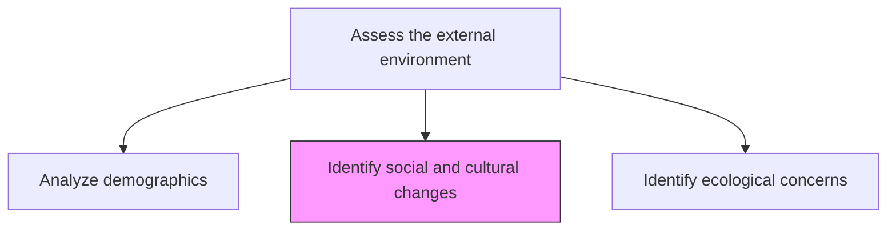
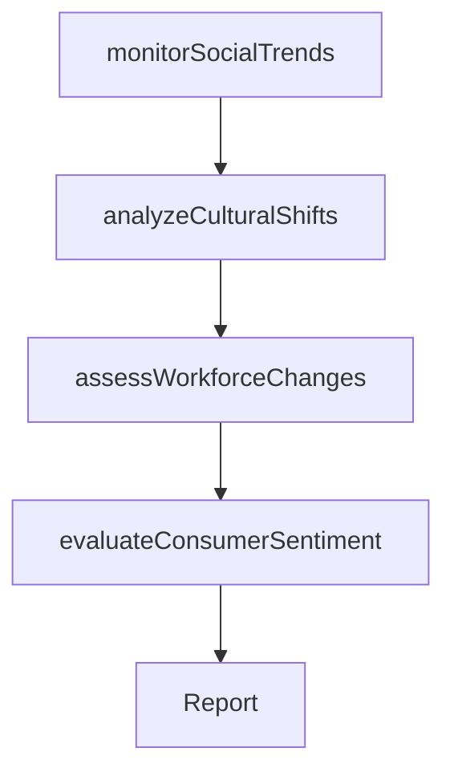

# Identify social and cultural changes

> Business-as-Code definition for social and cultural change identification. Models the monitoring and analysis of societal shifts, value system evolution, and cultural trends that affect business strategy and market positioning.

## Overview

Distinguishing changes in societal makeup, as well as the cultural composite. Isolate shifts in the societal composition and distribution, as well as the value systems and attributes that bind the organization together. Analyze well-regarded publications--and gather the perspective of public intellectuals and opinion leaders--on relevant issues.

## Process Hierarchy



## GraphDL

```yaml
identify:
  object: Social And Cultural Changes
  actor: SocialTrendsAnalyst
  result: SocialTrendReport
```

## Actions

| Action | Description |
|--------|-------------|
| monitorSocialTrends | Track shifts in societal composition, values, and consumer behavior |
| analyzeCulturalShifts | Evaluate changes in cultural norms, preferences, and attitudes |
| assessWorkforceChanges | Identify shifts in workforce expectations and labor market dynamics |
| evaluateConsumerSentiment | Gauge evolving consumer values and purchasing priorities |

## Events

| Event | Description |
|-------|-------------|
| socialTrendsMonitored | Social trend data collected and reviewed |
| culturalShiftsAnalyzed | Cultural change analysis completed |
| workforceChangesAssessed | Workforce trend assessment published |
| consumerSentimentEvaluated | Consumer values and sentiment analysis finalized |

## Searches

| Search | Description |
|--------|-------------|
| getSocialTrends | Retrieve social trend data by region or demographic group |
| getCulturalInsights | Access cultural shift analyses and predictions |
| getConsumerSentiment | Retrieve consumer sentiment data by market segment |

## Process Flow



## RACI Matrix

| Activity | Responsible | Accountable | Consulted | Informed |
|----------|-------------|-------------|-----------|----------|
| monitorSocialTrends | SocialTrendsAnalyst | VP Strategy | Marketing | Executive |
| analyzeCulturalShifts | SocialTrendsAnalyst | VP Marketing | HR | Product |
| assessWorkforceChanges | HRAnalyst | CHRO | Operations | Strategy |
| evaluateConsumerSentiment | MarketResearcher | VP Marketing | Sales | Product |

## Related Processes

| Process | Relationship |
|---------|-------------|
| 1.1.1.6 Analyze demographics | Parallel - demographic and social factors are interrelated |
| 1.1.2 Survey market and determine customer needs and wants | Downstream - social trends shape customer expectations |
| 7.0 Manage Human Capital | Related - workforce social trends affect talent strategy |

## Related Departments

| Department | Role |
|-----------|------|
| Marketing | Tracks consumer culture shifts and brand implications |
| Human Resources | Monitors workforce expectations and labor trends |
| Strategy | Integrates social insights into long-term planning |

## Related Occupations

| Occupation | Involvement |
|-----------|-------------|
| Social Trends Analyst | Primary executor of societal trend monitoring |
| Market Research Analyst | Studies consumer cultural preferences |
| HR Analyst | Tracks workforce and labor market shifts |

## KPIs

| KPI | Description | Unit |
|-----|-------------|------|
| Trend Detection Rate | Number of material social trends identified per quarter | Count |
| Cultural Relevance Score | Survey-based measure of brand alignment with cultural values | Score (1-10) |
| Workforce Sentiment Index | Employee satisfaction with organizational cultural alignment | Score (1-10) |

## Usage

```typescript
import { identifySocialAndCulturalChanges } from '@headlessly/identify-social-and-cultural-changes'

const social = identifySocialAndCulturalChanges()

// Monitor social trends
const trends = await social.monitorSocialTrends({
  regions: ['US', 'EU', 'APAC'],
  topics: ['sustainability-values', 'remote-work', 'digital-wellbeing']
})

// Evaluate consumer sentiment shifts
const sentiment = await social.evaluateConsumerSentiment({
  segments: ['gen-z', 'millennials', 'gen-x'],
  dimensions: ['brand-purpose', 'ethical-sourcing', 'digital-experience']
})
```
