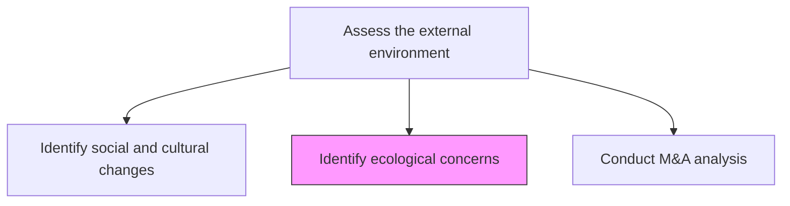
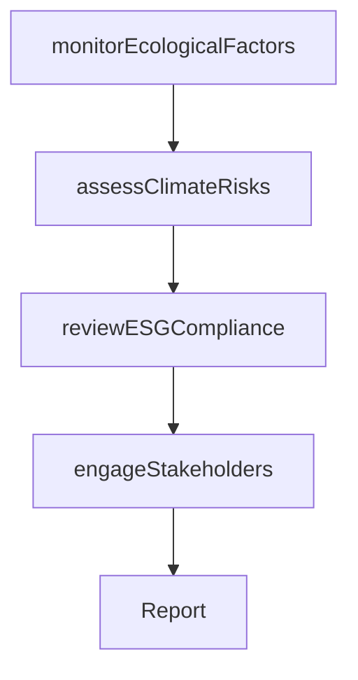

# Identify ecological concerns

> Business-as-Code definition for ecological concern identification. Models the monitoring and analysis of environmental, climate, and ecological risks that may impact the organization's operations, compliance, and sustainability strategy.

## Overview

Identifying changes in ecological ecosystems that can be directly or indirectly detrimental to the organization. Analyze ecological factors within the immediate ecosystem for near to middle-term impact. Analyze the ecology, at large, to get a sense of long-term shifts and concerns. Gather analyses from research publications. Speak to subject matter experts. Engage with advocacy groups, lawyers, journalists, and the active populations.

## Process Hierarchy



## GraphDL

```yaml
identify:
  object: Ecological Concerns
  actor: SustainabilityAnalyst
  result: EcologicalRiskAssessment
```

## Actions

| Action | Description |
|--------|-------------|
| monitorEcologicalFactors | Track environmental changes affecting operations and supply chain |
| assessClimateRisks | Evaluate climate-related risks and their business impact |
| reviewESGCompliance | Assess adherence to environmental, social, and governance standards |
| engageStakeholders | Consult with environmental experts, advocacy groups, and regulators |

## Events

| Event | Description |
|-------|-------------|
| ecologicalFactorsMonitored | Environmental data collected and ecological risks reviewed |
| climateRisksAssessed | Climate risk evaluation completed with impact projections |
| esgComplianceReviewed | ESG compliance assessment finalized |
| stakeholdersEngaged | Environmental stakeholder consultations completed |

## Searches

| Search | Description |
|--------|-------------|
| getEcologicalRisks | Retrieve ecological risk assessments by region or facility |
| getClimateProjections | Access climate risk projections and scenario data |
| getESGScorecard | Retrieve the organization's ESG compliance scorecard |

## Process Flow



## RACI Matrix

| Activity | Responsible | Accountable | Consulted | Informed |
|----------|-------------|-------------|-----------|----------|
| monitorEcologicalFactors | SustainabilityAnalyst | VP Sustainability | Operations | Executive |
| assessClimateRisks | SustainabilityAnalyst | VP Sustainability | Finance, Legal | BoardOfDirectors |
| reviewESGCompliance | ComplianceOfficer | GeneralCounsel | Sustainability | Investors |
| engageStakeholders | SustainabilityManager | VP Sustainability | CorporateCommunications | Executive |

## Related Processes

| Process | Relationship |
|---------|-------------|
| 1.2.2.8 Develop sustainability strategy | Downstream - ecological concerns inform sustainability strategy |
| 1.1.1.4 Identify political and regulatory issues | Parallel - environmental regulation overlaps with ecological concerns |
| 11.0 Manage Business Risk | Downstream - ecological risks feed enterprise risk management |

## Related Departments

| Department | Role |
|-----------|------|
| Sustainability | Leads ecological monitoring and ESG assessment |
| Operations | Identifies operational environmental impact |
| Legal | Monitors environmental regulatory compliance |

## Related Occupations

| Occupation | Involvement |
|-----------|-------------|
| Sustainability Analyst | Primary executor of ecological assessment |
| Environmental Compliance Specialist | Monitors regulatory adherence |
| Climate Risk Analyst | Models climate-related business risks |

## KPIs

| KPI | Description | Unit |
|-----|-------------|------|
| Carbon Footprint | Total greenhouse gas emissions across operations | Metric Tons CO2e |
| ESG Rating | Third-party ESG rating score | Score |
| Environmental Incident Rate | Number of environmental incidents per year | Count |

## Usage

```typescript
import { identifyEcologicalConcerns } from '@headlessly/identify-ecological-concerns'

const ecology = identifyEcologicalConcerns()

// Monitor ecological factors
const factors = await ecology.monitorEcologicalFactors({
  scope: ['supply-chain', 'operations', 'product-lifecycle'],
  regions: ['North America', 'Southeast Asia']
})

// Assess climate risks
const climateRisks = await ecology.assessClimateRisks({
  scenarios: ['RCP-4.5', 'RCP-8.5'],
  horizon: '10-year',
  assets: ['manufacturing-plants', 'data-centers']
})
```
