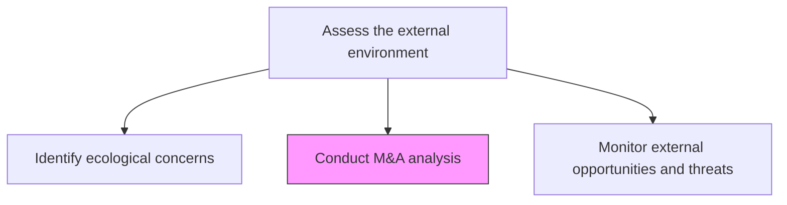
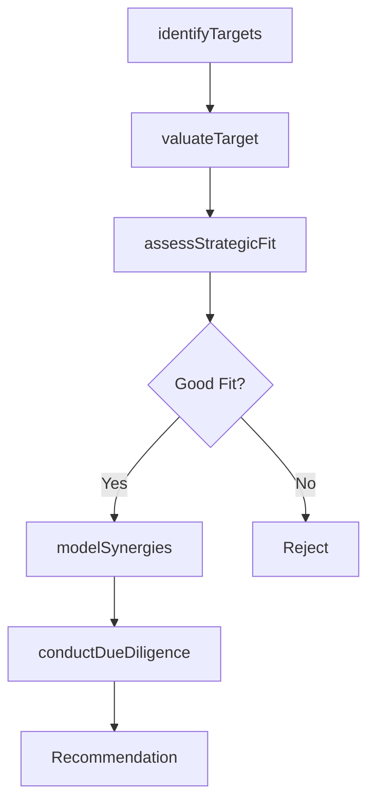

# Conduct mergers and acquisitions (M&A) analysis

> Business-as-Code definition for mergers and acquisitions analysis. Models the identification, valuation, due diligence, and strategic fit assessment of potential M&A targets to support inorganic growth decisions.

## Overview

Analyzing the market for potential merger and acquisition opportunities. Identify target companies that align with strategic objectives, evaluate their financial and operational fitness, and model the potential value creation from combining entities. Assess strategic fit, cultural compatibility, and integration complexity for each candidate.

## Process Hierarchy



## GraphDL

```yaml
conduct:
  object: Mergers And Acquisitions (M&A) Analysis
  actor: CorporateDevelopmentAnalyst
  result: MandAAnalysisReport
```

## Actions

| Action | Description |
|--------|-------------|
| identifyTargets | Screen the market for potential acquisition or merger candidates |
| valuateTarget | Perform financial valuation of M&A targets using DCF and comparable methods |
| assessStrategicFit | Evaluate alignment between target and organizational strategic objectives |
| modelSynergies | Quantify revenue and cost synergies for proposed transactions |
| conductDueDiligence | Perform comprehensive financial, legal, and operational due diligence |

## Events

| Event | Description |
|-------|-------------|
| targetsIdentified | M&A target candidates screened and shortlisted |
| targetValuated | Financial valuation of an M&A target completed |
| strategicFitAssessed | Strategic alignment assessment finalized |
| synergiesModeled | Revenue and cost synergy projections completed |
| dueDiligenceConducted | Comprehensive due diligence investigation concluded |

## Searches

| Search | Description |
|--------|-------------|
| listMandATargets | Retrieve shortlisted M&A targets by sector, size, or geography |
| getValuation | Access financial valuation for a specific target |
| getSynergyModel | Retrieve synergy projections for a proposed transaction |

## Process Flow



## RACI Matrix

| Activity | Responsible | Accountable | Consulted | Informed |
|----------|-------------|-------------|-----------|----------|
| identifyTargets | CorporateDevelopmentAnalyst | VP CorporateDevelopment | Strategy | CEO |
| valuateTarget | FinancialAnalyst | CFO | InvestmentBanker | BoardOfDirectors |
| assessStrategicFit | CorporateDevelopmentAnalyst | VP Strategy | BusinessUnitLeads | Executive |
| conductDueDiligence | CorporateDevelopmentAnalyst | CFO | Legal, Accounting | BoardOfDirectors |

## Related Processes

| Process | Relationship |
|---------|-------------|
| 1.1.5 Conduct organization restructuring opportunities | Parent - M&A analysis is a component of restructuring |
| 1.2.2.6 Develop merger/demerger/acquisition/exit strategy | Downstream - analysis informs M&A strategy |
| 8.0 Manage Financial Resources | Supporting - financial resources for deal execution |

## Related Departments

| Department | Role |
|-----------|------|
| Corporate Development | Leads target identification and deal analysis |
| Finance | Performs valuations and financial due diligence |
| Legal | Manages legal due diligence and regulatory filings |
| Strategy | Evaluates strategic fit with organizational objectives |

## Related Occupations

| Occupation | Involvement |
|-----------|-------------|
| Corporate Development Analyst | Primary executor of M&A analysis |
| Investment Banker | Provides deal advisory and valuation expertise |
| M&A Attorney | Handles legal aspects of due diligence |

## KPIs

| KPI | Description | Unit |
|-----|-------------|------|
| Pipeline Size | Number of active M&A targets under evaluation | Count |
| Valuation Accuracy | Variance between projected and realized deal values | % |
| Due Diligence Cycle Time | Average time to complete due diligence per target | Weeks |

## Usage

```typescript
import { conductMergersAndAcquisitionsMAAnalysis } from '@headlessly/conduct-mergers-and-acquisitions-ma-analysis'

const manda = conductMergersAndAcquisitionsMAAnalysis()

// Identify potential targets
const targets = await manda.identifyTargets({
  sectors: ['SaaS', 'fintech'],
  revenueRange: { min: 5000000, max: 50000000 },
  geography: 'North America'
})

// Valuate a target
const valuation = await manda.valuateTarget({
  targetId: targets[0].id,
  methods: ['DCF', 'comparable-transactions', 'precedent-multiples']
})
```
