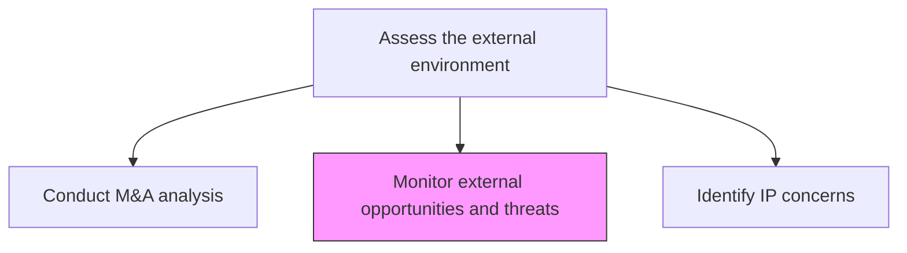
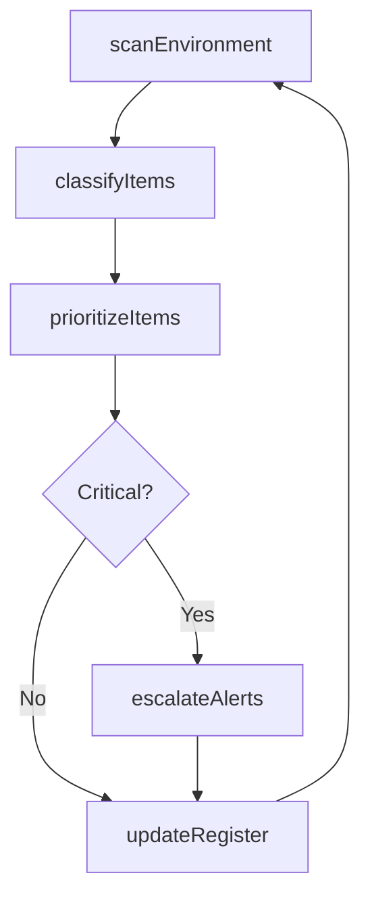

# Monitor external opportunities and threats

> Business-as-Code definition for external opportunity and threat monitoring. Models the continuous surveillance, classification, and escalation of external factors that present strategic opportunities or threats to the organization.

## Overview

Continuously monitoring the external environment for emerging opportunities and threats that could affect the organization's strategic position. Aggregate signals from competitive intelligence, market data, regulatory changes, technology shifts, and geopolitical developments into a unified threat and opportunity register. Classify, prioritize, and escalate items requiring strategic response.

## Process Hierarchy



## GraphDL

```yaml
monitor:
  object: External Opportunities And Threats
  actor: StrategyAnalyst
  result: OpportunityThreatRegister
```

## Actions

| Action | Description |
|--------|-------------|
| scanEnvironment | Aggregate signals from all external scanning activities |
| classifyItems | Categorize items as opportunities or threats with severity ratings |
| prioritizeItems | Rank opportunities and threats by urgency and strategic impact |
| escalateAlerts | Notify leadership of high-priority opportunities or threats |
| updateRegister | Maintain the opportunity and threat register with current statuses |

## Events

| Event | Description |
|-------|-------------|
| environmentScanned | External signals aggregated from all monitoring sources |
| itemsClassified | Opportunities and threats categorized and rated |
| itemsPrioritized | Register items ranked by urgency and strategic importance |
| alertsEscalated | High-priority items elevated to leadership attention |
| registerUpdated | Opportunity and threat register refreshed |

## Searches

| Search | Description |
|--------|-------------|
| getThreatRegister | Retrieve the current opportunity and threat register |
| getHighPriorityItems | List items requiring immediate strategic attention |
| getItemHistory | Access the history and status changes for a specific item |

## Process Flow



## RACI Matrix

| Activity | Responsible | Accountable | Consulted | Informed |
|----------|-------------|-------------|-----------|----------|
| scanEnvironment | StrategyAnalyst | VP Strategy | Marketing, Legal | Executive |
| classifyItems | StrategyAnalyst | VP Strategy | BusinessIntelligence | BusinessUnits |
| prioritizeItems | VP Strategy | ChiefStrategyOfficer | Finance | CEO |
| escalateAlerts | VP Strategy | CEO | BoardOfDirectors | AllLeadership |

## Related Processes

| Process | Relationship |
|---------|-------------|
| 1.1.1.1 Identify competitors | Upstream - competitive data feeds opportunity/threat monitoring |
| 1.1.1.3 Identify economic trends | Upstream - economic shifts generate threats and opportunities |
| 11.0 Manage Business Risk | Downstream - threats feed the enterprise risk management process |

## Related Departments

| Department | Role |
|-----------|------|
| Strategy | Owns the opportunity and threat register |
| Business Intelligence | Provides data aggregation and analysis |
| Risk Management | Integrates threats into enterprise risk framework |

## Related Occupations

| Occupation | Involvement |
|-----------|-------------|
| Strategy Analyst | Monitors and classifies external signals |
| Business Intelligence Analyst | Aggregates data from multiple sources |
| Risk Manager | Escalates threats into enterprise risk processes |

## KPIs

| KPI | Description | Unit |
|-----|-------------|------|
| Register Freshness | Average age of items in the opportunity and threat register | Days |
| Alert Response Time | Time from alert escalation to strategic response initiated | Hours |
| Opportunity Conversion Rate | Percentage of identified opportunities acted upon | % |

## Usage

```typescript
import { monitorExternalOpportunitiesAndThreats } from '@headlessly/monitor-external-opportunities-and-threats'

const monitor = monitorExternalOpportunitiesAndThreats()

// Scan and classify external signals
const scan = await monitor.scanEnvironment({
  sources: ['competitive-intel', 'market-data', 'regulatory-alerts', 'tech-radar'],
  frequency: 'weekly'
})

// Get high-priority items requiring attention
const critical = await monitor.getHighPriorityItems({
  severityThreshold: 'high',
  categories: ['competitive-threat', 'market-opportunity', 'regulatory-change']
})
```
