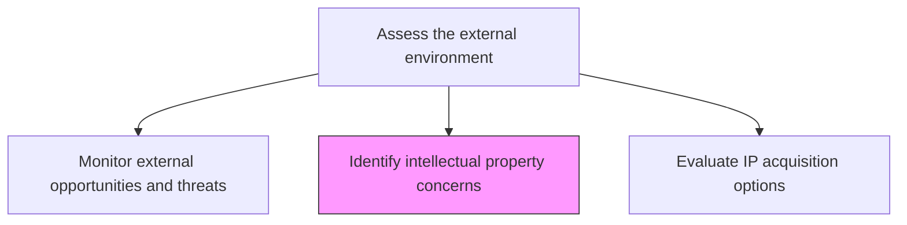
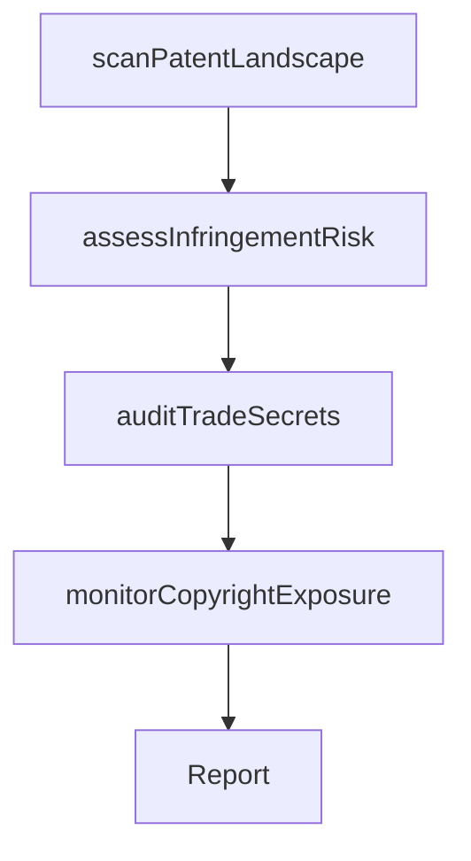

# Identify intellectual property concerns

> Business-as-Code definition for intellectual property concern identification. Models the monitoring of patent landscapes, trademark risks, trade secret exposure, and copyright threats to protect the organization's IP assets.

## Overview

Establishing measures and procedures for identifying various intellectual property threats and concerns. Monitor the patent and trademark landscape for potential infringement risks. Identify trade secret vulnerabilities and copyright exposure. Assess the competitive IP landscape to understand freedom-to-operate constraints and opportunities for IP-based differentiation.

## Process Hierarchy



## GraphDL

```yaml
identify:
  object: Intellectual Property Concerns
  actor: IPCounsel
  result: IPRiskAssessment
```

## Actions

| Action | Description |
|--------|-------------|
| scanPatentLandscape | Monitor patent filings and grants relevant to the organization's domain |
| assessInfringementRisk | Evaluate risk of infringing existing patents or trademarks |
| auditTradeSecrets | Review trade secret protections and identify vulnerabilities |
| monitorCopyrightExposure | Track potential copyright risks in products and content |

## Events

| Event | Description |
|-------|-------------|
| patentLandscapeScanned | Patent landscape analysis completed and updated |
| infringementRiskAssessed | Patent and trademark infringement risk evaluation finalized |
| tradeSecretsAudited | Trade secret protection audit completed |
| copyrightExposureMonitored | Copyright risk assessment finalized |

## Searches

| Search | Description |
|--------|-------------|
| getIPRisks | Retrieve identified IP risks by type, severity, or domain |
| getPatentLandscape | Access the patent landscape analysis for a technology area |
| getTradeSecretAudit | Retrieve the latest trade secret protection audit results |

## Process Flow



## RACI Matrix

| Activity | Responsible | Accountable | Consulted | Informed |
|----------|-------------|-------------|-----------|----------|
| scanPatentLandscape | IPCounsel | GeneralCounsel | R&D | VP ProductDevelopment |
| assessInfringementRisk | IPCounsel | GeneralCounsel | Engineering | Executive |
| auditTradeSecrets | IPCounsel | GeneralCounsel | HR, IT Security | CEO |
| monitorCopyrightExposure | IPCounsel | GeneralCounsel | Marketing, Content | Product |

## Related Processes

| Process | Relationship |
|---------|-------------|
| 1.1.1.12 Evaluate IP acquisition options | Downstream - IP concerns inform acquisition strategy |
| 2.1.3 Manage patents, copyrights, and regulatory requirements | Related - IP governance and management |
| 11.0 Manage Business Risk | Downstream - IP risks feed enterprise risk management |

## Related Departments

| Department | Role |
|-----------|------|
| Legal | Leads IP risk identification and assessment |
| Research and Development | Provides technical context for patent analysis |
| Information Security | Protects trade secrets and proprietary information |

## Related Occupations

| Occupation | Involvement |
|-----------|-------------|
| IP Counsel | Primary executor of IP concern identification |
| Patent Analyst | Researches patent landscape and filings |
| Information Security Officer | Protects trade secret and proprietary data |

## KPIs

| KPI | Description | Unit |
|-----|-------------|------|
| IP Risk Count | Number of identified IP risks under active management | Count |
| Freedom-to-Operate Coverage | Percentage of key product areas with completed FTO analysis | % |
| Trade Secret Audit Frequency | How often trade secret protection reviews are conducted | Per Year |

## Usage

```typescript
import { identifyIntellectualPropertyConcerns } from '@headlessly/identify-intellectual-property-concerns'

const ipConcerns = identifyIntellectualPropertyConcerns()

// Scan the patent landscape
const landscape = await ipConcerns.scanPatentLandscape({
  domains: ['machine-learning', 'cloud-computing', 'data-analytics'],
  jurisdictions: ['US', 'EU', 'China']
})

// Assess infringement risk
const risks = await ipConcerns.assessInfringementRisk({
  products: ['analytics-platform', 'data-pipeline'],
  patentLandscapeId: landscape.id
})
```
