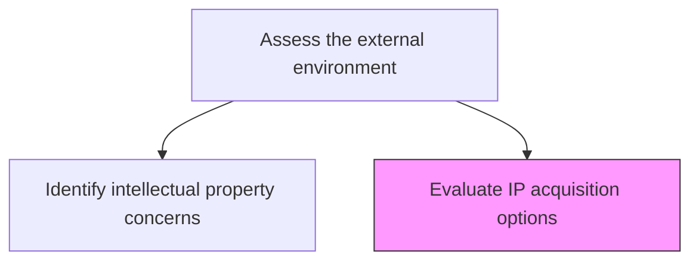
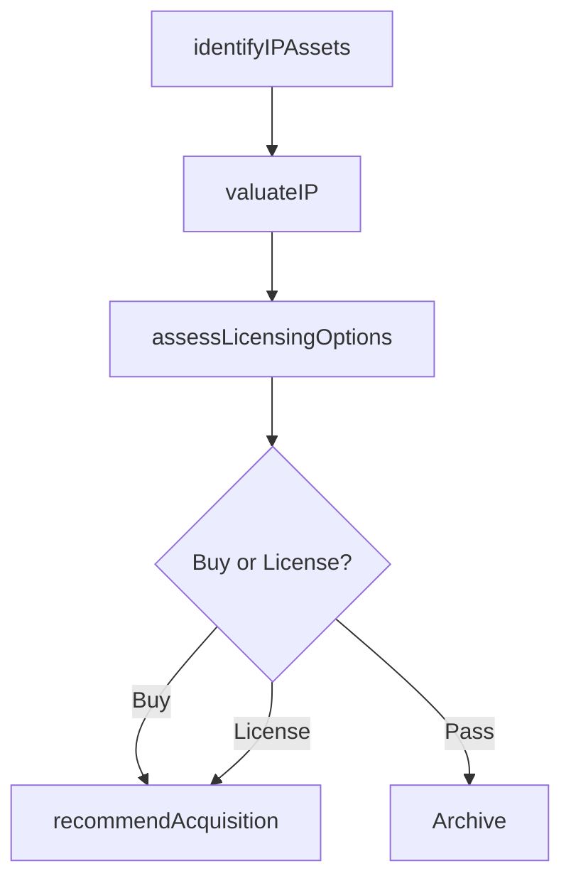

# Evaluate IP acquisition options

> Business-as-Code definition for IP acquisition option evaluation. Models the valuation, licensing analysis, and acquisition decision-making for intellectual property rights, including patents, copyrights, and technology licenses.

## Overview

Establishing and defining measures and methods for valuation and acquisitions of IP. Defining the value of intellectual property for buying and licensing of IP rights. Assess available IP assets in the market, model the value creation potential of acquiring or licensing each asset, and recommend the optimal acquisition approach.

## Process Hierarchy



## GraphDL

```yaml
evaluate:
  object: IP Acquisition Options
  actor: IPCounsel
  result: IPAcquisitionRecommendation
```

## Actions

| Action | Description |
|--------|-------------|
| identifyIPAssets | Scan the market for available IP assets aligned with strategic needs |
| valuateIP | Determine the fair market value of target IP through established methods |
| assessLicensingOptions | Evaluate licensing terms, royalty structures, and exclusivity options |
| recommendAcquisition | Formalize IP acquisition or licensing recommendation with business case |

## Events

| Event | Description |
|-------|-------------|
| ipAssetsIdentified | Available IP assets screened and shortlisted |
| ipValuated | IP valuation completed using established methodology |
| licensingOptionsAssessed | Licensing and royalty structures evaluated |
| acquisitionRecommended | IP acquisition recommendation submitted with business case |

## Searches

| Search | Description |
|--------|-------------|
| listAvailableIP | Retrieve available IP assets by technology domain or owner |
| getIPValuation | Access the valuation report for a specific IP asset |
| getLicensingTerms | Retrieve licensing option details for a target IP asset |

## Process Flow



## RACI Matrix

| Activity | Responsible | Accountable | Consulted | Informed |
|----------|-------------|-------------|-----------|----------|
| identifyIPAssets | IPCounsel | GeneralCounsel | R&D, Strategy | VP ProductDevelopment |
| valuateIP | IPCounsel | GeneralCounsel | Finance | CFO |
| assessLicensingOptions | IPCounsel | GeneralCounsel | Procurement | Legal |
| recommendAcquisition | IPCounsel | GeneralCounsel | VP Strategy | CEO |

## Related Processes

| Process | Relationship |
|---------|-------------|
| 1.1.1.11 Identify intellectual property concerns | Upstream - IP concerns drive acquisition needs |
| 2.1.3 Manage patents, copyrights, and regulatory requirements | Downstream - acquired IP enters portfolio management |
| 1.1.1.9 Conduct M&A analysis | Related - IP acquisition may be part of M&A deal |

## Related Departments

| Department | Role |
|-----------|------|
| Legal | Leads IP valuation and acquisition analysis |
| Finance | Models financial impact of IP acquisition |
| Research and Development | Assesses technical value and integration feasibility |

## Related Occupations

| Occupation | Involvement |
|-----------|-------------|
| IP Counsel | Primary executor of IP acquisition evaluation |
| Patent Valuation Specialist | Performs IP valuation analysis |
| Licensing Manager | Evaluates licensing structures and terms |

## KPIs

| KPI | Description | Unit |
|-----|-------------|------|
| IP Pipeline Value | Total estimated value of IP assets under evaluation | USD |
| Acquisition Cycle Time | Average time from IP identification to acquisition completion | Months |
| Licensing Cost Efficiency | Cost of licensing versus estimated value of IP acquired | Ratio |

## Usage

```typescript
import { evaluateIpAcquisitionOptions } from '@headlessly/evaluate-ip-acquisition-options'

const ipAcquisition = evaluateIpAcquisitionOptions()

// Identify available IP assets
const assets = await ipAcquisition.identifyIPAssets({
  domains: ['natural-language-processing', 'computer-vision'],
  assetTypes: ['patent', 'trade-secret', 'copyright']
})

// Valuate a specific IP asset
const valuation = await ipAcquisition.valuateIP({
  assetId: assets[0].id,
  methods: ['income-approach', 'market-approach', 'cost-approach']
})
```
