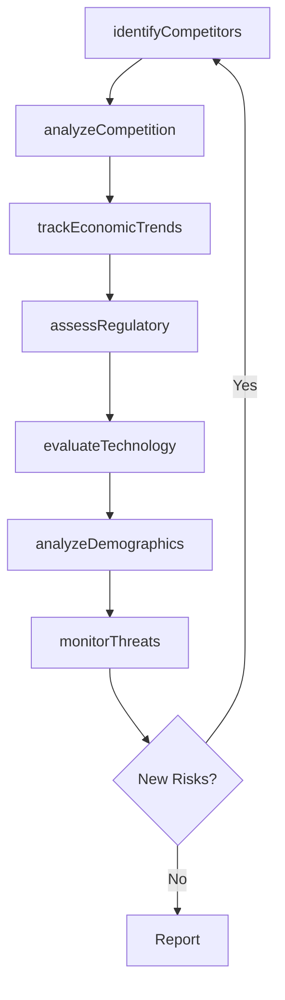

# Assess the external environment

> Business-as-Code definition for external environment assessment. Models the systematic analysis of competitive forces, economic trends, regulatory landscape, technology innovations, demographics, and ecological factors that shape organizational strategy.

## Overview

Assessing all forces, entities, and systems that are external to an organization but can affect its operation. Analyze far-reaching currents in the macroeconomic situation, assess the competition, evaluate technological changes, and identify societal as well as ecological issues of concern. Create a big-picture understanding of externalities, with sufficient depth across individual aspects.

## Process Hierarchy

```mermaid
graph TD
    A[Assess the external environment]
    A --> B[Identify competitors]
    A --> C[Analyze and evaluate competition]
    A --> D[Identify economic trends]
    A --> E[Identify political and regulatory issues]
    A --> F[Assess new technology innovations]
    A --> G[Analyze demographics]
    A --> H[Identify social and cultural changes]
    A --> I[Identify ecological concerns]
    A --> J[Conduct mergers and acquisitions (M&A) analysis]
    A --> K[Monitor external opportunities and threats]
    A --> L[Identify intellectual property concerns]
    A --> M[Evaluate IP acquisition options]
```

## GraphDL

```yaml
assess:
  object: External Environment
  actor: StrategyAnalyst
  result: ExternalEnvironmentReport
```

## Actions

| Action | Description |
|--------|-------------|
| identifyCompetitors | Survey the market landscape to identify and profile competing firms |
| analyzeCompetition | Evaluate competitive positioning, market share, and strategic moves |
| trackEconomicTrends | Monitor macroeconomic indicators and forecast economic shifts |
| assessRegulatory | Identify political and regulatory risks and compliance requirements |
| evaluateTechnology | Assess emerging technology innovations and disruption potential |
| analyzeDemographics | Study population trends and their impact on target markets |
| monitorThreats | Track external opportunities and threats on an ongoing basis |

## Events

| Event | Description |
|-------|-------------|
| competitorsIdentified | Competitor landscape analysis completed |
| competitionAnalyzed | Competitive forces evaluation finalized |
| economicTrendsTracked | Economic trend analysis updated |
| regulatoryAssessed | Political and regulatory risk assessment completed |
| technologyEvaluated | Technology innovation assessment finalized |
| demographicsAnalyzed | Demographic analysis completed |
| threatsMonitored | External opportunity and threat register updated |

## Searches

| Search | Description |
|--------|-------------|
| getCompetitorLandscape | Retrieve the current competitive landscape analysis |
| getEconomicOutlook | Access macroeconomic trend data and forecasts |
| getRegulatoryRisks | List identified political and regulatory risks by severity |
| getTechnologyRadar | Retrieve technology innovation assessments and maturity ratings |
| getThreatRegister | Access the current register of external opportunities and threats |

## Process Flow



## RACI Matrix

| Activity | Responsible | Accountable | Consulted | Informed |
|----------|-------------|-------------|-----------|----------|
| identifyCompetitors | StrategyAnalyst | VP Strategy | Sales | Executive |
| analyzeCompetition | StrategyAnalyst | VP Strategy | ProductTeam | Marketing |
| trackEconomicTrends | Economist | VP Strategy | Finance | BoardOfDirectors |
| assessRegulatory | RegulatoryAffairs | GeneralCounsel | Compliance | Executive |
| evaluateTechnology | TechnologyScout | CTO | Engineering | ProductTeam |

## Sub-Processes

| ID | Name | Description |
|----|------|-------------|
| 1.1.1.1 | Identify competitors | Identifying your competitors, their service and/or product. Evaluating competitors strategies to det |
| 1.1.1.2 | Analyze and evaluate competition | Assessing the competitive forces in the marketplace that could potentially affect the organization.  |
| 1.1.1.3 | Identify economic trends | Determining large-scale macroeconomic shifts and trends, with medium to long-term relevance for the  |
| 1.1.1.4 | Identify political and regulatory issues | Identifying areas of concern pertaining to public policy and regulation, established by sovereign or |
| 1.1.1.5 | Assess new technology innovations | Assessing developments in technologies presently being used by the business, new technologies that h |
| 1.1.1.6 | Analyze demographics | Analyzing statistical data relating to the size, distribution, and composition of relevant populatio |
| 1.1.1.7 | Identify social and cultural changes | Distinguishing changes in societal makeup, as well as the cultural composite. Isolate shifts in the  |
| 1.1.1.8 | Identify ecological concerns | Identifying changes in ecological ecosystems that can be directly or indirectly detrimental to the o |
| 1.1.1.9 | Conduct mergers and acquisitions (M&A) analysis | Evaluating potential mergers, acquisitions, divestitures, and strategic partnerships. Analyze target |
| 1.1.1.10 | Monitor external opportunities and threats | Continuously scanning the external environment to detect emerging opportunities and threats. Maintai |
| 1.1.1.11 | Identify intellectual property concerns | Establishing measures and procedures for identifying various intellectual property threats and conce |
| 1.1.1.12 | Evaluate IP acquisition options | Establishing and defining measures and methods for valuation and acquisitions of IP. Defining the va |

## Related Processes

| Process | Relationship |
|---------|-------------|
| 1.1.2 Survey market and determine customer needs and wants | Parallel - market intelligence complements external scan |
| 1.1.3 Assess the internal environment | Complementary - SWOT analysis pairs external with internal |
| 1.1.4 Establish strategic vision | Downstream - external insights shape the strategic vision |

## Related Departments

| Department | Role |
|-----------|------|
| Strategy | Conducts competitive and macroeconomic analysis |
| Legal | Monitors regulatory and IP landscape |
| Technology | Evaluates emerging technology disruptions |
| Marketing | Tracks demographic and market trends |
| Sustainability | Monitors ecological and ESG concerns |

## Related Occupations

| Occupation | Involvement |
|-----------|-------------|
| Strategy Analyst | Primary executor of environmental scanning |
| Market Researcher | Gathers competitive and demographic data |
| Regulatory Affairs Specialist | Tracks political and regulatory changes |
| Technology Scout | Evaluates emerging technology innovations |

## KPIs

| KPI | Description | Unit |
|-----|-------------|------|
| Scan Frequency | How often the external environment assessment is refreshed | Per Year |
| Threat Detection Rate | Percentage of material external threats identified before impact | % |
| Competitor Coverage | Proportion of known competitors actively profiled | % |
| Intelligence Freshness | Average age of external environment data points | Days |
| Regulatory Compliance Gap | Number of unaddressed regulatory risks | Count |

## Usage

```typescript
import { assessExternalEnvironment } from '@headlessly/assess-external-environment'

const external = assessExternalEnvironment()

// Identify and profile competitors
const competitors = await external.identifyCompetitors({
  industry: 'Enterprise Software',
  region: 'Global',
  minRevenue: 10000000
})

// Track economic trends
const trends = await external.trackEconomicTrends({
  indicators: ['GDP', 'inflation', 'interest-rates'],
  horizon: '2-year'
})

// Monitor threats and opportunities
const threats = await external.monitorThreats({
  categories: ['competitive', 'regulatory', 'technology'],
  severity: 'high'
})
```
