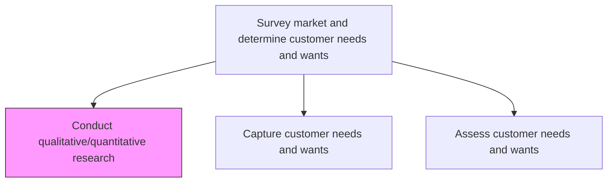
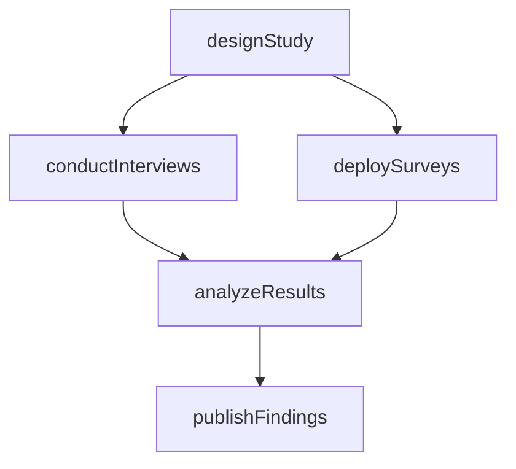

# Conduct qualitative/quantitative research and assessments

> Business-as-Code definition for qualitative and quantitative market research. Models the design, execution, and analysis of research studies using interviews, focus groups, surveys, and statistical methods to understand market dynamics and customer behavior.

## Overview

Investigating key market features and customer characteristics, using qualitative and quantitative measures to capture relevant aspects. Distill key ingredients that allow the organization to Capture customer needs and wants [19946], and Assess customer needs and wants [19947]. Conduct standardized appraisals by defining selection parameters and setting quotas.

## Process Hierarchy



## GraphDL

```yaml
conduct:
  object: Qualitative/quantitative Research And Assessments
  actor: MarketResearcher
  result: ResearchReport
```

## Actions

| Action | Description |
|--------|-------------|
| designStudy | Define research objectives, methodology, sample size, and parameters |
| conductInterviews | Execute qualitative interviews and focus group sessions |
| deploySurveys | Design, distribute, and collect quantitative survey responses |
| analyzeResults | Perform statistical and thematic analysis of research data |
| publishFindings | Document and communicate research findings and recommendations |

## Events

| Event | Description |
|-------|-------------|
| studyDesigned | Research methodology and parameters defined |
| interviewsConducted | Qualitative interview sessions completed |
| surveysDeployed | Survey responses collected and validated |
| resultsAnalyzed | Statistical and qualitative analysis completed |
| findingsPublished | Research report finalized and distributed |

## Searches

| Search | Description |
|--------|-------------|
| getResearchStudies | List research studies by type, status, or segment |
| getStudyResults | Retrieve analysis results for a specific study |
| getSurveyResponses | Access raw survey response data for further analysis |

## Process Flow



## RACI Matrix

| Activity | Responsible | Accountable | Consulted | Informed |
|----------|-------------|-------------|-----------|----------|
| designStudy | MarketResearcher | VP Marketing | Product, Sales | Strategy |
| conductInterviews | MarketResearcher | VP Marketing | CustomerSuccess | Product |
| deploySurveys | MarketResearcher | VP Marketing | DataScience | Strategy |
| analyzeResults | DataAnalyst | VP Marketing | MarketResearcher | Product |

## Related Processes

| Process | Relationship |
|---------|-------------|
| 1.1.2.2 Capture customer needs and wants | Downstream - research findings feed needs capture |
| 1.1.2.3 Assess customer needs and wants | Downstream - research data enables needs assessment |
| 1.1.1.6 Analyze demographics | Complementary - demographic data informs research design |

## Related Departments

| Department | Role |
|-----------|------|
| Marketing | Designs and executes market research programs |
| Data Science | Provides statistical analysis and modeling support |
| Product | Consumes research findings for product decisions |

## Related Occupations

| Occupation | Involvement |
|-----------|-------------|
| Market Research Analyst | Designs and executes research studies |
| Data Analyst | Performs statistical analysis of quantitative data |
| UX Researcher | Conducts qualitative user research |

## KPIs

| KPI | Description | Unit |
|-----|-------------|------|
| Study Completion Rate | Percentage of planned research studies completed on schedule | % |
| Response Rate | Average survey response rate across studies | % |
| Insights Actionability | Percentage of findings that result in strategic or product actions | % |

## Usage

```typescript
import { conductQualitativeQuantitativeResearchAndAssessments } from '@headlessly/conduct-qualitative-quantitative-research-and-assessments'

const research = conductQualitativeQuantitativeResearchAndAssessments()

// Design a mixed-methods study
const study = await research.designStudy({
  objective: 'Understand mid-market buyer decision criteria',
  methods: ['depth-interviews', 'online-survey'],
  sampleSize: { qualitative: 30, quantitative: 500 },
  segments: ['IT-decision-makers', 'procurement-leaders']
})

// Analyze collected results
const findings = await research.analyzeResults({
  studyId: study.id,
  analysisType: ['thematic-coding', 'regression-analysis']
})
```
