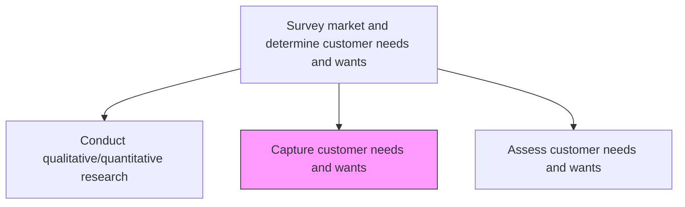
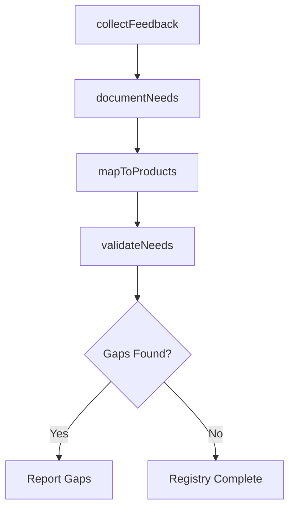

# Capture customer needs and wants

> Business-as-Code definition for customer needs and wants capture. Models the systematic collection, documentation, and categorization of customer requirements, pain points, and desires from multiple feedback channels.

## Overview

Identifying and collecting customers' wants and needs of a product and/or services from a marketing perspective. Identify which consumer needs are important and whether needs are being met by current products/services.

## Process Hierarchy



## GraphDL

```yaml
capture:
  object: Customer Needs And Wants
  actor: CustomerInsightsManager
  result: CustomerNeedsRegistry
```

## Actions

| Action | Description |
|--------|-------------|
| collectFeedback | Gather customer feedback from surveys, interviews, and support channels |
| documentNeeds | Record and categorize customer needs, wants, and pain points |
| mapToProducts | Link captured needs to existing products and identify gaps |
| validateNeeds | Confirm captured needs through follow-up with customer representatives |

## Events

| Event | Description |
|-------|-------------|
| feedbackCollected | Customer feedback gathered from designated channels |
| needsDocumented | Customer needs recorded and categorized in the registry |
| needsMappedToProducts | Needs linked to existing product coverage and gaps identified |
| needsValidated | Captured needs confirmed through customer follow-up |

## Searches

| Search | Description |
|--------|-------------|
| getCustomerNeeds | Retrieve customer needs filtered by segment, priority, or category |
| findUnmetNeeds | Identify needs not currently addressed by existing offerings |
| getNeedsByProduct | Access customer needs mapped to a specific product or service |

## Process Flow



## RACI Matrix

| Activity | Responsible | Accountable | Consulted | Informed |
|----------|-------------|-------------|-----------|----------|
| collectFeedback | CustomerInsightsManager | VP Marketing | Sales, Support | Product |
| documentNeeds | CustomerInsightsManager | VP Marketing | UXResearcher | Strategy |
| mapToProducts | ProductManager | VP Product | Marketing | Engineering |
| validateNeeds | CustomerInsightsManager | VP Marketing | Sales | Product |

## Related Processes

| Process | Relationship |
|---------|-------------|
| 1.1.2.1 Conduct qualitative/quantitative research | Upstream - research feeds needs capture |
| 1.1.2.3 Assess customer needs and wants | Downstream - captured needs are assessed and prioritized |
| 2.2.2 Generate new product/service concepts | Downstream - unmet needs trigger concept generation |

## Related Departments

| Department | Role |
|-----------|------|
| Marketing | Leads customer feedback collection and documentation |
| Sales | Provides direct customer input and competitive insights |
| Customer Support | Shares recurring customer issues and feature requests |
| Product | Maps needs to product capabilities and gaps |

## Related Occupations

| Occupation | Involvement |
|-----------|-------------|
| Customer Insights Manager | Primary executor of needs capture |
| UX Researcher | Gathers qualitative user experience feedback |
| Sales Representative | Relays front-line customer input |

## KPIs

| KPI | Description | Unit |
|-----|-------------|------|
| Needs Capture Volume | Number of distinct customer needs documented per quarter | Count |
| Channel Coverage | Number of feedback channels actively monitored | Count |
| Gap Identification Rate | Percentage of captured needs revealing product gaps | % |

## Usage

```typescript
import { captureCustomerNeedsAndWants } from '@headlessly/capture-customer-needs-and-wants'

const capture = captureCustomerNeedsAndWants()

// Collect feedback from multiple channels
const feedback = await capture.collectFeedback({
  channels: ['surveys', 'support-tickets', 'sales-calls', 'social-media'],
  period: 'last-quarter'
})

// Document and categorize needs
const needs = await capture.documentNeeds({
  feedbackId: feedback.id,
  categories: ['functional', 'usability', 'performance', 'integration']
})
```
