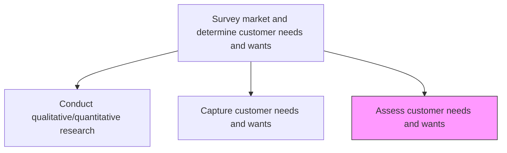
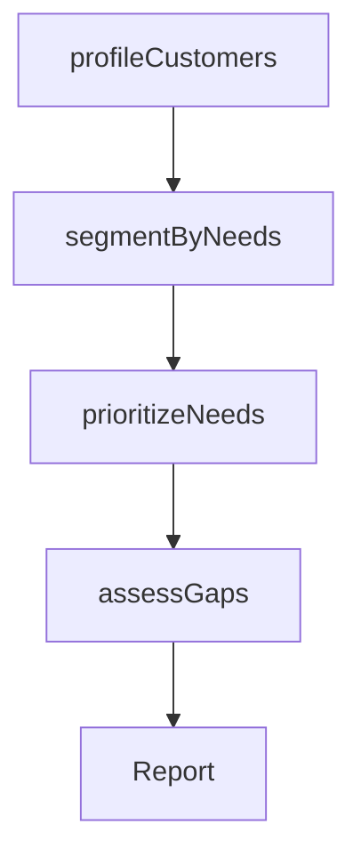

# Assess customer needs and wants

> Business-as-Code definition for customer needs and wants assessment. Models the evaluation, prioritization, and profiling of captured customer requirements to inform product strategy, market segmentation, and targeting decisions.

## Overview

Creating customer profiles to get a picture of customers and their needs. Identify particular groups of people/organizations that benefit from your product/services and then selling to them.

## Process Hierarchy



## GraphDL

```yaml
assess:
  object: Customer Needs And Wants
  actor: ProductManager
  result: NeedsPriorityMatrix
```

## Actions

| Action | Description |
|--------|-------------|
| profileCustomers | Create detailed customer profiles based on captured needs and behaviors |
| segmentByNeeds | Group customers into needs-based segments for targeting |
| prioritizeNeeds | Rank customer needs by strategic importance and market opportunity |
| assessGaps | Evaluate gaps between customer expectations and current offerings |

## Events

| Event | Description |
|-------|-------------|
| customersProfiled | Customer profiles created from needs and behavioral data |
| segmentedByNeeds | Needs-based customer segments defined |
| needsPrioritized | Customer needs ranked and priority matrix updated |
| gapsAssessed | Product-market gaps identified and quantified |

## Searches

| Search | Description |
|--------|-------------|
| getCustomerProfiles | Retrieve customer profiles by segment or attribute |
| getNeedsPriorityMatrix | Access the prioritized needs ranking matrix |
| getProductGaps | List product-market gaps by severity and opportunity size |

## Process Flow



## RACI Matrix

| Activity | Responsible | Accountable | Consulted | Informed |
|----------|-------------|-------------|-----------|----------|
| profileCustomers | MarketResearcher | VP Marketing | Sales | Product |
| segmentByNeeds | MarketResearcher | VP Marketing | DataScience | Strategy |
| prioritizeNeeds | ProductManager | VP Product | Marketing, Sales | Engineering |
| assessGaps | ProductManager | VP Product | CustomerSuccess | Executive |

## Related Processes

| Process | Relationship |
|---------|-------------|
| 1.1.2.2 Capture customer needs and wants | Upstream - captured needs feed assessment |
| 2.2 Generate and define new product/service ideas | Downstream - prioritized needs drive ideation |
| 1.2.7 Develop customer experience strategy | Downstream - assessed needs inform CX strategy |

## Related Departments

| Department | Role |
|-----------|------|
| Product | Prioritizes needs and identifies product gaps |
| Marketing | Creates customer profiles and segments |
| Sales | Validates needs assessment against field experience |

## Related Occupations

| Occupation | Involvement |
|-----------|-------------|
| Product Manager | Leads needs prioritization and gap assessment |
| Market Research Analyst | Creates customer profiles and segments |
| Customer Success Manager | Validates needs relevance with existing customers |

## KPIs

| KPI | Description | Unit |
|-----|-------------|------|
| Segment Coverage | Number of needs-based customer segments with active profiles | Count |
| Gap Resolution Rate | Percentage of identified product gaps addressed within 12 months | % |
| Prioritization Accuracy | Correlation between prioritized needs and actual market demand | Score (1-10) |

## Usage

```typescript
import { assessCustomerNeedsAndWants } from '@headlessly/assess-customer-needs-and-wants'

const assessment = assessCustomerNeedsAndWants()

// Profile customers from captured needs data
const profiles = await assessment.profileCustomers({
  dataSource: 'needs-registry',
  attributes: ['industry', 'size', 'budget', 'pain-points']
})

// Prioritize needs by strategic importance
const priorityMatrix = await assessment.prioritizeNeeds({
  criteria: ['revenue-impact', 'competitive-advantage', 'feasibility'],
  weightings: { revenueImpact: 0.4, competitiveAdvantage: 0.35, feasibility: 0.25 }
})
```
