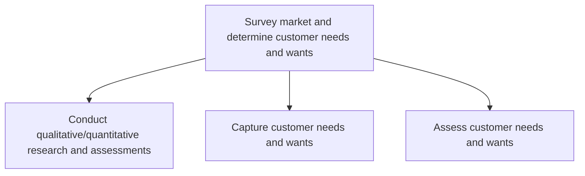
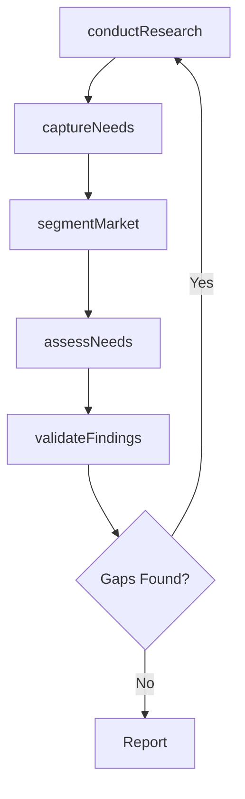

# Survey market and determine customer needs and wants

> Business-as-Code definition for market surveying and customer needs analysis. Models the research, capture, and assessment of customer requirements through qualitative and quantitative methods to inform product and service strategy.

## Overview

Examining the market to identify customer required solutions. Assess the relevant market(s) to determine the products/services that are needed or wanted by customers. Carry out quantitative and qualitative analyses to capture and investigate products/services. Employ creative techniques that allow for a closer appreciation of the customer, and design relevant solutions.

## Process Hierarchy



## GraphDL

```yaml
survey:
  object: Market And Determine Customer Needs And Wants
  actor: MarketResearcher
  result: CustomerNeedsReport
```

## Actions

| Action | Description |
|--------|-------------|
| conductResearch | Execute qualitative and quantitative market research studies |
| captureNeeds | Collect and document customer needs, wants, and pain points |
| assessNeeds | Evaluate and prioritize captured customer needs against market opportunity |
| segmentMarket | Group customers into segments based on shared characteristics and needs |
| validateFindings | Confirm research findings through follow-up studies or customer panels |

## Events

| Event | Description |
|-------|-------------|
| researchConducted | Market research study completed and results compiled |
| needsCaptured | Customer needs and wants documented from research inputs |
| needsAssessed | Customer needs evaluated and prioritized |
| marketSegmented | Customer segments defined and profiled |
| findingsValidated | Research findings confirmed through validation methods |

## Searches

| Search | Description |
|--------|-------------|
| getMarketResearch | Retrieve market research studies by type, date, or segment |
| getCustomerNeeds | List captured customer needs filtered by segment or priority |
| getSegmentProfiles | Access customer segment profiles and characteristics |
| findUnmetNeeds | Identify high-priority customer needs not currently addressed |

## Process Flow



## RACI Matrix

| Activity | Responsible | Accountable | Consulted | Informed |
|----------|-------------|-------------|-----------|----------|
| conductResearch | MarketResearcher | VP Marketing | Sales, Product | Strategy |
| captureNeeds | MarketResearcher | VP Marketing | CustomerSuccess | Product |
| assessNeeds | ProductManager | VP Product | Marketing, Sales | Strategy |
| segmentMarket | MarketResearcher | VP Marketing | DataScience | Sales |

## Sub-Processes

| ID | Name | Description |
|----|------|-------------|
| 1.1.2.1 | Conduct qualitative/quantitative research and assessments | Investigating key market features and customer characteristics, using qualitative and quantitative m |
| 1.1.2.2 | Capture customer needs and wants | Identifying and collecting customers' wants and needs of a product and/or services from a marketing  |
| 1.1.2.3 | Assess customer needs and wants | Creating customer profiles to get a picture of customers and their needs. Identify particular groups |

## Related Processes

| Process | Relationship |
|---------|-------------|
| 1.1.1 Assess the external environment | Parallel - market survey complements external environmental scan |
| 1.1.4 Establish strategic vision | Downstream - customer insights inform strategic vision |
| 2.0 Design and Develop Products and Services | Downstream - customer needs drive product development |

## Related Departments

| Department | Role |
|-----------|------|
| Marketing | Leads market research and customer analysis |
| Sales | Provides front-line customer insights and feedback |
| Product | Translates customer needs into product requirements |
| Customer Success | Shares ongoing customer satisfaction and retention data |

## Related Occupations

| Occupation | Involvement |
|-----------|-------------|
| Market Research Analyst | Designs and executes research studies |
| Product Manager | Translates findings into product strategy |
| Customer Insights Manager | Synthesizes customer feedback into actionable themes |

## KPIs

| KPI | Description | Unit |
|-----|-------------|------|
| Research Cycle Time | Average time from research initiation to report delivery | Weeks |
| Customer Coverage | Percentage of target segments with active research | % |
| Needs Capture Rate | Number of distinct customer needs documented per quarter | Count |
| Validation Accuracy | Percentage of initial findings confirmed by follow-up validation | % |

## Usage

```typescript
import { surveyMarketAndDetermineCustomerNeedsAndWants } from '@headlessly/survey-market-and-determine-customer-needs-and-wants'

const market = surveyMarketAndDetermineCustomerNeedsAndWants()

// Conduct market research
const study = await market.conductResearch({
  method: 'mixed',
  segments: ['enterprise', 'mid-market'],
  sampleSize: 500
})

// Capture and assess customer needs
const needs = await market.captureNeeds({
  studyId: study.id,
  sources: ['surveys', 'interviews', 'support-tickets']
})

const prioritized = await market.assessNeeds({
  needsId: needs.id,
  criteria: ['frequency', 'severity', 'willingness-to-pay']
})
```
