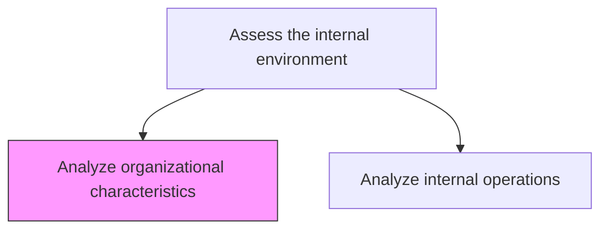
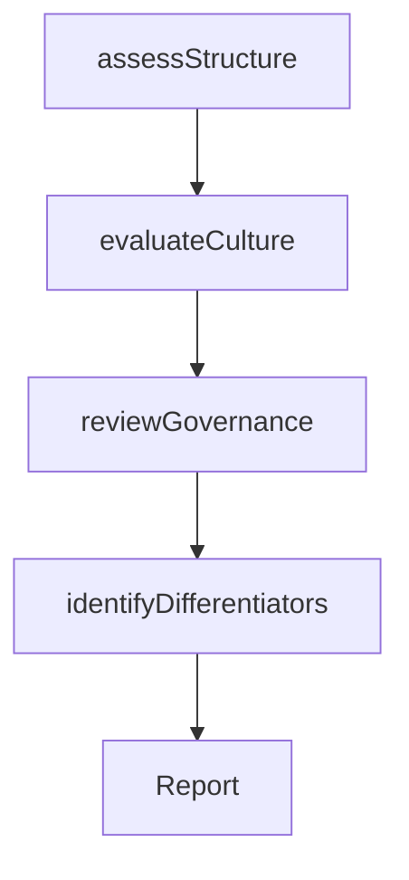

# Analyze organizational characteristics

> Business-as-Code definition for organizational characteristics analysis. Models the examination of structure, culture, governance, and differentiating attributes that define the organization's identity and operational foundation.

## Overview

Identifying and examining key attributes that differentiate the organization in the market and those that underscore the core of its operations. Consider how the organization functions. Reflect over tangible and intangible aspects in order to spot critical correlations and the interplay between these attributes. Have senior executives conduct the analysis, with input from management and operational personnel.

## Process Hierarchy



## GraphDL

```yaml
analyze:
  object: Organizational Characteristics
  actor: OrganizationalDevelopmentSpecialist
  result: OrganizationalProfile
```

## Actions

| Action | Description |
|--------|-------------|
| assessStructure | Evaluate organizational hierarchy, reporting lines, and span of control |
| evaluateCulture | Measure organizational culture, values, and employee engagement |
| reviewGovernance | Examine governance frameworks, decision-making processes, and authority |
| identifyDifferentiators | Pinpoint attributes that distinguish the organization in the market |

## Events

| Event | Description |
|-------|-------------|
| structureAssessed | Organizational structure analysis completed |
| cultureEvaluated | Culture and engagement assessment finalized |
| governanceReviewed | Governance framework review completed |
| differentiatorsIdentified | Market-differentiating attributes documented |

## Searches

| Search | Description |
|--------|-------------|
| getOrganizationalProfile | Retrieve the current organizational characteristics profile |
| getCultureMetrics | Access culture and engagement survey results |
| getGovernanceFramework | Retrieve governance structure documentation |

## Process Flow



## RACI Matrix

| Activity | Responsible | Accountable | Consulted | Informed |
|----------|-------------|-------------|-----------|----------|
| assessStructure | OrganizationalDevelopmentSpecialist | CHRO | Executive | AllManagers |
| evaluateCulture | HRAnalyst | CHRO | AllEmployees | Executive |
| reviewGovernance | ComplianceOfficer | GeneralCounsel | Executive | BoardOfDirectors |
| identifyDifferentiators | StrategyAnalyst | VP Strategy | Marketing, Sales | Executive |

## Related Processes

| Process | Relationship |
|---------|-------------|
| 1.1.3.2 Analyze internal operations | Sibling - operations analysis complements organizational analysis |
| 1.1.3.6 Identify core competencies | Downstream - organizational attributes feed competency identification |
| 1.2.4 Create organizational design | Downstream - analysis informs organizational redesign |

## Related Departments

| Department | Role |
|-----------|------|
| Human Resources | Leads organizational culture and structure assessment |
| Strategy | Identifies market-differentiating characteristics |
| Legal | Reviews governance and compliance frameworks |

## Related Occupations

| Occupation | Involvement |
|-----------|-------------|
| Organizational Development Specialist | Primary executor of organizational analysis |
| HR Analyst | Conducts culture and engagement surveys |
| Strategy Analyst | Identifies strategic differentiators |

## KPIs

| KPI | Description | Unit |
|-----|-------------|------|
| Employee Engagement Score | Survey-based measure of workforce engagement and satisfaction | Score (1-10) |
| Governance Maturity | Assessment of governance framework completeness and effectiveness | Score (1-5) |
| Organizational Agility | Speed of decision-making and adaptation to change | Days |

## Usage

```typescript
import { analyzeOrganizationalCharacteristics } from '@headlessly/analyze-organizational-characteristics'

const orgAnalysis = analyzeOrganizationalCharacteristics()

// Assess organizational structure
const structure = await orgAnalysis.assessStructure({
  scope: 'enterprise',
  dimensions: ['hierarchy', 'reporting-lines', 'span-of-control']
})

// Evaluate organizational culture
const culture = await orgAnalysis.evaluateCulture({
  method: 'survey',
  dimensions: ['innovation', 'collaboration', 'accountability']
})
```
