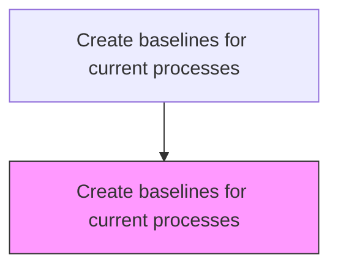
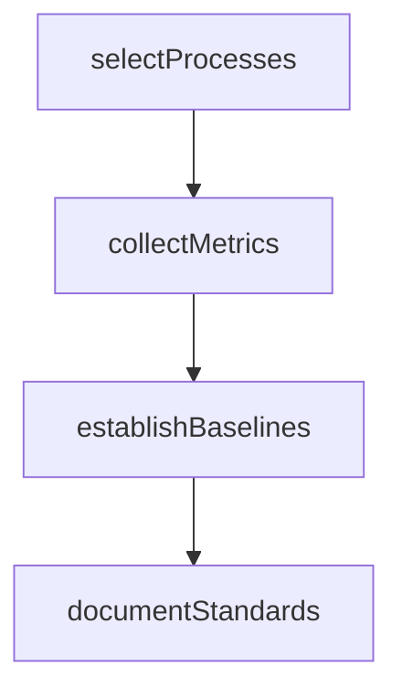

# Create baselines for current processes

> Business-as-Code definition for process baseline creation. Models the establishment of performance standards for current business processes to enable benchmarking, continuous improvement, and strategic planning.

## Overview

Establishing baselines that provide standards for assessing performance levels and allow for a relational benchmarking of current processes. Undertake a survey of archival performance records, conducted in conjunction by the management and the operations personnel. Take into account the organization's internal objectives, particularly for process improvement and enhancement. Understand industry best practices.

## Process Hierarchy



## GraphDL

```yaml
create:
  object: Baselines For Current Processes
  actor: ProcessEngineer
  result: ProcessBaseline
```

## Actions

| Action | Description |
|--------|-------------|
| selectProcesses | Identify key business processes for baseline measurement |
| collectMetrics | Gather historical performance data for selected processes |
| establishBaselines | Define baseline metrics and acceptable performance ranges |
| documentStandards | Record baselines and associated industry best practices |

## Events

| Event | Description |
|-------|-------------|
| processesSelected | Key processes identified for baseline measurement |
| metricsCollected | Historical performance data gathered and validated |
| baselinesEstablished | Performance baselines defined and approved |
| standardsDocumented | Baselines and best practices formally documented |

## Searches

| Search | Description |
|--------|-------------|
| getBaselines | Retrieve performance baselines by process or department |
| getHistoricalMetrics | Access historical performance data for a specific process |
| getBaselineVariance | Compare current performance against established baselines |

## Process Flow



## RACI Matrix

| Activity | Responsible | Accountable | Consulted | Informed |
|----------|-------------|-------------|-----------|----------|
| selectProcesses | ProcessEngineer | COO | DepartmentHeads | Strategy |
| collectMetrics | OperationsAnalyst | COO | Finance | QualityAssurance |
| establishBaselines | ProcessEngineer | COO | ExternalConsultant | Executive |

## Related Processes

| Process | Relationship |
|---------|-------------|
| 1.1.3.2 Analyze internal operations | Upstream - operational data feeds baseline creation |
| 1.2.5.2 Establish baseline metrics | Related - organizational goal baselines |
| 1.2.2.11 Develop lean/continuous improvement strategy | Downstream - baselines enable improvement measurement |

## Related Departments

| Department | Role |
|-----------|------|
| Operations | Provides process data and validates baselines |
| Quality Assurance | Contributes quality metrics and standards |
| Finance | Supplies cost-per-transaction and efficiency data |

## Related Occupations

| Occupation | Involvement |
|-----------|-------------|
| Process Engineer | Primary executor of baseline creation |
| Operations Analyst | Gathers and analyzes historical performance data |

## KPIs

| KPI | Description | Unit |
|-----|-------------|------|
| Baseline Coverage | Percentage of key processes with established baselines | % |
| Data Freshness | Age of the most recent baseline measurement | Months |
| Improvement Rate | Performance improvement relative to baseline over time | % |

## Usage

```typescript
import { createBaselinesForCurrentProcesses } from '@headlessly/create-baselines-for-current-processes'

const baselines = createBaselinesForCurrentProcesses()

// Select processes and establish baselines
const processes = await baselines.selectProcesses({
  scope: ['order-to-cash', 'hire-to-retire', 'procure-to-pay']
})

const baseline = await baselines.establishBaselines({
  processIds: processes.map(p => p.id),
  metrics: ['cycle-time', 'cost-per-transaction', 'error-rate'],
  period: 'trailing-12-months'
})
```
