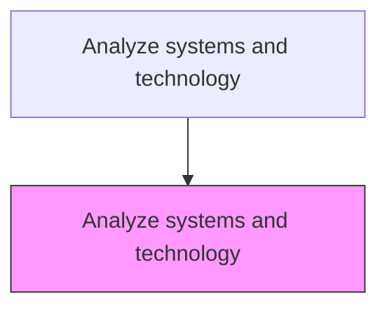
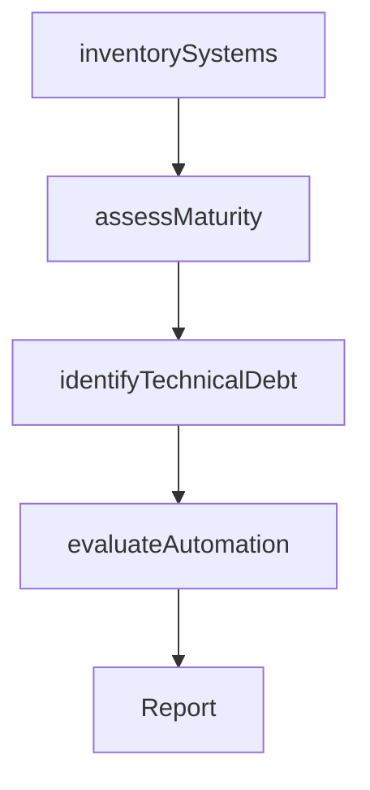

# Analyze systems and technology

> Business-as-Code definition for systems and technology analysis. Models the evaluation of deployed technology systems, infrastructure maturity, automation capabilities, and technical debt to guide IT strategy and investment decisions.

## Overview

Analyzing the capabilities of technology and process automation systems deployed within the organization in order to direct future associated processes. Conduct a broad-based survey to examine various aspects associated with such systems and technologies, with the objective of identifying key facets that are of interest. Investigate the intended purpose, purpose served, utility, longevity, remaining service-life, repair or service requirements, etc.

## Process Hierarchy



## GraphDL

```yaml
analyze:
  object: Systems And Technology
  actor: EnterpriseArchitect
  result: TechnologyAssessmentReport
```

## Actions

| Action | Description |
|--------|-------------|
| inventorySystems | Catalog all deployed technology systems and platforms |
| assessMaturity | Evaluate the maturity and capability of each technology system |
| identifyTechnicalDebt | Locate areas of technical debt and obsolescence risk |
| evaluateAutomation | Assess the degree of process automation and optimization opportunities |

## Events

| Event | Description |
|-------|-------------|
| systemsInventoried | Technology system catalog compiled and validated |
| maturityAssessed | Technology maturity assessment completed |
| technicalDebtIdentified | Technical debt and obsolescence risks documented |
| automationEvaluated | Process automation levels assessed |

## Searches

| Search | Description |
|--------|-------------|
| getSystemInventory | Retrieve the catalog of deployed technology systems |
| getMaturityScores | Access maturity scores by system, platform, or domain |
| getTechnicalDebt | List technical debt items by severity and remediation cost |

## Process Flow



## RACI Matrix

| Activity | Responsible | Accountable | Consulted | Informed |
|----------|-------------|-------------|-----------|----------|
| inventorySystems | EnterpriseArchitect | CTO | ITOperations | Finance |
| assessMaturity | EnterpriseArchitect | CTO | Engineering | VP Strategy |
| identifyTechnicalDebt | SoftwareArchitect | CTO | Engineering | ProductDevelopment |
| evaluateAutomation | ProcessEngineer | CTO | Operations | COO |

## Related Processes

| Process | Relationship |
|---------|-------------|
| 1.1.1.5 Assess new technology innovations | Complementary - external technology scan paired with internal audit |
| 6.0 Manage Enterprise IT | Related - IT management maintains the analyzed systems |
| 1.1.3.2 Analyze internal operations | Sibling - technology enables operational processes |

## Related Departments

| Department | Role |
|-----------|------|
| Information Technology | Provides system inventory and performance data |
| Engineering | Assesses technical debt and architecture quality |
| Operations | Identifies automation gaps and efficiency opportunities |

## Related Occupations

| Occupation | Involvement |
|-----------|-------------|
| Enterprise Architect | Leads technology assessment and architecture review |
| Software Architect | Evaluates technical debt and system quality |
| IT Operations Manager | Provides system performance and reliability data |

## KPIs

| KPI | Description | Unit |
|-----|-------------|------|
| System Maturity Score | Average maturity level across deployed systems | Score (1-5) |
| Technical Debt Ratio | Ratio of technical debt remediation cost to total IT budget | % |
| Automation Coverage | Percentage of key processes with full or partial automation | % |

## Usage

```typescript
import { analyzeSystemsAndTechnology } from '@headlessly/analyze-systems-and-technology'

const techAnalysis = analyzeSystemsAndTechnology()

// Inventory deployed systems
const inventory = await techAnalysis.inventorySystems({
  scope: 'enterprise',
  categories: ['ERP', 'CRM', 'data-platform', 'custom-applications']
})

// Assess technology maturity
const maturity = await techAnalysis.assessMaturity({
  systemIds: inventory.map(s => s.id),
  framework: 'CMMI'
})
```
