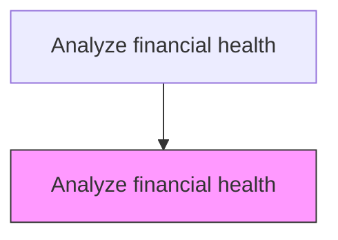
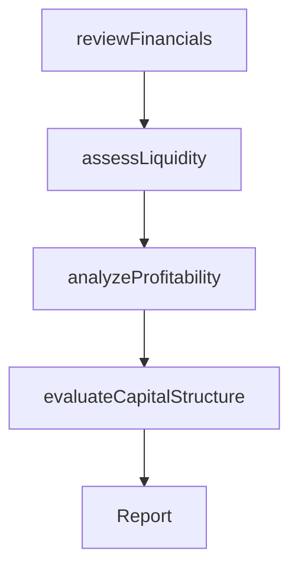

# Analyze financial health

> Business-as-Code definition for financial health analysis. Models the evaluation of the organization's financial position including liquidity, solvency, profitability, and capital structure to inform resource allocation and strategic decisions.

## Overview

Appraising the financial state of the organization so that management can create resource allocation strategies. Scrutinize the organization's financials--including balance sheets, statements of income, cash-flows, equity holdings, and liquidity--with the objective of understanding the organization's financial health and capacities. (This analysis directly feeds into Conduct organizational restructuring opportunities [16792] and Define a business concept and long-term vision [17040].)

## Process Hierarchy



## GraphDL

```yaml
analyze:
  object: Financial Health
  actor: FinancialAnalyst
  result: FinancialHealthReport
```

## Actions

| Action | Description |
|--------|-------------|
| reviewFinancials | Examine balance sheets, income statements, and cash flow statements |
| assessLiquidity | Evaluate the organization's ability to meet short-term obligations |
| analyzeProfitability | Measure profit margins, return on equity, and earnings trends |
| evaluateCapitalStructure | Assess the mix of debt and equity and its impact on financial risk |

## Events

| Event | Description |
|-------|-------------|
| financialsReviewed | Financial statement review completed |
| liquidityAssessed | Liquidity analysis finalized |
| profitabilityAnalyzed | Profitability metrics evaluated |
| capitalStructureEvaluated | Capital structure assessment completed |

## Searches

| Search | Description |
|--------|-------------|
| getFinancialRatios | Retrieve key financial ratios by period |
| getLiquidityMetrics | Access current and quick ratio data over time |
| getProfitabilityTrends | Retrieve margin and earnings trends |

## Process Flow



## RACI Matrix

| Activity | Responsible | Accountable | Consulted | Informed |
|----------|-------------|-------------|-----------|----------|
| reviewFinancials | FinancialAnalyst | CFO | Accounting | Executive |
| assessLiquidity | TreasuryAnalyst | CFO | Banking | BoardOfDirectors |
| analyzeProfitability | FinancialAnalyst | CFO | BusinessUnits | VP Strategy |

## Related Processes

| Process | Relationship |
|---------|-------------|
| 1.1.5 Conduct organization restructuring opportunities | Downstream - financial health informs restructuring decisions |
| 1.2.9 Develop financial strategies | Downstream - analysis informs financial strategy formulation |
| 8.0 Manage Financial Resources | Related - ongoing financial management and reporting |

## Related Departments

| Department | Role |
|-----------|------|
| Finance | Leads financial analysis and reporting |
| Accounting | Provides financial statement data |
| Treasury | Assesses liquidity and capital markets position |

## Related Occupations

| Occupation | Involvement |
|-----------|-------------|
| Financial Analyst | Primary executor of financial health analysis |
| Treasury Analyst | Evaluates liquidity and cash position |
| Controller | Provides audited financial data |

## KPIs

| KPI | Description | Unit |
|-----|-------------|------|
| Current Ratio | Ratio of current assets to current liabilities | Ratio |
| Net Profit Margin | Net income as a percentage of revenue | % |
| Debt-to-Equity Ratio | Total debt divided by total shareholder equity | Ratio |

## Usage

```typescript
import { analyzeFinancialHealth } from '@headlessly/analyze-financial-health'

const financial = analyzeFinancialHealth()

// Review financial statements
const review = await financial.reviewFinancials({
  period: 'trailing-4-quarters',
  statements: ['balance-sheet', 'income-statement', 'cash-flow']
})

// Analyze profitability trends
const profitability = await financial.analyzeProfitability({
  metrics: ['gross-margin', 'operating-margin', 'net-margin', 'ROE'],
  benchmarkAgainst: 'industry-median'
})
```
