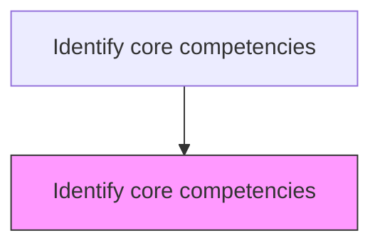
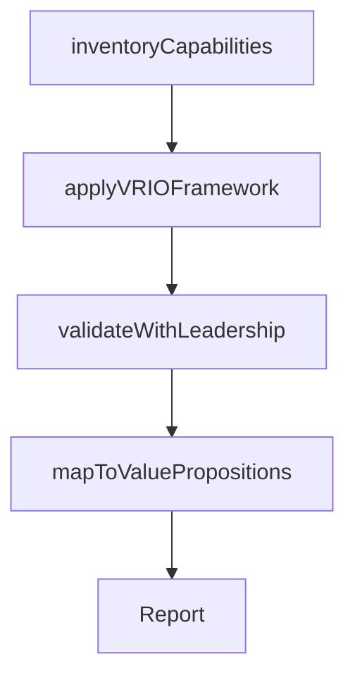

# Identify core competencies

> Business-as-Code definition for core competency identification. Models the discovery and validation of distinctive organizational capabilities that provide sustainable competitive advantage in the marketplace.

## Overview

Determining a strategically significant aggregate of competence and capacities that differentiates the organization in the market. Identify distinguishing attributes including unique skills and resources and its brand and services in the marketplace. Have senior executives and management personnel assess competencies in order to further develop these capabilities into distinct commercial value propositions.

## Process Hierarchy



## GraphDL

```yaml
identify:
  object: Core Competencies
  actor: VP Strategy
  result: CoreCompetencyMap
```

## Actions

| Action | Description |
|--------|-------------|
| inventoryCapabilities | Catalog organizational skills, resources, and knowledge assets |
| applyVRIOFramework | Evaluate capabilities for value, rarity, inimitability, and organization |
| validateWithLeadership | Confirm core competencies through executive assessment workshops |
| mapToValuePropositions | Link core competencies to commercial value propositions |

## Events

| Event | Description |
|-------|-------------|
| capabilitiesInventoried | Organizational capabilities catalog compiled |
| vrioApplied | VRIO framework analysis completed |
| leadershipValidated | Executive competency validation workshops concluded |
| competenciesMapped | Core competencies linked to value propositions |

## Searches

| Search | Description |
|--------|-------------|
| getCoreCompetencies | Retrieve identified core competencies and their VRIO ratings |
| getCapabilityInventory | Access the full organizational capability inventory |
| getCompetencyGaps | Identify capability gaps relative to strategic needs |

## Process Flow



## RACI Matrix

| Activity | Responsible | Accountable | Consulted | Informed |
|----------|-------------|-------------|-----------|----------|
| inventoryCapabilities | StrategyAnalyst | VP Strategy | HR, Operations | Executive |
| applyVRIOFramework | StrategyAnalyst | VP Strategy | BusinessUnitLeads | Finance |
| validateWithLeadership | VP Strategy | CEO | BoardOfDirectors | AllManagers |

## Related Processes

| Process | Relationship |
|---------|-------------|
| 1.1.3.1 Analyze organizational characteristics | Upstream - organizational profile feeds competency identification |
| 1.2.6.2 Identify core competency for each business unit | Downstream - enterprise competencies guide BU-level analysis |
| 1.2.2 Define and evaluate strategic options | Downstream - competencies constrain strategic option selection |

## Related Departments

| Department | Role |
|-----------|------|
| Strategy | Leads competency identification and VRIO analysis |
| Human Resources | Provides skills and talent data |
| Operations | Contributes operational capability insights |

## Related Occupations

| Occupation | Involvement |
|-----------|-------------|
| Strategy Analyst | Conducts competency analysis using VRIO framework |
| Organizational Development Specialist | Assesses skills and knowledge assets |
| VP Strategy | Validates and champions core competency findings |

## KPIs

| KPI | Description | Unit |
|-----|-------------|------|
| Competency Count | Number of validated core competencies | Count |
| Competitive Advantage Duration | Estimated sustainability of core competency advantage | Years |
| Competency Utilization | Percentage of core competencies actively leveraged in products | % |

## Usage

```typescript
import { identifyCoreCompetencies } from '@headlessly/identify-core-competencies'

const competencies = identifyCoreCompetencies()

// Inventory organizational capabilities
const capabilities = await competencies.inventoryCapabilities({
  scope: 'enterprise',
  categories: ['technology', 'talent', 'processes', 'brand', 'IP']
})

// Apply VRIO framework analysis
const vrio = await competencies.applyVRIOFramework({
  capabilityIds: capabilities.map(c => c.id),
  peerComparison: 'industry-leaders'
})
```
