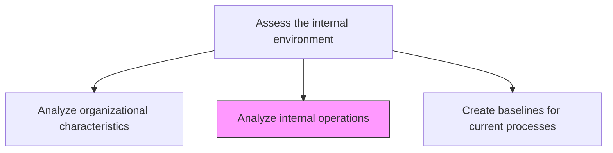
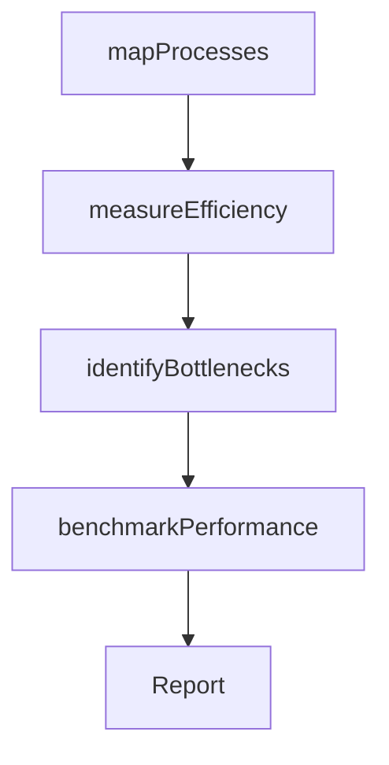

# Analyze internal operations

> Business-as-Code definition for internal operations analysis. Models the measurement and evaluation of operational efficiency, throughput, quality, and resource utilization across the organization's core business processes.

## Overview

Identify key elements of operations and measure effectiveness of these elements within internal operations.

## Process Hierarchy



## GraphDL

```yaml
analyze:
  object: Internal Operations
  actor: ProcessEngineer
  result: OperationsAssessmentReport
```

## Actions

| Action | Description |
|--------|-------------|
| mapProcesses | Document current operational processes and workflows |
| measureEfficiency | Quantify throughput, cycle time, and resource utilization |
| identifyBottlenecks | Locate constraints and inefficiencies in operational workflows |
| benchmarkPerformance | Compare operational metrics against industry standards |

## Events

| Event | Description |
|-------|-------------|
| processesMapped | Operational processes documented and workflow maps created |
| efficiencyMeasured | Operational performance metrics collected and analyzed |
| bottlenecksIdentified | Process constraints and inefficiencies located |
| performanceBenchmarked | Metrics compared against industry benchmarks |

## Searches

| Search | Description |
|--------|-------------|
| getOperationsMetrics | Retrieve operational performance data by process or department |
| getBottlenecks | List identified bottlenecks by severity and impact |
| getBenchmarkComparison | Access benchmark comparison results |

## Process Flow



## RACI Matrix

| Activity | Responsible | Accountable | Consulted | Informed |
|----------|-------------|-------------|-----------|----------|
| mapProcesses | ProcessEngineer | COO | DepartmentHeads | Strategy |
| measureEfficiency | OperationsAnalyst | COO | Finance | VP Strategy |
| identifyBottlenecks | ProcessEngineer | COO | QualityAssurance | Operations |
| benchmarkPerformance | OperationsAnalyst | COO | ExternalConsultant | Executive |

## Related Processes

| Process | Relationship |
|---------|-------------|
| 1.1.3.1 Analyze organizational characteristics | Sibling - organizational attributes inform operational context |
| 1.1.3.3 Create baselines for current processes | Downstream - analysis data feeds baseline creation |
| 1.2.2.11 Develop lean/continuous improvement strategy | Downstream - operational analysis drives improvement strategy |

## Related Departments

| Department | Role |
|-----------|------|
| Operations | Primary owner of internal operations analysis |
| Quality Assurance | Provides quality and defect data |
| Finance | Contributes cost and resource utilization data |

## Related Occupations

| Occupation | Involvement |
|-----------|-------------|
| Process Engineer | Maps processes and identifies inefficiencies |
| Operations Analyst | Measures performance and conducts benchmarking |
| Quality Engineer | Provides quality performance data |

## KPIs

| KPI | Description | Unit |
|-----|-------------|------|
| Process Efficiency Ratio | Output value relative to input resources consumed | Ratio |
| Cycle Time | Average time to complete key operational processes | Hours |
| Bottleneck Count | Number of active process bottlenecks | Count |

## Usage

```typescript
import { analyzeInternalOperations } from '@headlessly/analyze-internal-operations'

const operations = analyzeInternalOperations()

// Map and measure operational processes
const processMap = await operations.mapProcesses({
  scope: ['order-to-cash', 'procure-to-pay'],
  includeSubProcesses: true
})

// Identify bottlenecks
const bottlenecks = await operations.identifyBottlenecks({
  processMapId: processMap.id,
  threshold: { cycleTimeVariance: 20, errorRate: 5 }
})
```
