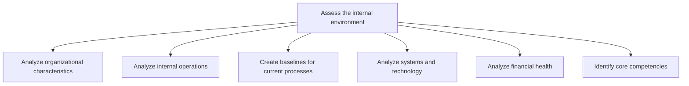
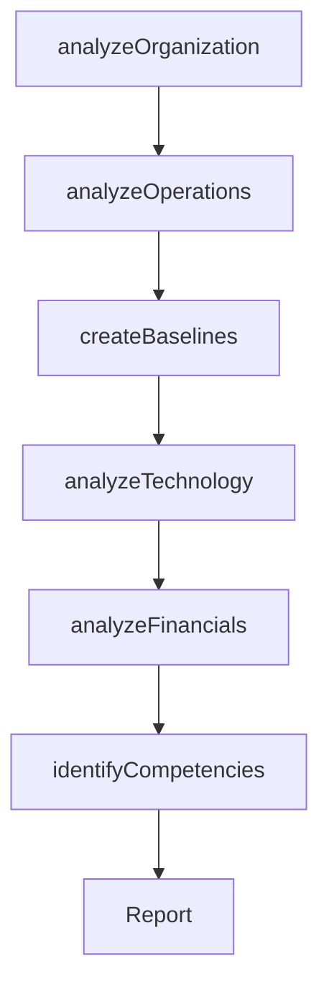

# Assess the internal environment

> Business-as-Code definition for internal environment assessment. Models the analysis of organizational characteristics, operations, processes, technology systems, financial health, and core competencies to identify strengths and areas for improvement.

## Overview

Undertaking a review of the organization's in-house skills and resources in order to create a big-picture understanding of internal capacities. Assess the organization's capabilities in order to advance the advantageous and weed out the detrimental aspects. Identify synergic associations within the backdrop of the forces and players active in the market, and take into account all externalities.

## Process Hierarchy



## GraphDL

```yaml
assess:
  object: Internal Environment
  actor: OperationsAnalyst
  result: InternalAssessmentReport
```

## Actions

| Action | Description |
|--------|-------------|
| analyzeOrganization | Examine organizational structure, culture, and governance characteristics |
| analyzeOperations | Evaluate internal operations for efficiency and effectiveness |
| createBaselines | Establish performance baselines for current business processes |
| analyzeTechnology | Assess the maturity and capability of deployed systems and technology |
| analyzeFinancials | Review the organization's financial health and resource position |
| identifyCompetencies | Determine the core competencies that differentiate the organization |

## Events

| Event | Description |
|-------|-------------|
| organizationAnalyzed | Organizational characteristics assessment completed |
| operationsAnalyzed | Internal operations efficiency review finalized |
| baselinesCreated | Process performance baselines established |
| technologyAnalyzed | Technology systems maturity assessment completed |
| financialsAnalyzed | Financial health review completed |
| competenciesIdentified | Core competencies documented and validated |

## Searches

| Search | Description |
|--------|-------------|
| getInternalAssessment | Retrieve the latest internal environment assessment report |
| getProcessBaselines | Access performance baselines for specified business processes |
| getCoreCompetencies | List identified core competencies and their maturity levels |
| getFinancialHealth | Retrieve financial health indicators and trend data |

## Process Flow



## RACI Matrix

| Activity | Responsible | Accountable | Consulted | Informed |
|----------|-------------|-------------|-----------|----------|
| analyzeOrganization | OperationsAnalyst | VP Strategy | HR, Legal | Executive |
| analyzeOperations | ProcessEngineer | COO | DepartmentHeads | Strategy |
| createBaselines | ProcessEngineer | COO | QualityAssurance | Finance |
| analyzeTechnology | ITArchitect | CTO | Engineering | Operations |
| analyzeFinancials | FinancialAnalyst | CFO | Accounting | Strategy |

## Sub-Processes

| ID | Name | Description |
|----|------|-------------|
| 1.1.3.1 | Analyze organizational characteristics | Identifying and examining key attributes that differentiate the organization in the market and those |
| 1.1.3.2 | Analyze internal operations | Identify key elements of operations and measure effectiveness of these elements within internal oper |
| 1.1.3.3 | Create baselines for current processes | Establishing baselines that provide standards for assessing performance levels and allow for a relat |
| 1.1.3.4 | Analyze systems and technology | Analyzing the capabilities of technology and process automation systems deployed within the organiza |
| 1.1.3.5 | Analyze financial health | Appraising the financial state of the organization so that management can create resource allocation |
| 1.1.3.6 | Identify core competencies | Determining a strategically significant aggregate of competence and capacities that differentiates t |

## Related Processes

| Process | Relationship |
|---------|-------------|
| 1.1.1 Assess the external environment | Complementary - internal and external assessments form SWOT analysis |
| 1.1.4 Establish strategic vision | Downstream - internal capabilities shape achievable vision |
| 1.2.4 Create organizational design | Downstream - assessment informs organizational redesign |

## Related Departments

| Department | Role |
|-----------|------|
| Strategy | Coordinates the overall internal assessment |
| Operations | Provides operational performance data and process insights |
| Finance | Contributes financial health analysis and resource data |
| Information Technology | Assesses technology systems and infrastructure maturity |
| Human Resources | Evaluates workforce capabilities and organizational culture |

## Related Occupations

| Occupation | Involvement |
|-----------|-------------|
| Operations Analyst | Evaluates process efficiency and operational performance |
| Financial Analyst | Assesses financial health and capital position |
| IT Architect | Reviews technology infrastructure and capabilities |
| Organizational Development Specialist | Analyzes culture and competency gaps |

## KPIs

| KPI | Description | Unit |
|-----|-------------|------|
| Process Maturity Score | Average maturity level of assessed business processes | Score (1-5) |
| Technology Readiness Index | Assessment of technology stack capability and modernization | Score (1-10) |
| Financial Health Ratio | Composite financial health indicator (liquidity, solvency, efficiency) | Ratio |
| Competency Gap Count | Number of critical competency gaps identified | Count |

## Usage

```typescript
import { assessInternalEnvironment } from '@headlessly/assess-internal-environment'

const internal = assessInternalEnvironment()

// Analyze organizational characteristics
const orgProfile = await internal.analyzeOrganization({
  areas: ['structure', 'culture', 'governance'],
  benchmarkAgainst: 'industry-median'
})

// Create baselines for current processes
const baselines = await internal.createBaselines({
  processes: ['order-to-cash', 'procure-to-pay', 'hire-to-retire'],
  metrics: ['cycle-time', 'cost-per-transaction', 'error-rate']
})

// Identify core competencies
const competencies = await internal.identifyCompetencies({
  method: 'VRIO',
  scope: 'enterprise'
})
```
