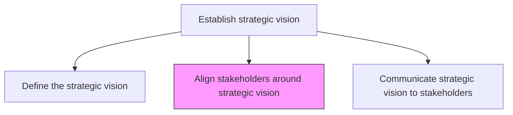
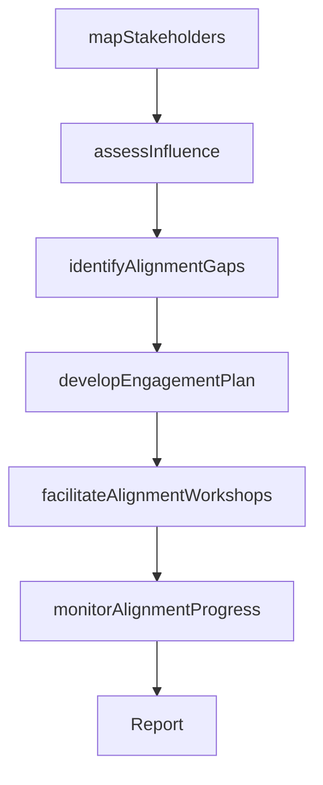

# Align stakeholders around strategic vision

> Business-as-Code definition for stakeholder alignment around strategic vision. Models the mapping, engagement, and orientation of key organizational stakeholders to ensure unified support for the strategic direction.

## Overview

Orienting those entities, associated with the organization that have a direct bearing on its operations and output, in a way that advances its strategic vision. Map all stakeholders in strategic configurations, within the architectural layout of the marketplace, and position the organization relative to them. (This exercise is undertaken by senior strategy personnel, drawing upon the process Define a business concept and long-term vision [17040].)

## Process Hierarchy



## GraphDL

```yaml
align:
  object: Stakeholders Around Strategic Vision
  actor: VP Strategy
  result: StakeholderAlignmentMap
```

## Actions

| Action | Description |
|--------|-------------|
| mapStakeholders | Identify and catalog all internal and external stakeholders |
| assessInfluence | Evaluate each stakeholder's influence, interest, and impact on strategy |
| identifyAlignmentGaps | Detect misalignments between stakeholder priorities and strategic vision |
| developEngagementPlan | Create targeted engagement strategies for each stakeholder group |
| facilitateAlignmentWorkshops | Conduct workshops to build consensus around strategic direction |
| monitorAlignmentProgress | Track stakeholder buy-in and commitment levels over time |

## Events

| Event | Description |
|-------|-------------|
| stakeholdersMapped | Stakeholder inventory and classification completed |
| influenceAssessed | Stakeholder influence and interest analysis finalized |
| alignmentGapsIdentified | Misalignment areas between stakeholders and vision documented |
| engagementPlanDeveloped | Targeted stakeholder engagement strategies created |
| alignmentWorkshopsConducted | Consensus-building workshops completed |
| alignmentProgressMonitored | Stakeholder buy-in metrics updated |

## Searches

| Search | Description |
|--------|-------------|
| getStakeholderMap | Retrieve the stakeholder map with influence and interest ratings |
| getAlignmentGaps | List alignment gaps by stakeholder group and severity |
| getEngagementPlan | Access engagement strategies for specific stakeholder segments |
| getAlignmentMetrics | Retrieve stakeholder buy-in and commitment scores |

## Process Flow



## RACI Matrix

| Activity | Responsible | Accountable | Consulted | Informed |
|----------|-------------|-------------|-----------|----------|
| mapStakeholders | StrategyAnalyst | VP Strategy | BusinessUnitLeads | CEO |
| assessInfluence | StrategyAnalyst | VP Strategy | InvestorRelations | BoardOfDirectors |
| identifyAlignmentGaps | VP Strategy | CEO | ExecutiveTeam | HumanResources |
| developEngagementPlan | VP Strategy | CEO | CorporateCommunications | Marketing |
| facilitateAlignmentWorkshops | VP Strategy | CEO | ExternalFacilitator | AllManagers |

## Related Processes

| Process | Relationship |
|---------|-------------|
| 1.1.4.1 Define the strategic vision | Upstream - vision definition precedes alignment |
| 1.1.4.3 Communicate strategic vision to stakeholders | Downstream - alignment informs communication strategy |
| 1.2.1 Define the mission | Related - mission clarity supports stakeholder alignment |

## Related Departments

| Department | Role |
|-----------|------|
| Strategy | Leads stakeholder mapping and alignment activities |
| Corporate Communications | Develops messaging for stakeholder engagement |
| Investor Relations | Manages alignment with shareholders and financial stakeholders |
| Human Resources | Facilitates internal employee alignment and engagement |

## Related Occupations

| Occupation | Involvement |
|-----------|-------------|
| VP Strategy | Leads stakeholder alignment and engagement planning |
| Strategy Analyst | Conducts stakeholder mapping and influence analysis |
| Investor Relations Manager | Engages financial stakeholders on strategic direction |
| Change Management Specialist | Facilitates alignment workshops and monitors adoption |

## KPIs

| KPI | Description | Unit |
|-----|-------------|------|
| Stakeholder Coverage | Percentage of key stakeholders formally engaged | % |
| Alignment Score | Average stakeholder agreement with strategic vision | Score (1-10) |
| Engagement Completion | Percentage of planned engagement activities completed | % |
| Consensus Rate | Proportion of stakeholders actively supporting the vision | % |

## Usage

```typescript
import { alignStakeholdersAroundStrategicVision } from '@headlessly/align-stakeholders-around-strategic-vision'

const alignment = alignStakeholdersAroundStrategicVision()

// Map stakeholders and assess influence
const stakeholders = await alignment.mapStakeholders({
  scope: ['internal', 'external'],
  categories: ['executives', 'board', 'investors', 'employees', 'partners']
})

// Identify alignment gaps
const gaps = await alignment.identifyAlignmentGaps({
  stakeholderIds: stakeholders.map(s => s.id),
  visionId: 'current-strategic-vision'
})
```
