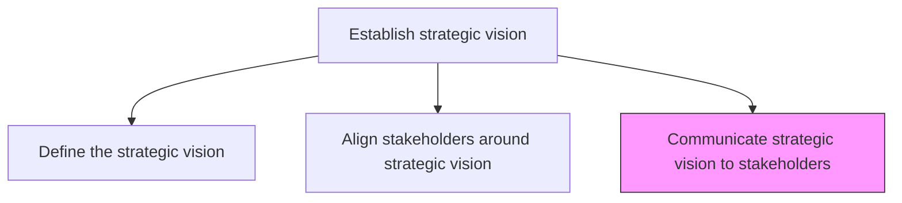
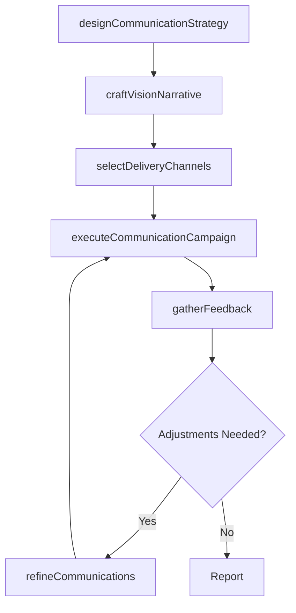

# Communicate strategic vision to stakeholders

> Business-as-Code definition for strategic vision communication. Models the design and execution of multi-channel communication campaigns to cascade the strategic vision across all stakeholder groups.

## Overview

Developing and executing communication strategies to convey an alignment plan of all organizational stakeholders, which helps the organization realize its vision. Create custom communication strategies and delivery channels with the objective of orienting stakeholders according to the configuration maps created in the process Align stakeholders around a strategic vision [10035]. Have senior strategy personnel closely collaborate with the communications/marketing team.

## Process Hierarchy



## GraphDL

```yaml
communicate:
  object: Strategic Vision To Stakeholders
  actor: CorporateCommunicationsDirector
  result: VisionCommunicationPlan
```

## Actions

| Action | Description |
|--------|-------------|
| designCommunicationStrategy | Develop a multi-channel communication plan tailored to stakeholder segments |
| craftVisionNarrative | Create compelling messaging that translates the vision into actionable narratives |
| selectDeliveryChannels | Identify optimal communication channels for each stakeholder group |
| executeCommunicationCampaign | Roll out the vision communication across all selected channels |
| gatherFeedback | Collect stakeholder feedback on vision clarity and resonance |
| refineCommunications | Adjust messaging and channels based on feedback and engagement data |

## Events

| Event | Description |
|-------|-------------|
| communicationStrategyDesigned | Multi-channel communication plan finalized |
| visionNarrativeCrafted | Vision messaging and narratives approved |
| deliveryChannelsSelected | Communication channels assigned to stakeholder groups |
| communicationCampaignExecuted | Vision communication campaign launched |
| feedbackGathered | Stakeholder feedback on vision communication collected |
| communicationsRefined | Messaging and delivery adjusted based on feedback |

## Searches

| Search | Description |
|--------|-------------|
| getCommunicationPlan | Retrieve the vision communication strategy and timeline |
| getChannelEffectiveness | Access engagement metrics by communication channel |
| getStakeholderFeedback | Retrieve feedback responses from stakeholder groups |
| getCommunicationHistory | Access historical vision communication campaigns |

## Process Flow



## RACI Matrix

| Activity | Responsible | Accountable | Consulted | Informed |
|----------|-------------|-------------|-----------|----------|
| designCommunicationStrategy | CorporateCommunicationsDirector | CEO | VP Strategy | ExecutiveTeam |
| craftVisionNarrative | CommunicationsManager | CorporateCommunicationsDirector | VP Strategy | Marketing |
| executeCommunicationCampaign | CommunicationsManager | CorporateCommunicationsDirector | HumanResources | AllEmployees |
| gatherFeedback | CommunicationsManager | CorporateCommunicationsDirector | HumanResources | VP Strategy |

## Related Processes

| Process | Relationship |
|---------|-------------|
| 1.1.4.2 Align stakeholders around strategic vision | Upstream - alignment maps inform communication targeting |
| 1.1.4.1 Define the strategic vision | Upstream - vision statement is the core communication content |
| 1.3.1 Develop and assign strategic initiatives | Downstream - communication prepares organization for initiative rollout |

## Related Departments

| Department | Role |
|-----------|------|
| Corporate Communications | Leads vision communication strategy and execution |
| Marketing | Supports external stakeholder messaging and brand alignment |
| Human Resources | Facilitates internal employee communication and engagement |
| Investor Relations | Manages vision communication to shareholders and analysts |

## Related Occupations

| Occupation | Involvement |
|-----------|-------------|
| Corporate Communications Director | Leads communication strategy design and execution |
| Communications Manager | Executes vision communication campaigns |
| Change Management Specialist | Supports employee adoption of the strategic vision |
| Investor Relations Manager | Communicates vision to financial stakeholders |

## KPIs

| KPI | Description | Unit |
|-----|-------------|------|
| Communication Reach | Percentage of stakeholders who received vision communication | % |
| Message Comprehension | Stakeholder understanding of the strategic vision | Score (1-10) |
| Channel Engagement Rate | Engagement rate across communication channels | % |
| Feedback Response Rate | Percentage of stakeholders providing feedback on vision communication | % |

## Usage

```typescript
import { communicateStrategicVisionToStakeholders } from '@headlessly/communicate-strategic-vision-to-stakeholders'

const comms = communicateStrategicVisionToStakeholders()

// Design the communication strategy
const strategy = await comms.designCommunicationStrategy({
  stakeholderSegments: ['executives', 'employees', 'investors', 'partners'],
  visionId: 'current-strategic-vision'
})

// Execute the communication campaign
const campaign = await comms.executeCommunicationCampaign({
  strategyId: strategy.id,
  channels: ['town-hall', 'email', 'intranet', 'investor-briefing']
})
```
