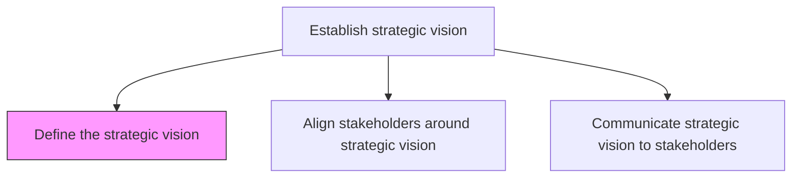
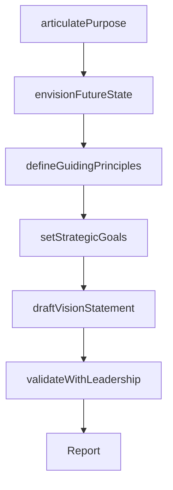

# Define the strategic vision

> Business-as-Code definition for strategic vision formulation. Models the creation and documentation of the organization's aspirational future state, guiding principles, and directional goals that drive long-term strategic planning.

## Overview

Developing goals to define organizations vision. Define and document ideas, direction, and activities which enable the organization to reach these goals.

## Process Hierarchy



## GraphDL

```yaml
define:
  object: Strategic Vision
  actor: CEO
  result: VisionStatement
```

## Actions

| Action | Description |
|--------|-------------|
| articulatePurpose | Define the organization's core purpose and reason for existence |
| envisionFutureState | Describe the desired future state of the organization |
| defineGuidingPrinciples | Establish the values and principles that guide strategic direction |
| setStrategicGoals | Formulate high-level goals that operationalize the vision |
| draftVisionStatement | Compose a concise, inspiring vision statement |
| validateWithLeadership | Review and refine the vision with the executive team |

## Events

| Event | Description |
|-------|-------------|
| purposeArticulated | Core organizational purpose formally defined |
| futureStateEnvisioned | Desired future state documented and described |
| guidingPrinciplesDefined | Strategic guiding principles established |
| strategicGoalsSet | High-level strategic goals formulated |
| visionStatementDrafted | Vision statement composed and reviewed |
| leadershipValidated | Executive team endorsed the strategic vision |

## Searches

| Search | Description |
|--------|-------------|
| getVisionStatement | Retrieve the current strategic vision statement |
| getStrategicGoals | Access the strategic goals linked to the vision |
| getGuidingPrinciples | List the guiding principles and values |
| getVisionHistory | Retrieve historical vision statements and evolution |

## Process Flow



## RACI Matrix

| Activity | Responsible | Accountable | Consulted | Informed |
|----------|-------------|-------------|-----------|----------|
| articulatePurpose | CEO | BoardOfDirectors | ExecutiveTeam | AllEmployees |
| envisionFutureState | CEO | BoardOfDirectors | VP Strategy | ExecutiveTeam |
| setStrategicGoals | VP Strategy | CEO | BusinessUnitLeads | Finance |
| draftVisionStatement | VP Strategy | CEO | CorporateCommunications | Marketing |
| validateWithLeadership | CEO | BoardOfDirectors | ExecutiveTeam | LegalCounsel |

## Related Processes

| Process | Relationship |
|---------|-------------|
| 1.1.4.2 Align stakeholders around strategic vision | Downstream - vision feeds stakeholder alignment |
| 1.1.4.3 Communicate strategic vision to stakeholders | Downstream - vision must be communicated broadly |
| 1.1.3 Assess the internal environment | Upstream - internal assessment informs vision |
| 1.1.1 Assess the external environment | Upstream - external landscape shapes vision |

## Related Departments

| Department | Role |
|-----------|------|
| Executive Office | Leads vision definition and endorsement |
| Strategy | Translates vision into strategic goals and frameworks |
| Corporate Communications | Assists in crafting vision language |
| Human Resources | Ensures vision reflects organizational culture |

## Related Occupations

| Occupation | Involvement |
|-----------|-------------|
| Chief Executive Officer | Primary author and champion of the strategic vision |
| VP Strategy | Supports vision formulation with strategic analysis |
| Corporate Communications Director | Shapes vision language for stakeholder resonance |

## KPIs

| KPI | Description | Unit |
|-----|-------------|------|
| Vision Clarity Score | Employee understanding rating of the strategic vision | Score (1-10) |
| Goal Alignment | Percentage of business unit goals linked to the vision | % |
| Vision Refresh Cycle | Time since last strategic vision review or update | Months |

## Usage

```typescript
import { defineStrategicVision } from '@headlessly/define-strategic-vision'

const vision = defineStrategicVision()

// Articulate organizational purpose
const purpose = await vision.articulatePurpose({
  inputs: ['mission-statement', 'founding-principles', 'stakeholder-expectations']
})

// Draft the vision statement
const statement = await vision.draftVisionStatement({
  futureState: purpose.futureState,
  timeHorizon: '5-years',
  audience: 'all-stakeholders'
})
```
