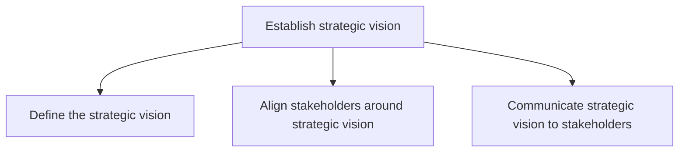
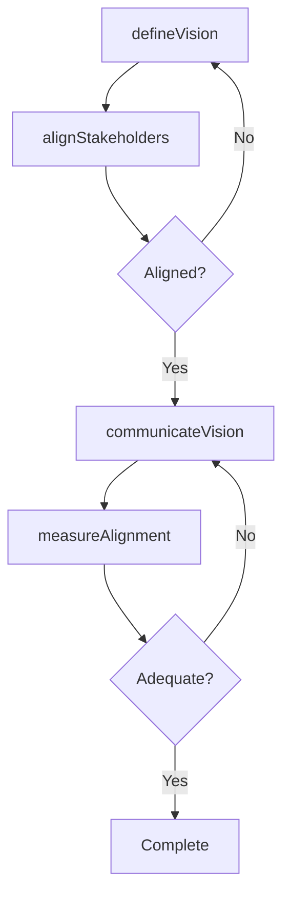

# Establish strategic vision

> Business-as-Code definition for strategic vision establishment. Models the process of defining, aligning stakeholders around, and communicating the organization's long-term strategic vision.

## Overview

Establishing the organization's long-term vision as a strategic positioning and engagement of stakeholders. Institute the vision by creating strategic orientations of all stakeholders. Understand the strategy development frameworks in this context.

## Process Hierarchy



## GraphDL

```yaml
establish:
  object: Strategic Vision
  actor: CEO
  result: VisionStatement
```

## Actions

| Action | Description |
|--------|-------------|
| defineVision | Draft the strategic vision statement with long-term direction and aspirations |
| alignStakeholders | Engage leadership and board around the strategic vision through workshops |
| communicateVision | Disseminate the approved vision through internal and external channels |
| measureAlignment | Assess the degree of stakeholder understanding and buy-in |

## Events

| Event | Description |
|-------|-------------|
| visionDefined | Strategic vision statement drafted and reviewed by leadership |
| stakeholdersAligned | Leadership and board consensus on strategic vision achieved |
| visionCommunicated | Vision distributed through all designated communication channels |
| alignmentMeasured | Stakeholder alignment assessment completed |

## Searches

| Search | Description |
|--------|-------------|
| getVisionStatement | Retrieve the current strategic vision statement and version history |
| getAlignmentScore | Access stakeholder alignment survey results |
| getCommunicationPlan | Retrieve the vision communication plan and execution status |

## Process Flow



## RACI Matrix

| Activity | Responsible | Accountable | Consulted | Informed |
|----------|-------------|-------------|-----------|----------|
| defineVision | ChiefStrategyOfficer | CEO | BoardOfDirectors | Executive |
| alignStakeholders | ChiefStrategyOfficer | CEO | BusinessUnitLeads | HR |
| communicateVision | CorporateCommunications | CEO | Marketing | AllEmployees |
| measureAlignment | HR | ChiefStrategyOfficer | CorporateCommunications | CEO |

## Sub-Processes

| ID | Name | Description |
|----|------|-------------|
| 1.1.4.1 | Define the strategic vision | Developing goals to define organizations vision. Define and document ideas, direction, and activitie |
| 1.1.4.2 | Align stakeholders around strategic vision | Orienting those entities, associated with the organization that have a direct bearing on its operati |
| 1.1.4.3 | Communicate strategic vision to stakeholders | Developing and executing communication strategies to convey an alignment plan of all organizational  |

## Related Processes

| Process | Relationship |
|---------|-------------|
| 1.1.1 Assess the external environment | Upstream - external assessment informs vision |
| 1.1.3 Assess the internal environment | Upstream - internal capabilities shape achievable vision |
| 1.2 Develop business strategy | Downstream - vision drives strategy formulation |

## Related Departments

| Department | Role |
|-----------|------|
| Executive Office | Sponsors and approves the strategic vision |
| Strategy | Drafts and refines the vision statement |
| Corporate Communications | Designs and executes the vision communication plan |
| Human Resources | Measures stakeholder alignment and engagement |

## Related Occupations

| Occupation | Involvement |
|-----------|-------------|
| Chief Executive Officer | Accountable for the strategic vision |
| Chief Strategy Officer | Drafts and facilitates vision development |
| Communications Director | Plans and executes vision rollout |

## KPIs

| KPI | Description | Unit |
|-----|-------------|------|
| Stakeholder Alignment Score | Percentage of leaders who can articulate the vision | % |
| Employee Vision Awareness | Survey-based measure of vision understanding across the workforce | Score (1-10) |
| Vision Communication Reach | Percentage of employees reached through communication channels | % |

## Usage

```typescript
import { establishStrategicVision } from '@headlessly/establish-strategic-vision'

const vision = establishStrategicVision()

// Define the strategic vision
const statement = await vision.defineVision({
  horizon: '10-year',
  themes: ['market-leadership', 'innovation', 'sustainability'],
  inputs: ['external-scan', 'internal-assessment', 'market-research']
})

// Align stakeholders through workshops
await vision.alignStakeholders({
  visionId: statement.id,
  stakeholders: ['board', 'executive-team', 'business-unit-leads']
})

// Communicate to the organization
await vision.communicateVision({
  visionId: statement.id,
  channels: ['town-hall', 'intranet', 'email', 'team-meetings']
})
```
