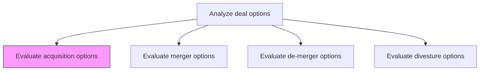
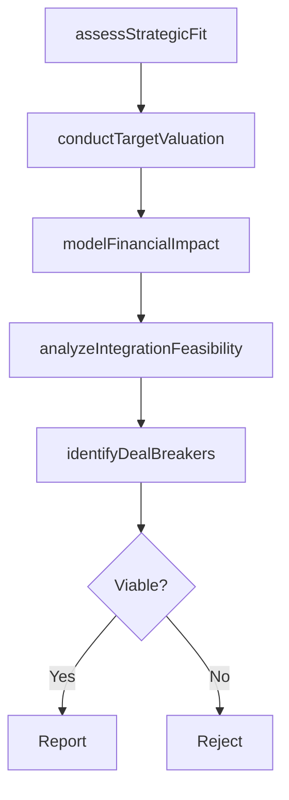

# Evaluate acquisition options

> Business-as-Code definition for acquisition option evaluation. Models the appraisal of potential acquisition targets including strategic fit assessment, financial valuation, and integration feasibility analysis.

## Overview

Appraising entities identified as being suitable for acquisition, taking into account the restructuring opportunities in the internal and external context. Verify the appropriateness and viability of the short-listed options. Ensure these entities pertain to the state-of-affairs in the market, as well as fit with the resources and capabilities of the organization.

## Process Hierarchy



## GraphDL

```yaml
evaluate:
  object: Acquisition Options
  actor: CorporateDevelopmentManager
  result: AcquisitionAssessment
```

## Actions

| Action | Description |
|--------|-------------|
| assessStrategicFit | Evaluate how the target entity complements the organization's strategic objectives |
| conductTargetValuation | Determine fair market value using multiple valuation methodologies |
| analyzeIntegrationFeasibility | Assess the complexity and cost of integrating the target into existing operations |
| modelFinancialImpact | Project the acquisition's impact on earnings, cash flow, and balance sheet |
| identifyDealBreakers | Surface material risks or incompatibilities that could preclude the acquisition |

## Events

| Event | Description |
|-------|-------------|
| strategicFitAssessed | Target entity strategic alignment evaluation completed |
| targetValuationConducted | Financial valuation of the acquisition target finalized |
| integrationFeasibilityAnalyzed | Integration complexity and cost assessment completed |
| financialImpactModeled | Pro forma financial projections prepared |
| dealBreakersIdentified | Material risks and deal-breaking factors documented |

## Searches

| Search | Description |
|--------|-------------|
| getAcquisitionTargets | Retrieve shortlisted acquisition targets with evaluation status |
| getTargetValuation | Access valuation details for a specific acquisition target |
| getIntegrationAssessment | Retrieve integration feasibility analysis for a target |

## Process Flow



## RACI Matrix

| Activity | Responsible | Accountable | Consulted | Informed |
|----------|-------------|-------------|-----------|----------|
| assessStrategicFit | CorporateDevelopmentManager | CEO | VP Strategy | BoardOfDirectors |
| conductTargetValuation | FinancialAnalyst | CFO | InvestmentBanker | CorporateDevelopmentManager |
| analyzeIntegrationFeasibility | CorporateDevelopmentAnalyst | COO | BusinessUnitLeads | HumanResources |
| identifyDealBreakers | GeneralCounsel | CEO | ExternalAdvisor | CFO |

## Related Processes

| Process | Relationship |
|---------|-------------|
| 1.1.5.3.2 Evaluate merger options | Sibling - alternative deal structure for same targets |
| 1.1.5.2 Perform due-diligence | Upstream - diligence findings feed acquisition evaluation |
| 1.1.1.9 Conduct mergers and acquisitions analysis | Related - M&A analysis provides market context |

## Related Departments

| Department | Role |
|-----------|------|
| Corporate Development | Leads acquisition evaluation and deal structuring |
| Finance | Conducts valuation and financial impact modeling |
| Legal | Assesses regulatory requirements and deal-breaking risks |
| Operations | Evaluates integration feasibility and operational synergies |

## Related Occupations

| Occupation | Involvement |
|-----------|-------------|
| Corporate Development Manager | Leads acquisition target evaluation |
| Investment Banker | Provides valuation expertise and comparable transactions |
| Financial Analyst | Builds financial models and pro forma projections |

## KPIs

| KPI | Description | Unit |
|-----|-------------|------|
| Target Evaluation Throughput | Number of acquisition targets fully evaluated per quarter | Count |
| Valuation Accuracy | Post-acquisition variance from pre-deal valuation estimate | % |
| Integration Cost Accuracy | Actual vs projected integration costs | % |

## Usage

```typescript
import { evaluateAcquisitionOptions } from '@headlessly/evaluate-acquisition-options'

const acquisition = evaluateAcquisitionOptions()

// Assess strategic fit of acquisition target
const fit = await acquisition.assessStrategicFit({
  targetEntityId: 'target-corp-123',
  strategicObjectives: ['market-expansion', 'technology-capability', 'talent-acquisition']
})

// Conduct target valuation
const valuation = await acquisition.conductTargetValuation({
  targetEntityId: 'target-corp-123',
  methods: ['DCF', 'comparable-companies', 'precedent-transactions']
})
```
