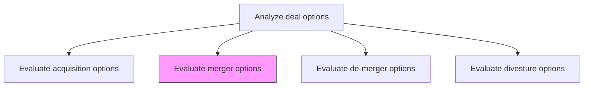
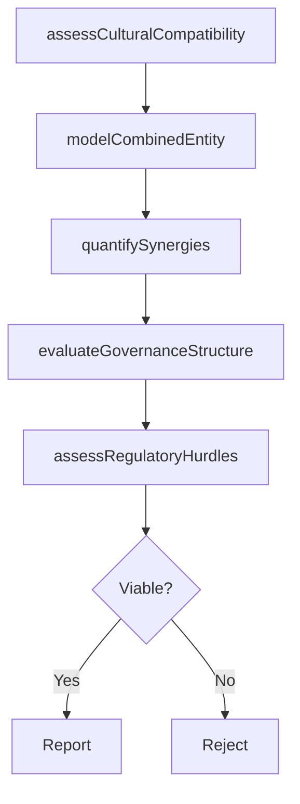

# Evaluate merger options

> Business-as-Code definition for merger option evaluation. Models the assessment of potential merger partners including cultural compatibility, combined entity valuation, governance structure, and synergy realization potential.

## Overview

Appraising entities identified as being suitable for a merger, taking stock of the restructuring opportunities within the firm and the market. Verify the appropriateness and viability of such options. Assess these entities to ensure their pertinence to the contextual state-of-affairs in the market, as well as a fit with the resources and capabilities of the organization itself. (This process can be carried out, in its entirety, by qualified in-house personnel or may be designated to specialist professional services providers.)

## Process Hierarchy



## GraphDL

```yaml
evaluate:
  object: Merger Options
  actor: CorporateDevelopmentManager
  result: MergerAssessment
```

## Actions

| Action | Description |
|--------|-------------|
| assessCulturalCompatibility | Evaluate organizational culture alignment between merging entities |
| modelCombinedEntity | Project the financial and operational profile of the merged organization |
| evaluateGovernanceStructure | Define the leadership and governance framework for the combined entity |
| quantifySynergies | Estimate revenue and cost synergies achievable through the merger |
| assessRegulatoryHurdles | Identify antitrust, regulatory, and compliance barriers to the merger |

## Events

| Event | Description |
|-------|-------------|
| culturalCompatibilityAssessed | Cultural alignment evaluation between entities completed |
| combinedEntityModeled | Financial and operational projections for merged entity prepared |
| governanceStructureEvaluated | Post-merger governance and leadership structure defined |
| synergiesQuantified | Revenue and cost synergy estimates finalized |
| regulatoryHurdlesAssessed | Regulatory and antitrust barriers evaluated |

## Searches

| Search | Description |
|--------|-------------|
| getMergerCandidates | Retrieve shortlisted merger partners with evaluation status |
| getCombinedEntityProjections | Access financial projections for the merged entity |
| getSynergyEstimates | Retrieve synergy estimates by category and timeline |
| getRegulatoryAssessment | Access regulatory and antitrust analysis for a merger option |

## Process Flow



## RACI Matrix

| Activity | Responsible | Accountable | Consulted | Informed |
|----------|-------------|-------------|-----------|----------|
| assessCulturalCompatibility | HumanResources | CorporateDevelopmentManager | OrganizationalDevelopment | CEO |
| modelCombinedEntity | FinancialAnalyst | CFO | InvestmentBanker | CorporateDevelopmentManager |
| evaluateGovernanceStructure | GeneralCounsel | CEO | BoardOfDirectors | VP Strategy |
| quantifySynergies | CorporateDevelopmentAnalyst | CFO | BusinessUnitLeads | COO |
| assessRegulatoryHurdles | GeneralCounsel | CEO | ExternalLegalCounsel | CFO |

## Related Processes

| Process | Relationship |
|---------|-------------|
| 1.1.5.3.1 Evaluate acquisition options | Sibling - alternative deal structure for same targets |
| 1.1.5.3.3 Evaluate de-merger options | Sibling - reverse transaction analysis |
| 1.1.5.2 Perform due-diligence | Upstream - diligence findings inform merger evaluation |

## Related Departments

| Department | Role |
|-----------|------|
| Corporate Development | Leads merger evaluation and deal structuring |
| Finance | Models combined entity financials and synergy projections |
| Legal | Assesses regulatory requirements and governance structures |
| Human Resources | Evaluates cultural compatibility and workforce integration |

## Related Occupations

| Occupation | Involvement |
|-----------|-------------|
| Corporate Development Manager | Leads merger partner evaluation |
| Investment Banker | Provides merger valuation and structuring advisory |
| General Counsel | Assesses regulatory and governance implications |
| Organizational Development Specialist | Evaluates cultural fit and integration readiness |

## KPIs

| KPI | Description | Unit |
|-----|-------------|------|
| Cultural Compatibility Score | Assessment of organizational culture alignment | Score (1-10) |
| Projected Synergy Value | Estimated total synergy value from the merger | Currency |
| Regulatory Risk Level | Assessed likelihood of regulatory impediment | Score (1-5) |
| Time to Merger Close | Estimated timeline from evaluation to merger completion | Months |

## Usage

```typescript
import { evaluateMergerOptions } from '@headlessly/evaluate-merger-options'

const merger = evaluateMergerOptions()

// Assess cultural compatibility with a merger partner
const culture = await merger.assessCulturalCompatibility({
  partnerEntityId: 'partner-corp-456',
  dimensions: ['leadership-style', 'decision-making', 'innovation-orientation', 'risk-tolerance']
})

// Model the combined entity financials
const combined = await merger.modelCombinedEntity({
  partnerEntityId: 'partner-corp-456',
  projectionPeriod: '5-years',
  scenarios: ['base', 'upside', 'downside']
})
```
