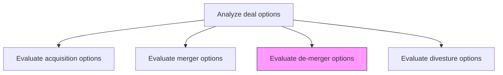
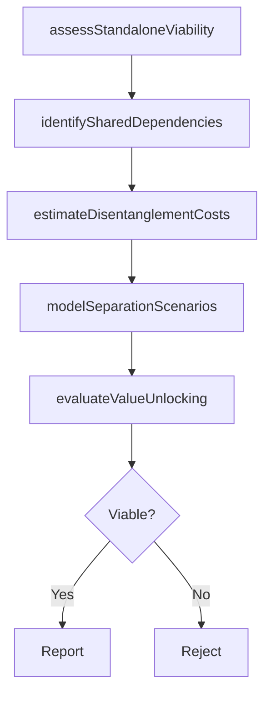

# Evaluate de-merger options

> Business-as-Code definition for de-merger option evaluation. Models the assessment of separation scenarios for previously merged entities or subsidiaries, including standalone viability, value unlocking potential, and operational disentanglement planning.

## Overview

Evaluating departments and subsidiaries within the organization, and/or previously merged entities, to assess the appropriateness of a de-merger, taking account of the fit between these entities as well as any relevant externalities. Examine the pertinence and soundness of a formalized dissociation.

## Process Hierarchy



## GraphDL

```yaml
evaluate:
  object: De-merger Options
  actor: CorporateDevelopmentManager
  result: DeMergerAssessment
```

## Actions

| Action | Description |
|--------|-------------|
| assessStandaloneViability | Evaluate whether each entity can operate independently with sufficient capabilities |
| modelSeparationScenarios | Project financial outcomes under various de-merger structures |
| identifySharedDependencies | Catalog shared systems, contracts, resources, and IP that require disentanglement |
| estimateDisentanglementCosts | Quantify the costs and timeline for operational separation |
| evaluateValueUnlocking | Assess whether separation would unlock shareholder value for either entity |

## Events

| Event | Description |
|-------|-------------|
| standaloneViabilityAssessed | Independent operating capability evaluation completed |
| separationScenariosModeled | Financial projections for de-merger options prepared |
| sharedDependenciesIdentified | Shared resources and dependencies cataloged |
| disentanglementCostsEstimated | Separation cost and timeline estimates finalized |
| valueUnlockingEvaluated | Shareholder value impact analysis completed |

## Searches

| Search | Description |
|--------|-------------|
| getDeMergerCandidates | Retrieve entities or divisions evaluated for de-merger |
| getSeparationScenarios | Access financial projections for each de-merger scenario |
| getSharedDependencies | List shared dependencies requiring disentanglement |

## Process Flow



## RACI Matrix

| Activity | Responsible | Accountable | Consulted | Informed |
|----------|-------------|-------------|-----------|----------|
| assessStandaloneViability | CorporateDevelopmentAnalyst | CorporateDevelopmentManager | BusinessUnitLeads | CEO |
| identifySharedDependencies | CorporateDevelopmentAnalyst | COO | IT | HumanResources |
| estimateDisentanglementCosts | FinancialAnalyst | CFO | Operations | CorporateDevelopmentManager |
| evaluateValueUnlocking | CorporateDevelopmentManager | CEO | InvestorRelations | BoardOfDirectors |

## Related Processes

| Process | Relationship |
|---------|-------------|
| 1.1.5.3.2 Evaluate merger options | Sibling - reverse analysis of previous mergers |
| 1.1.5.3.4 Evaluate divesture options | Sibling - alternative separation mechanism |
| 1.1.5.2 Perform due-diligence | Upstream - diligence findings inform de-merger evaluation |

## Related Departments

| Department | Role |
|-----------|------|
| Corporate Development | Leads de-merger evaluation and scenario modeling |
| Finance | Projects financial impact and standalone economics |
| Legal | Assesses regulatory and contractual separation requirements |
| Information Technology | Evaluates systems disentanglement complexity |

## Related Occupations

| Occupation | Involvement |
|-----------|-------------|
| Corporate Development Manager | Leads de-merger evaluation and recommendation |
| Financial Analyst | Models standalone economics and separation costs |
| General Counsel | Assesses legal and regulatory separation requirements |
| Enterprise Architect | Evaluates technology and systems disentanglement |

## KPIs

| KPI | Description | Unit |
|-----|-------------|------|
| Standalone Viability Score | Assessment of independent operating capability | Score (1-10) |
| Disentanglement Cost Estimate | Projected total cost of operational separation | Currency |
| Value Unlocking Potential | Estimated incremental shareholder value from de-merger | Currency |
| Separation Timeline | Projected duration of the de-merger process | Months |

## Usage

```typescript
import { evaluateDeMergerOptions } from '@headlessly/evaluate-de-merger-options'

const deMerger = evaluateDeMergerOptions()

// Assess standalone viability of a business unit
const viability = await deMerger.assessStandaloneViability({
  entityId: 'business-unit-789',
  dimensions: ['revenue-independence', 'operational-capability', 'talent-retention', 'customer-base']
})

// Estimate disentanglement costs
const costs = await deMerger.estimateDisentanglementCosts({
  entityId: 'business-unit-789',
  categories: ['systems', 'contracts', 'facilities', 'workforce']
})
```
