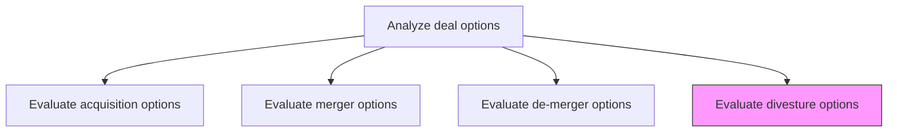
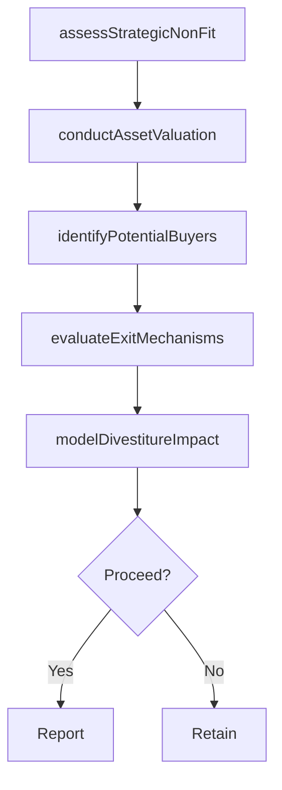

# Evaluate divesture options

> Business-as-Code definition for divestiture option evaluation. Models the assessment of business units, subsidiaries, or assets for potential sale, spin-off, or liquidation, including buyer identification, valuation, and strategic impact analysis.

## Overview

Evaluating departments and/or subsidiaries within the organization to assess the appropriateness of a divestment, taking account of all market externalities. Examine any internal entities that have been identified to be suitable for dismemberment from the organization. Ensure the pertinence and soundness of such a move.

## Process Hierarchy



## GraphDL

```yaml
evaluate:
  object: Divesture Options
  actor: CorporateDevelopmentManager
  result: DivestitureAssessment
```

## Actions

| Action | Description |
|--------|-------------|
| assessStrategicNonFit | Evaluate why the business unit or asset no longer aligns with core strategy |
| conductAssetValuation | Determine fair market value of the entity or assets being divested |
| identifyPotentialBuyers | Screen and shortlist potential acquirers or investors |
| modelDivestitureImpact | Project the financial and operational impact on the remaining organization |
| evaluateExitMechanisms | Compare divestiture structures including sale, spin-off, carve-out, and liquidation |

## Events

| Event | Description |
|-------|-------------|
| strategicNonFitAssessed | Rationale for divestiture documented and validated |
| assetValuationConducted | Fair market valuation of divestiture candidate completed |
| potentialBuyersIdentified | Prospective acquirers or investors shortlisted |
| divestitureImpactModeled | Impact on remaining organization projected |
| exitMechanismsEvaluated | Divestiture structures compared and recommended |

## Searches

| Search | Description |
|--------|-------------|
| getDivestitureCandidates | Retrieve entities or assets evaluated for divestiture |
| getAssetValuation | Access valuation details for a specific divestiture candidate |
| getPotentialBuyers | List identified potential acquirers with qualification status |
| getDivestitureImpact | Retrieve projected financial and operational impact of divestiture |

## Process Flow



## RACI Matrix

| Activity | Responsible | Accountable | Consulted | Informed |
|----------|-------------|-------------|-----------|----------|
| assessStrategicNonFit | CorporateDevelopmentManager | CEO | VP Strategy | BoardOfDirectors |
| conductAssetValuation | FinancialAnalyst | CFO | InvestmentBanker | CorporateDevelopmentManager |
| identifyPotentialBuyers | CorporateDevelopmentAnalyst | CorporateDevelopmentManager | InvestmentBanker | GeneralCounsel |
| modelDivestitureImpact | FinancialAnalyst | CFO | COO | InvestorRelations |

## Related Processes

| Process | Relationship |
|---------|-------------|
| 1.1.5.3.3 Evaluate de-merger options | Sibling - alternative separation mechanism |
| 1.1.5.3.1 Evaluate acquisition options | Sibling - buyer-side perspective of same transaction type |
| 1.1.5.2 Perform due-diligence | Upstream - diligence findings inform divestiture evaluation |

## Related Departments

| Department | Role |
|-----------|------|
| Corporate Development | Leads divestiture evaluation and buyer identification |
| Finance | Conducts asset valuation and impact modeling |
| Legal | Structures divestiture transactions and manages regulatory requirements |
| Investor Relations | Manages communication of divestiture rationale to shareholders |

## Related Occupations

| Occupation | Involvement |
|-----------|-------------|
| Corporate Development Manager | Leads divestiture evaluation and recommendation |
| Investment Banker | Provides valuation advisory and buyer identification |
| Financial Analyst | Models financial impact and asset valuation |
| Investor Relations Manager | Communicates divestiture strategy to financial stakeholders |

## KPIs

| KPI | Description | Unit |
|-----|-------------|------|
| Asset Valuation Premium | Sale price relative to book value of divested assets | % |
| Time to Close | Duration from divestiture decision to transaction completion | Months |
| Remaining Entity Impact | Change in earnings per share for the remaining organization | Currency |
| Buyer Pipeline Depth | Number of qualified potential acquirers identified | Count |

## Usage

```typescript
import { evaluateDivestureOptions } from '@headlessly/evaluate-divesture-options'

const divestiture = evaluateDivestureOptions()

// Assess strategic non-fit rationale
const nonFit = await divestiture.assessStrategicNonFit({
  entityId: 'subsidiary-321',
  criteria: ['strategic-alignment', 'growth-trajectory', 'capital-requirements', 'market-position']
})

// Identify potential buyers
const buyers = await divestiture.identifyPotentialBuyers({
  entityId: 'subsidiary-321',
  buyerTypes: ['strategic', 'financial-sponsor', 'management-buyout'],
  minimumQualification: 'letter-of-intent'
})
```
