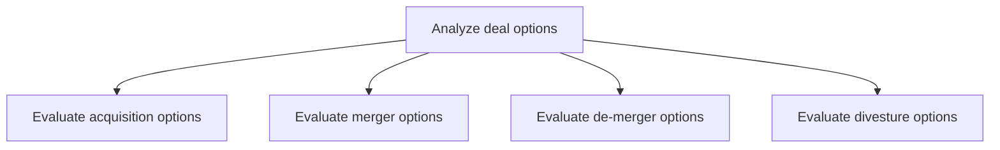
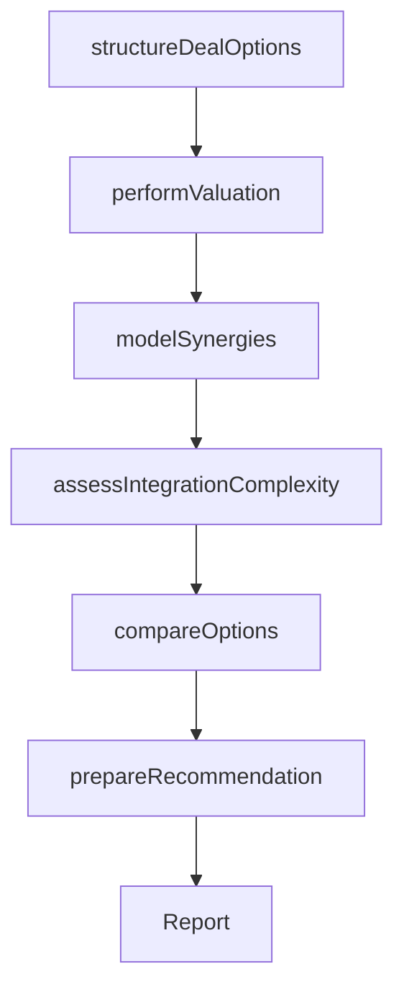

# Analyze deal options

> Business-as-Code definition for deal option analysis. Models the comprehensive evaluation of acquisition, merger, de-merger, and divestiture options including valuation, synergy modeling, and strategic impact assessment.

## Overview

Examining various options shortlisted for assimilating new entities into the organization or dissociating from it. Undertake a piecemeal and comprehensive consideration of each option identified for acquisition, merger, de-merger, and divestment. Consider intangible and non-material aspects of the entities involved and synergic aspects. Consider the assistance of specialist professional services.

## Process Hierarchy



## GraphDL

```yaml
analyze:
  object: Deal Options
  actor: CorporateDevelopmentManager
  result: DealOptionsAnalysis
```

## Actions

| Action | Description |
|--------|-------------|
| structureDealOptions | Define the range of deal structures and terms for each option |
| modelSynergies | Quantify revenue and cost synergies for each deal scenario |
| performValuation | Conduct financial valuation using DCF, comparables, and precedent transactions |
| assessIntegrationComplexity | Evaluate the operational and cultural integration challenges for each option |
| compareOptions | Rank deal options based on strategic fit, financial return, and risk profile |
| prepareRecommendation | Synthesize analysis into an executive recommendation with supporting rationale |

## Events

| Event | Description |
|-------|-------------|
| dealOptionsStructured | Deal structures and terms defined for all options |
| synergiesModeled | Revenue and cost synergy projections completed |
| valuationPerformed | Financial valuations completed for all deal options |
| integrationComplexityAssessed | Integration challenges and timelines evaluated |
| optionsCompared | Deal options ranked and compared against selection criteria |
| recommendationPrepared | Executive deal recommendation finalized |

## Searches

| Search | Description |
|--------|-------------|
| getDealOptions | Retrieve all deal options with structure and valuation details |
| getSynergyEstimates | Access synergy projections by deal option and category |
| getValuationComparisons | Compare valuations across deal options and methodologies |
| getDealRecommendation | Retrieve the executive recommendation and supporting analysis |

## Process Flow



## RACI Matrix

| Activity | Responsible | Accountable | Consulted | Informed |
|----------|-------------|-------------|-----------|----------|
| structureDealOptions | CorporateDevelopmentManager | CFO | InvestmentBanker | CEO |
| performValuation | FinancialAnalyst | CFO | ExternalAdvisor | CorporateDevelopmentManager |
| modelSynergies | CorporateDevelopmentAnalyst | CorporateDevelopmentManager | BusinessUnitLeads | Finance |
| compareOptions | CorporateDevelopmentManager | CEO | CFO | BoardOfDirectors |
| prepareRecommendation | CorporateDevelopmentManager | CEO | GeneralCounsel | BoardOfDirectors |

## Sub-Processes

| ID | Name | Description |
|----|------|-------------|
| 1.1.5.3.1 | Evaluate acquisition options | Appraising entities identified as being suitable for acquisition, taking into account the restructur |
| 1.1.5.3.2 | Evaluate merger options | Appraising entities identified as being suitable for a merger, taking stock of the restructuring opp |
| 1.1.5.3.3 | Evaluate de-merger options | Evaluating departments and subsidiaries within the organization, and/or previously merged entities,  |
| 1.1.5.3.4 | Evaluate divesture options | Evaluating departments and/or subsidiaries within the organization to assess the appropriateness of  |

## Related Processes

| Process | Relationship |
|---------|-------------|
| 1.1.5.2 Perform due-diligence | Upstream - diligence findings inform deal analysis |
| 1.1.5.1 Identify restructuring opportunities | Upstream - identified opportunities are analyzed here |
| 1.2.9 Develop financial strategies | Downstream - deal decisions shape financial strategy |

## Related Departments

| Department | Role |
|-----------|------|
| Corporate Development | Leads deal structuring, valuation, and recommendation |
| Finance | Provides financial modeling and valuation support |
| Legal | Reviews deal structures for regulatory and contractual compliance |
| Strategy | Ensures deal options align with long-term strategic direction |

## Related Occupations

| Occupation | Involvement |
|-----------|-------------|
| Corporate Development Manager | Leads deal option analysis and executive recommendation |
| Investment Banker | Provides valuation and deal structuring advisory |
| Financial Analyst | Conducts financial modeling and synergy analysis |
| General Counsel | Reviews legal implications of deal structures |

## KPIs

| KPI | Description | Unit |
|-----|-------------|------|
| Deal Options Evaluated | Number of deal options fully analyzed per engagement | Count |
| Synergy Realization Accuracy | Variance between projected and realized synergies | % |
| Valuation Accuracy | Post-deal variance from pre-deal valuation | % |
| Time to Recommendation | Elapsed time from deal identification to executive recommendation | Weeks |

## Usage

```typescript
import { analyzeDealOptions } from '@headlessly/analyze-deal-options'

const deals = analyzeDealOptions()

// Perform valuation on deal options
const valuations = await deals.performValuation({
  dealOptionIds: ['acq-001', 'merger-002', 'divest-003'],
  methods: ['DCF', 'comparable-companies', 'precedent-transactions']
})

// Compare and rank deal options
const comparison = await deals.compareOptions({
  dealOptionIds: valuations.map(v => v.dealOptionId),
  criteria: ['strategic-fit', 'financial-return', 'integration-risk', 'timeline']
})
```
