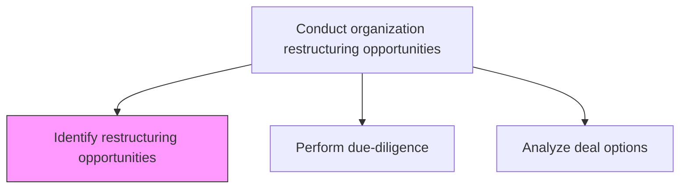
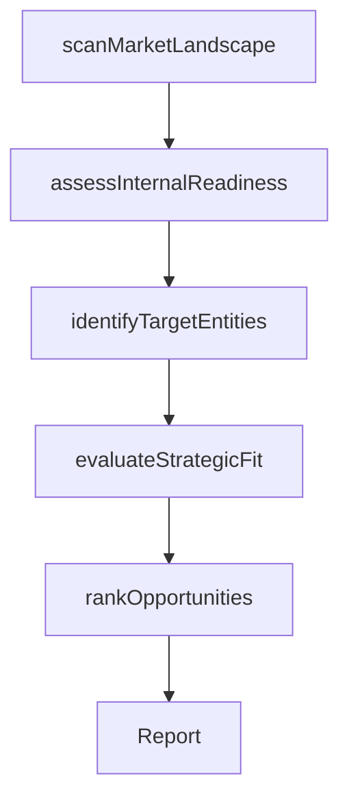

# Identify restructuring opportunities

> Business-as-Code definition for restructuring opportunity identification. Models the systematic scanning of internal capabilities and external market conditions to surface viable organizational restructuring options.

## Overview

Identifying opportunities for restructuring the organization, through an analysis of internal viability and external contingency. Conduct a broad-based survey of the market landscape, taking the large-scale trends and movements into account, to determine the necessity and possibility of restructuring the organization. Review the organization's internal capacities, the readiness of its process frameworks, the robustness of its financials, the capableness of its systems, the resourcefulness of its personnel, etc. for assimilating an extensive overhaul.

## Process Hierarchy



## GraphDL

```yaml
identify:
  object: Restructuring Opportunities
  actor: CorporateDevelopmentManager
  result: RestructuringOpportunityRegister
```

## Actions

| Action | Description |
|--------|-------------|
| scanMarketLandscape | Survey external market trends, consolidation patterns, and competitive dynamics |
| assessInternalReadiness | Evaluate the organization's capacity to absorb or execute structural change |
| identifyTargetEntities | Shortlist potential acquisition, merger, or divestiture candidates |
| evaluateStrategicFit | Assess how each opportunity aligns with the organization's strategic vision |
| rankOpportunities | Prioritize restructuring opportunities by strategic value and feasibility |

## Events

| Event | Description |
|-------|-------------|
| marketLandscapeScanned | External market survey and trend analysis completed |
| internalReadinessAssessed | Organizational capacity for restructuring evaluated |
| targetEntitiesIdentified | Potential restructuring candidates shortlisted |
| strategicFitEvaluated | Strategic alignment of each opportunity assessed |
| opportunitiesRanked | Restructuring opportunities prioritized and ranked |

## Searches

| Search | Description |
|--------|-------------|
| getRestructuringOpportunities | Retrieve identified restructuring opportunities by type and priority |
| getTargetEntities | Access shortlisted entities for acquisition, merger, or divestiture |
| getStrategicFitScores | Retrieve strategic fit assessment scores for each opportunity |

## Process Flow



## RACI Matrix

| Activity | Responsible | Accountable | Consulted | Informed |
|----------|-------------|-------------|-----------|----------|
| scanMarketLandscape | CorporateDevelopmentAnalyst | CorporateDevelopmentManager | VP Strategy | CEO |
| assessInternalReadiness | CorporateDevelopmentManager | CFO | COO | BoardOfDirectors |
| identifyTargetEntities | CorporateDevelopmentAnalyst | CorporateDevelopmentManager | InvestmentBanker | LegalCounsel |
| rankOpportunities | CorporateDevelopmentManager | CEO | CFO | BoardOfDirectors |

## Related Processes

| Process | Relationship |
|---------|-------------|
| 1.1.5.2 Perform due-diligence | Downstream - identified opportunities proceed to due diligence |
| 1.1.5.3 Analyze deal options | Downstream - opportunities inform deal option analysis |
| 1.1.3 Assess the internal environment | Upstream - internal assessment feeds restructuring evaluation |
| 1.1.1 Assess the external environment | Upstream - external landscape informs opportunity identification |

## Related Departments

| Department | Role |
|-----------|------|
| Corporate Development | Leads identification and evaluation of restructuring opportunities |
| Finance | Provides financial feasibility and valuation analysis |
| Strategy | Ensures alignment of opportunities with strategic direction |
| Legal | Reviews regulatory and compliance considerations |

## Related Occupations

| Occupation | Involvement |
|-----------|-------------|
| Corporate Development Manager | Leads opportunity identification and strategic fit evaluation |
| Corporate Development Analyst | Conducts market scanning and target entity research |
| Investment Banker | Provides external market intelligence and deal sourcing |

## KPIs

| KPI | Description | Unit |
|-----|-------------|------|
| Opportunities Identified | Number of restructuring opportunities surfaced per review cycle | Count |
| Strategic Fit Score | Average strategic alignment score of identified opportunities | Score (1-10) |
| Pipeline Conversion | Percentage of identified opportunities advancing to due diligence | % |

## Usage

```typescript
import { identifyRestructuringOpportunities } from '@headlessly/identify-restructuring-opportunities'

const restructuring = identifyRestructuringOpportunities()

// Scan the market landscape for restructuring opportunities
const opportunities = await restructuring.scanMarketLandscape({
  sectors: ['technology', 'healthcare', 'financial-services'],
  dealTypes: ['acquisition', 'merger', 'divestiture']
})

// Evaluate strategic fit of each opportunity
const fit = await restructuring.evaluateStrategicFit({
  opportunityIds: opportunities.map(o => o.id),
  visionId: 'current-strategic-vision'
})
```
