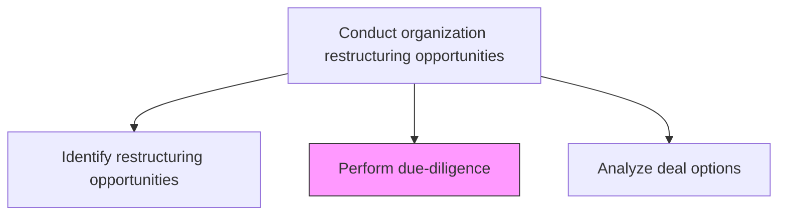
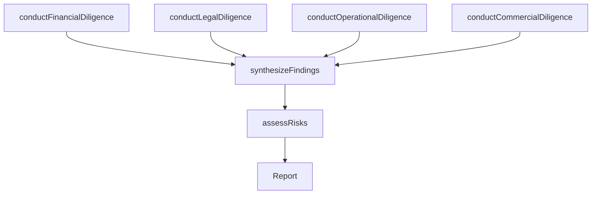

# Perform due-diligence

> Business-as-Code definition for due diligence execution. Models the systematic investigation and verification of target entities across financial, legal, operational, and commercial dimensions prior to restructuring transactions.

## Overview

Auditing the status quo of the probabilities, before formalizing any restructuring of the organization with another entity. Systematically investigate all entities discerned to be of interest in Identify restructuring opportunities [16793], to verify all tangible and substantial facts. Consider engaging specialist professional services including legal, accounting, and consulting help.

## Process Hierarchy



## GraphDL

```yaml
perform:
  object: Due-diligence
  actor: CorporateDevelopmentManager
  result: DueDiligenceReport
```

## Actions

| Action | Description |
|--------|-------------|
| conductFinancialDiligence | Examine financial statements, projections, liabilities, and capital structure |
| conductLegalDiligence | Review contracts, litigation, regulatory compliance, and intellectual property |
| conductOperationalDiligence | Assess operational processes, systems, workforce, and integration complexity |
| conductCommercialDiligence | Evaluate market position, customer base, revenue sustainability, and growth potential |
| synthesizeFindings | Consolidate all diligence workstreams into a comprehensive assessment |
| assessRisks | Identify material risks and develop mitigation recommendations |

## Events

| Event | Description |
|-------|-------------|
| financialDiligenceCompleted | Financial investigation and verification finalized |
| legalDiligenceCompleted | Legal review and compliance assessment concluded |
| operationalDiligenceCompleted | Operational capability and integration assessment finished |
| commercialDiligenceCompleted | Market and commercial viability analysis completed |
| findingsSynthesized | All diligence workstreams consolidated into final report |
| risksAssessed | Material risks identified and mitigation strategies documented |

## Searches

| Search | Description |
|--------|-------------|
| getDueDiligenceReport | Retrieve the consolidated due diligence report for a target entity |
| getFinancialFindings | Access financial diligence findings and red flags |
| getLegalFindings | Retrieve legal diligence results including compliance issues |
| getRiskRegister | Access identified risks and mitigation recommendations |

## Process Flow



## RACI Matrix

| Activity | Responsible | Accountable | Consulted | Informed |
|----------|-------------|-------------|-----------|----------|
| conductFinancialDiligence | FinancialAnalyst | CFO | ExternalAuditor | CorporateDevelopmentManager |
| conductLegalDiligence | GeneralCounsel | CFO | ExternalLegalCounsel | CEO |
| conductOperationalDiligence | CorporateDevelopmentManager | COO | EngineeringLeads | VP Strategy |
| conductCommercialDiligence | CorporateDevelopmentAnalyst | CorporateDevelopmentManager | Marketing | SalesLeadership |
| synthesizeFindings | CorporateDevelopmentManager | CEO | CFO | BoardOfDirectors |

## Related Processes

| Process | Relationship |
|---------|-------------|
| 1.1.5.1 Identify restructuring opportunities | Upstream - identified targets proceed to due diligence |
| 1.1.5.3 Analyze deal options | Downstream - diligence findings inform deal structure analysis |
| 1.1.3.5 Analyze financial health | Related - financial analysis methods applied to target entities |

## Related Departments

| Department | Role |
|-----------|------|
| Corporate Development | Leads due diligence coordination and synthesis |
| Finance | Conducts financial diligence and valuation verification |
| Legal | Performs legal and regulatory compliance review |
| Operations | Assesses operational integration feasibility |

## Related Occupations

| Occupation | Involvement |
|-----------|-------------|
| Corporate Development Manager | Coordinates and synthesizes all diligence workstreams |
| Financial Analyst | Conducts detailed financial investigation |
| General Counsel | Leads legal and regulatory diligence |
| External Consultant | Provides specialized diligence expertise |

## KPIs

| KPI | Description | Unit |
|-----|-------------|------|
| Diligence Cycle Time | Average time to complete full due diligence review | Days |
| Issue Detection Rate | Number of material issues identified per diligence engagement | Count |
| Diligence Cost Ratio | Due diligence cost as a percentage of potential deal value | % |
| Risk Mitigation Coverage | Percentage of identified risks with documented mitigation plans | % |

## Usage

```typescript
import { performDueDiligence } from '@headlessly/perform-due-diligence'

const diligence = performDueDiligence()

// Conduct financial due diligence on a target entity
const financial = await diligence.conductFinancialDiligence({
  targetEntityId: 'target-corp-123',
  scope: ['balance-sheet', 'income-statement', 'cash-flow', 'projections'],
  period: 'trailing-3-years'
})

// Synthesize all findings
const report = await diligence.synthesizeFindings({
  targetEntityId: 'target-corp-123',
  workstreams: ['financial', 'legal', 'operational', 'commercial']
})
```
