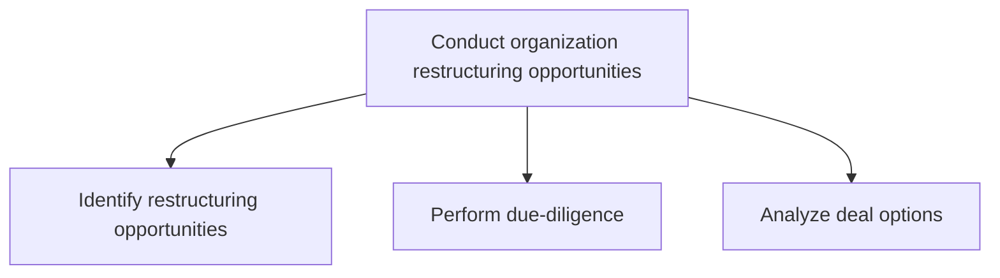
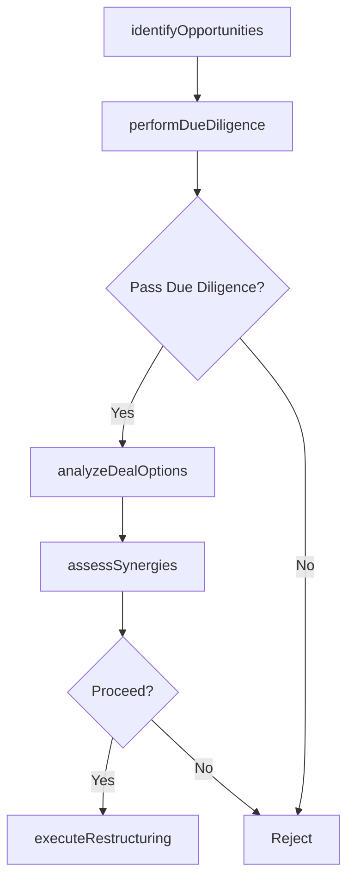

# Conduct organization restructuring opportunities

> Business-as-Code definition for organizational restructuring opportunity analysis. Models the identification, due diligence, and deal option evaluation for mergers, acquisitions, divestitures, and organizational restructuring.

## Overview

Examining the scope and contingencies for restructuring based on market situation and internal realities. Map the market forces over which any and all probabilities can be probed for utility and viability. Once the restructuring options have been analyzed and the due-diligence performed, execute the deal. Consider seeking professional services for assistance in formalizing these opportunities.

## Process Hierarchy



## GraphDL

```yaml
conduct:
  object: Organization Restructuring Opportunities
  actor: CorporateDevelopmentManager
  result: RestructuringRecommendation
```

## Actions

| Action | Description |
|--------|-------------|
| identifyOpportunities | Scan the market and internal portfolio for restructuring candidates |
| performDueDiligence | Audit financial, legal, and operational status of restructuring targets |
| analyzeDealOptions | Evaluate acquisition, merger, de-merger, and divestiture alternatives |
| assessSynergies | Quantify expected synergies and integration costs for each deal option |
| executeRestructuring | Formalize and implement the selected restructuring transaction |

## Events

| Event | Description |
|-------|-------------|
| opportunitiesIdentified | Restructuring opportunities scanned and shortlisted |
| dueDiligencePerformed | Financial and operational due diligence completed |
| dealOptionsAnalyzed | Acquisition, merger, and divestiture options evaluated |
| synergiesAssessed | Expected synergies and integration costs quantified |
| restructuringExecuted | Restructuring transaction formalized and initiated |

## Searches

| Search | Description |
|--------|-------------|
| listRestructuringCandidates | Retrieve shortlisted restructuring targets by type and status |
| getDueDiligenceReport | Access the due diligence report for a specific target |
| getDealAnalysis | Retrieve deal option analysis and financial projections |
| getSynergyEstimates | Access estimated synergies and integration cost models |

## Process Flow



## RACI Matrix

| Activity | Responsible | Accountable | Consulted | Informed |
|----------|-------------|-------------|-----------|----------|
| identifyOpportunities | CorporateDevelopmentManager | VP Strategy | Finance, Strategy | CEO |
| performDueDiligence | CorporateDevelopmentManager | CFO | Legal, Accounting | BoardOfDirectors |
| analyzeDealOptions | CorporateDevelopmentManager | CEO | InvestmentBanker | BoardOfDirectors |
| executeRestructuring | CorporateDevelopmentManager | CEO | Legal, HR | AllEmployees |

## Sub-Processes

| ID | Name | Description |
|----|------|-------------|
| 1.1.5.1 | Identify restructuring opportunities | Identifying opportunities for restructuring the organization, through an analysis of internal viabil |
| 1.1.5.2 | Perform due-diligence | Auditing the status quo of the probabilities, before formalizing any restructuring of the organizati |
| 1.1.5.3 | Analyze deal options | Examining various options shortlisted for assimilating new entities into the organization or dissoci |

## Related Processes

| Process | Relationship |
|---------|-------------|
| 1.1.1.9 Conduct mergers and acquisitions (M&A) analysis | Child - detailed M&A analysis within restructuring |
| 1.1.1 Assess the external environment | Upstream - external scan identifies restructuring triggers |
| 1.2.2.6 Develop merger/demerger/acquisition/exit strategy | Downstream - restructuring feeds M&A strategy development |

## Related Departments

| Department | Role |
|-----------|------|
| Corporate Development | Leads restructuring opportunity identification and deal execution |
| Finance | Provides valuation models and financial due diligence |
| Legal | Reviews regulatory compliance and contractual obligations |
| Human Resources | Plans workforce integration or separation |
| Operations | Assesses operational synergies and integration complexity |

## Related Occupations

| Occupation | Involvement |
|-----------|-------------|
| Corporate Development Manager | Leads the restructuring process end to end |
| Investment Banker | Provides deal advisory and valuation support |
| M&A Attorney | Handles legal due diligence and transaction documentation |

## KPIs

| KPI | Description | Unit |
|-----|-------------|------|
| Deal Pipeline Value | Total estimated value of restructuring opportunities under evaluation | USD |
| Due Diligence Cycle Time | Average time to complete due diligence for a target | Weeks |
| Synergy Realization Rate | Percentage of projected synergies actually achieved post-deal | % |
| Integration Completion Rate | Percentage of post-deal integration milestones completed on time | % |

## Usage

```typescript
import { conductOrganizationRestructuringOpportunities } from '@headlessly/conduct-organization-restructuring-opportunities'

const restructuring = conductOrganizationRestructuringOpportunities()

// Identify restructuring opportunities
const candidates = await restructuring.identifyOpportunities({
  types: ['acquisition', 'merger', 'divestiture'],
  minDealValue: 5000000,
  strategicFit: 'high'
})

// Perform due diligence on a target
const ddReport = await restructuring.performDueDiligence({
  targetId: candidates[0].id,
  scope: ['financial', 'legal', 'operational', 'cultural']
})

// Analyze deal options
const analysis = await restructuring.analyzeDealOptions({
  targetId: candidates[0].id,
  dueDiligenceId: ddReport.id,
  dealTypes: ['full-acquisition', 'majority-stake', 'strategic-partnership']
})
```
