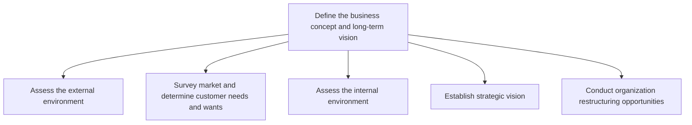
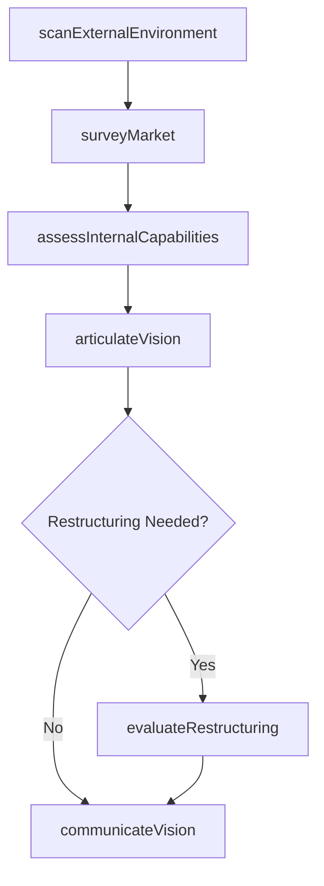

# Define the business concept and long-term vision

> Business-as-Code definition for business concept and long-term vision development. Models the process of scanning external and internal environments, surveying markets, establishing strategic vision, and evaluating organizational restructuring opportunities.

## Overview

Creating a conceptual framework of the organization's business activity and strategic vision with long-term applicability. Scout the organization's internal capabilities, as well as the customer's needs and desires, to identify a fit that can be used to advance a conceptual structure of the organization's business activity. Conduct analysis in light of relevant externalities and large-scale shifts in the market landscape.

## Process Hierarchy



## GraphDL

```yaml
define:
  object: Business Concept And Long-term Vision
  actor: ChiefStrategyOfficer
  result: BusinessConceptDocument
```

## Actions

| Action | Description |
|--------|-------------|
| scanExternalEnvironment | Analyze competitors, economic trends, regulatory landscape, and technology shifts |
| surveyMarket | Research market dynamics and identify customer needs and wants |
| assessInternalCapabilities | Evaluate organizational strengths, resources, and core competencies |
| articulateVision | Draft and refine the long-term strategic vision statement |
| evaluateRestructuring | Assess opportunities for mergers, acquisitions, and organizational restructuring |
| communicateVision | Disseminate the approved vision to stakeholders across the organization |

## Events

| Event | Description |
|-------|-------------|
| externalEnvironmentScanned | External environment analysis completed and documented |
| marketSurveyed | Market research and customer needs assessment finalized |
| internalCapabilitiesAssessed | Internal strengths and weaknesses evaluation completed |
| visionArticulated | Strategic vision statement drafted and reviewed |
| restructuringEvaluated | Restructuring opportunities assessed and recommendations made |
| visionCommunicated | Strategic vision distributed to all stakeholder groups |

## Searches

| Search | Description |
|--------|-------------|
| getEnvironmentAnalysis | Retrieve the latest external and internal environment assessments |
| getMarketResearch | Access market survey data and customer needs analyses |
| getVisionDocument | Retrieve the current strategic vision statement and supporting materials |
| findRestructuringOptions | List evaluated restructuring opportunities by type and status |

## Process Flow



## RACI Matrix

| Activity | Responsible | Accountable | Consulted | Informed |
|----------|-------------|-------------|-----------|----------|
| scanExternalEnvironment | StrategyAnalyst | ChiefStrategyOfficer | MarketResearch | Executive |
| surveyMarket | MarketResearcher | VP Marketing | Sales, Product | Strategy |
| assessInternalCapabilities | StrategyAnalyst | ChiefStrategyOfficer | Operations, HR | Finance |
| articulateVision | ChiefStrategyOfficer | CEO | BoardOfDirectors | AllEmployees |
| evaluateRestructuring | CorporateDevelopment | CEO | Legal, Finance | BoardOfDirectors |

## Sub-Processes

| ID | Name | Description |
|----|------|-------------|
| 1.1.1 | Assess the external environment | Assessing all forces, entities, and systems that are external to an organization but can affect its  |
| 1.1.2 | Survey market and determine customer needs and wants | Examining the market to identify customer required solutions. Assess the relevant market(s) to deter |
| 1.1.3 | Assess the internal environment | Undertaking a review of the organization's in-house skills and resources in order to create a big-pi |
| 1.1.4 | Establish strategic vision | Establishing the organization's long-term vision as a strategic positioning and engagement of stakeh |
| 1.1.5 | Conduct organization restructuring opportunities | Examining the scope and contingencies for restructuring based on market situation and internal reali |

## Related Processes

| Process | Relationship |
|---------|-------------|
| 1.2 Develop business strategy | Downstream - vision informs strategy formulation |
| 1.3 Execute and measure strategic initiatives | Downstream - vision guides initiative prioritization |
| 1.4 Develop and maintain business models | Parallel - business concept shapes business model design |

## Related Departments

| Department | Role |
|-----------|------|
| Strategy | Leads environment scanning and vision formulation |
| Marketing | Conducts market research and customer needs analysis |
| Finance | Provides financial baseline and feasibility data |
| Corporate Development | Evaluates M&A and restructuring opportunities |
| Executive Office | Approves and champions the strategic vision |

## Related Occupations

| Occupation | Involvement |
|-----------|-------------|
| Chief Strategy Officer | Owns the business concept and vision process |
| Strategy Analyst | Performs environmental scanning and analysis |
| Market Research Analyst | Gathers and synthesizes market intelligence |
| Corporate Development Manager | Assesses restructuring and M&A feasibility |

## KPIs

| KPI | Description | Unit |
|-----|-------------|------|
| Vision Clarity Score | Employee survey rating of how well vision is understood | Score (1-10) |
| Environmental Scan Frequency | How often external and internal assessments are refreshed | Per Year |
| Market Coverage | Percentage of addressable market segments analyzed | % |
| Vision-to-Strategy Cycle Time | Elapsed time from vision approval to strategy formulation | Weeks |

## Usage

```typescript
import { defineBusinessConceptAndLongTermVision } from '@headlessly/define-business-concept-and-long-term-vision'

const vision = defineBusinessConceptAndLongTermVision()

// Scan the external environment
const externalScan = await vision.scanExternalEnvironment({
  scope: ['competitors', 'economics', 'regulation', 'technology'],
  geographies: ['North America', 'Europe']
})

// Survey the market for customer needs
const marketData = await vision.surveyMarket({
  segments: ['enterprise', 'mid-market'],
  methods: ['quantitative', 'qualitative']
})

// Articulate the strategic vision
const visionDoc = await vision.articulateVision({
  externalScanId: externalScan.id,
  marketDataId: marketData.id,
  horizon: '5-year'
})
```
