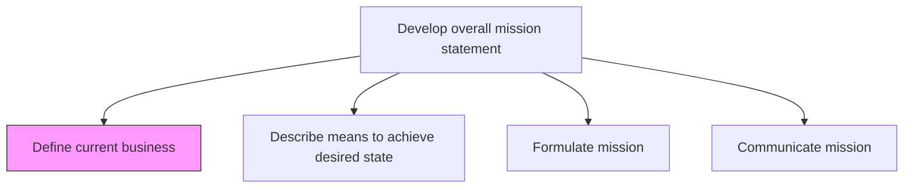
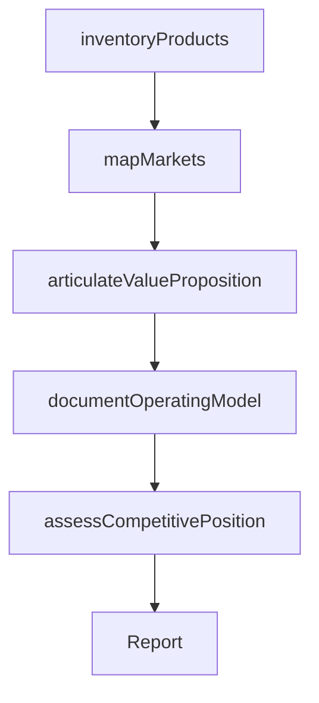

# Define current business

> Business-as-Code definition for current business state definition. Models the documentation of the organization's core products, markets, value proposition, operational model, and competitive position as the foundation for mission development.

## Overview

Defining the status quo relating to the de facto core of what the business is. Reflect over the fundamental essence of what the business accomplishes and the manner in which it operates. Look beyond the obvious solution capabilities to delineate capacities that form the basis of the business engine. Involve senior executives and management personnel and possibly professional services providers.

## Process Hierarchy



## GraphDL

```yaml
define:
  object: Current Business
  actor: VP Strategy
  result: BusinessDefinitionDocument
```

## Actions

| Action | Description |
|--------|-------------|
| inventoryProducts | Catalog current products, services, and solutions offered |
| mapMarkets | Identify and document the markets, segments, and geographies served |
| articulateValueProposition | Define the core value proposition and competitive differentiation |
| documentOperatingModel | Describe how the business creates, delivers, and captures value |
| assessCompetitivePosition | Evaluate the organization's competitive standing and market position |

## Events

| Event | Description |
|-------|-------------|
| productsInventoried | Product and service catalog documented |
| marketsMapped | Markets, segments, and geographies documented |
| valuePropositionArticulated | Core value proposition defined |
| operatingModelDocumented | Business operating model described |
| competitivePositionAssessed | Competitive standing evaluated |

## Searches

| Search | Description |
|--------|-------------|
| getBusinessDefinition | Retrieve the current business definition document |
| getProductCatalog | Access the current product and service inventory |
| getMarketProfile | Retrieve market and segment documentation |

## Process Flow



## RACI Matrix

| Activity | Responsible | Accountable | Consulted | Informed |
|----------|-------------|-------------|-----------|----------|
| inventoryProducts | StrategyAnalyst | VP Strategy | ProductManagement | Sales |
| mapMarkets | MarketResearcher | VP Strategy | Marketing | Finance |
| articulateValueProposition | VP Strategy | CEO | Marketing | ProductManagement |
| assessCompetitivePosition | StrategyAnalyst | VP Strategy | Sales | Executive |

## Related Processes

| Process | Relationship |
|---------|-------------|
| 1.2.1.2 Describe means to achieve desired state | Downstream - current state baseline enables gap analysis |
| 1.1.3 Assess the internal environment | Upstream - internal assessment feeds business definition |
| 1.1.1 Assess the external environment | Upstream - external context informs competitive position |

## Related Departments

| Department | Role |
|-----------|------|
| Strategy | Leads business definition and competitive analysis |
| Product Management | Provides product and service portfolio data |
| Marketing | Contributes market and customer insights |
| Finance | Supplies financial performance data |

## Related Occupations

| Occupation | Involvement |
|-----------|-------------|
| VP Strategy | Leads the business definition exercise |
| Strategy Analyst | Conducts analysis and documentation |
| Product Manager | Provides product portfolio information |

## KPIs

| KPI | Description | Unit |
|-----|-------------|------|
| Definition Completeness | Percentage of business dimensions documented | % |
| Stakeholder Validation | Number of executives who validated the definition | Count |
| Definition Currency | Time since last business definition update | Months |

## Usage

```typescript
import { defineCurrentBusiness } from '@headlessly/define-current-business'

const business = defineCurrentBusiness()

// Inventory current products and services
const products = await business.inventoryProducts({
  scope: 'enterprise',
  categories: ['products', 'services', 'solutions']
})

// Articulate the core value proposition
const valueProposition = await business.articulateValueProposition({
  targetSegments: ['enterprise', 'mid-market'],
  differentiators: ['technology', 'service-quality', 'price']
})
```
