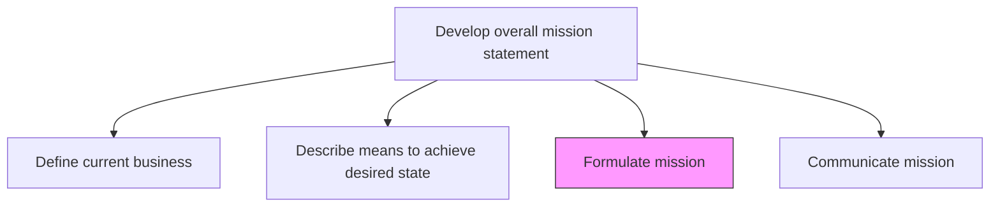
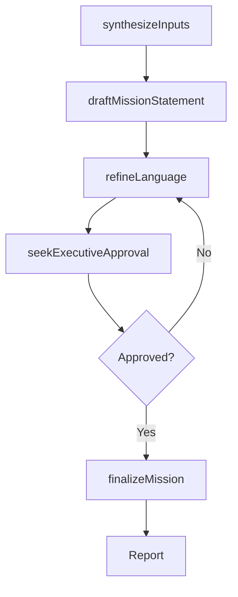

# Formulate mission

> Business-as-Code definition for mission formulation. Models the drafting, refinement, and approval of a concise mission statement that articulates the organization's purpose, target audience, and competitive approach.

## Overview

Outlining actionable objectives that effectively set a course to fulfill the organization's vision. In this fundamental activity, articulate certain goals or targets in broad but practicable terms to reach long-term objectives.

## Process Hierarchy



## GraphDL

```yaml
formulate:
  object: Mission
  actor: CEO
  result: MissionStatement
```

## Actions

| Action | Description |
|--------|-------------|
| synthesizeInputs | Consolidate business definition, strategic pathways, and vision into mission inputs |
| draftMissionStatement | Compose an initial mission statement capturing purpose, audience, and approach |
| refineLanguage | Iterate on the mission statement for clarity, brevity, and inspirational quality |
| seekExecutiveApproval | Present the mission statement to executive leadership and board for endorsement |
| finalizeMission | Incorporate feedback and produce the approved mission statement |

## Events

| Event | Description |
|-------|-------------|
| inputsSynthesized | Business definition and strategic pathway data consolidated |
| missionStatementDrafted | Initial mission statement composed |
| languageRefined | Mission statement iterated for clarity and impact |
| executiveApprovalSought | Mission statement presented to leadership for endorsement |
| missionFinalized | Approved mission statement produced |

## Searches

| Search | Description |
|--------|-------------|
| getMissionStatement | Retrieve the current approved mission statement |
| getMissionDrafts | Access draft versions and revision history |
| getMissionApprovalStatus | Check the approval status of the mission statement |

## Process Flow



## RACI Matrix

| Activity | Responsible | Accountable | Consulted | Informed |
|----------|-------------|-------------|-----------|----------|
| synthesizeInputs | VP Strategy | CEO | StrategyAnalyst | ExecutiveTeam |
| draftMissionStatement | VP Strategy | CEO | CorporateCommunications | Marketing |
| seekExecutiveApproval | CEO | BoardOfDirectors | ExecutiveTeam | LegalCounsel |
| finalizeMission | VP Strategy | CEO | CorporateCommunications | AllEmployees |

## Related Processes

| Process | Relationship |
|---------|-------------|
| 1.2.1.1 Define current business | Upstream - business definition feeds mission inputs |
| 1.2.1.2 Describe means to achieve desired state | Upstream - strategic pathways inform mission objectives |
| 1.2.1.4 Communicate mission | Downstream - finalized mission proceeds to communication |

## Related Departments

| Department | Role |
|-----------|------|
| Executive Office | Leads mission formulation and approval |
| Strategy | Provides strategic context and analytical inputs |
| Corporate Communications | Assists in crafting concise, impactful language |

## Related Occupations

| Occupation | Involvement |
|-----------|-------------|
| CEO | Final author and champion of the mission statement |
| VP Strategy | Synthesizes strategic inputs and drafts mission |
| Corporate Communications Director | Refines mission language for stakeholder resonance |

## KPIs

| KPI | Description | Unit |
|-----|-------------|------|
| Drafting Cycle Time | Time from input synthesis to final approved mission | Days |
| Stakeholder Endorsement | Number of executive endorsements received | Count |
| Mission Clarity Score | Employee rating of mission statement clarity | Score (1-10) |

## Usage

```typescript
import { formulateMission } from '@headlessly/formulate-mission'

const mission = formulateMission()

// Synthesize inputs from business definition and strategic pathways
const inputs = await mission.synthesizeInputs({
  businessDefinitionId: 'biz-def-2026',
  strategicPathwayIds: ['pathway-1', 'pathway-2'],
  visionId: 'strategic-vision-2030'
})

// Draft the mission statement
const draft = await mission.draftMissionStatement({
  inputsId: inputs.id,
  guidelines: { maxLength: 50, tone: 'aspirational', audience: 'all-stakeholders' }
})
```
