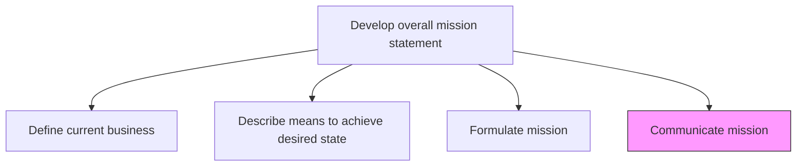
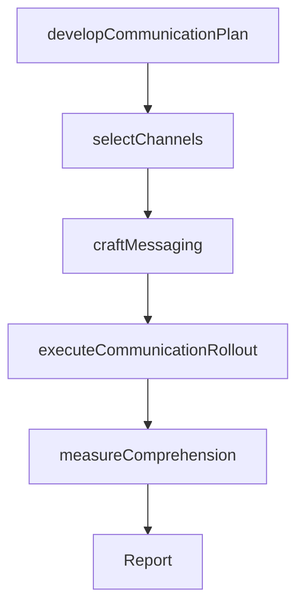

# Communicate mission

> Business-as-Code definition for mission communication. Models the development and execution of multi-channel communication campaigns to embed the mission statement across all internal and external stakeholder groups.

## Overview

Developing and executing a communication strategy to convey the mission statement. Create a universal communication strategy and appropriate delivery channels, with the objective of leveraging the latter to execute the former. Convey the inherent message of the mission to all stakeholders, including employees, customers, and the public. Ensure collaboration between senior strategy personnel and the communications/marketing team.

## Process Hierarchy



## GraphDL

```yaml
communicate:
  object: Mission
  actor: CorporateCommunicationsDirector
  result: MissionCommunicationPlan
```

## Actions

| Action | Description |
|--------|-------------|
| developCommunicationPlan | Create a structured plan for mission dissemination across stakeholder groups |
| selectChannels | Identify the most effective communication channels for each audience |
| craftMessaging | Develop audience-specific messaging that conveys the mission's essence |
| executeCommunicationRollout | Deploy the mission communication across all channels and audiences |
| measureComprehension | Assess stakeholder understanding and internalization of the mission |

## Events

| Event | Description |
|-------|-------------|
| communicationPlanDeveloped | Mission communication plan created and approved |
| channelsSelected | Communication channels assigned to stakeholder segments |
| messagingCrafted | Audience-specific messaging developed and approved |
| communicationRolloutExecuted | Mission communication deployed across all channels |
| comprehensionMeasured | Stakeholder understanding of mission assessed |

## Searches

| Search | Description |
|--------|-------------|
| getCommunicationPlan | Retrieve the mission communication plan |
| getChannelEffectiveness | Access engagement metrics by communication channel |
| getComprehensionScores | Retrieve mission comprehension scores by audience segment |

## Process Flow



## RACI Matrix

| Activity | Responsible | Accountable | Consulted | Informed |
|----------|-------------|-------------|-----------|----------|
| developCommunicationPlan | CorporateCommunicationsDirector | CEO | VP Strategy | Marketing |
| craftMessaging | CommunicationsManager | CorporateCommunicationsDirector | Marketing | HumanResources |
| executeCommunicationRollout | CommunicationsManager | CorporateCommunicationsDirector | HumanResources | AllEmployees |
| measureComprehension | CommunicationsManager | CorporateCommunicationsDirector | HumanResources | VP Strategy |

## Related Processes

| Process | Relationship |
|---------|-------------|
| 1.2.1.3 Formulate mission | Upstream - finalized mission is the communication content |
| 1.1.4.3 Communicate strategic vision to stakeholders | Related - parallel vision communication process |
| 1.2.8 Communicate strategies internally and externally | Related - broader strategy communication framework |

## Related Departments

| Department | Role |
|-----------|------|
| Corporate Communications | Leads mission communication strategy and execution |
| Marketing | Supports external mission messaging and brand alignment |
| Human Resources | Facilitates internal mission embedding and onboarding |
| Public Relations | Manages public-facing mission communication |

## Related Occupations

| Occupation | Involvement |
|-----------|-------------|
| Corporate Communications Director | Leads mission communication planning |
| Communications Manager | Executes communication campaigns |
| HR Business Partner | Embeds mission into employee programs |

## KPIs

| KPI | Description | Unit |
|-----|-------------|------|
| Mission Awareness | Percentage of employees who can articulate the mission | % |
| Communication Reach | Percentage of stakeholders who received mission communication | % |
| Channel Engagement | Average engagement rate across communication channels | % |

## Usage

```typescript
import { communicateMission } from '@headlessly/communicate-mission'

const comms = communicateMission()

// Develop the communication plan
const plan = await comms.developCommunicationPlan({
  missionId: 'approved-mission-2026',
  audiences: ['employees', 'customers', 'investors', 'public']
})

// Execute the communication rollout
const rollout = await comms.executeCommunicationRollout({
  planId: plan.id,
  channels: ['all-hands', 'email', 'intranet', 'website', 'press-release']
})
```
