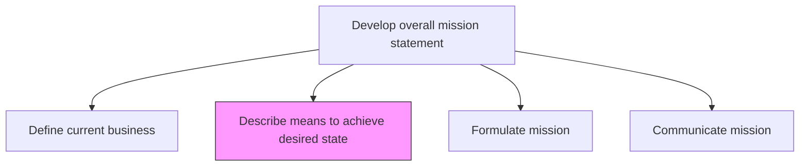
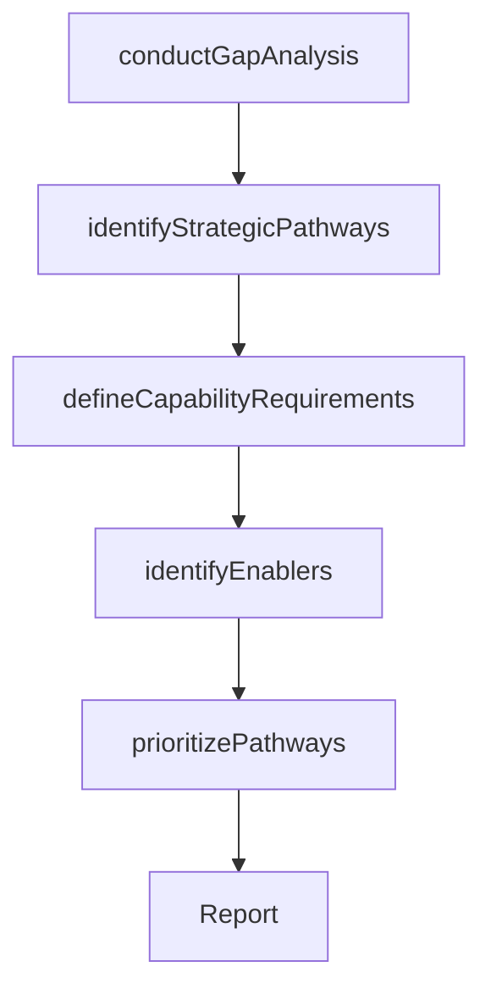

# Describe means to achieve desired state

> Business-as-Code definition for describing the means to achieve the desired organizational state. Models the gap analysis between current and future state, identification of strategic pathways, capability requirements, and enablers needed to bridge the gap.

## Overview

Outlining the strategic pathways and enabling mechanisms required to move the organization from its current state to its desired future state. Conduct a thorough gap analysis comparing the current business definition with the strategic vision, then identify the capabilities, resources, and initiatives necessary to close those gaps.

## Process Hierarchy



## GraphDL

```yaml
describe:
  object: Means To Achieve Desired State
  actor: VP Strategy
  result: StrategicPathwayDocument
```

## Actions

| Action | Description |
|--------|-------------|
| conductGapAnalysis | Compare current business state against the desired future state |
| identifyStrategicPathways | Define the primary routes for transitioning from current to desired state |
| defineCapabilityRequirements | Specify the capabilities, resources, and competencies needed |
| identifyEnablers | Determine the technology, partnerships, and investments that enable the transition |
| prioritizePathways | Rank strategic pathways by feasibility, impact, and alignment |

## Events

| Event | Description |
|-------|-------------|
| gapAnalysisConducted | Current-to-desired state gap analysis completed |
| strategicPathwaysIdentified | Transition pathways defined and documented |
| capabilityRequirementsDefined | Required capabilities and resources specified |
| enablersIdentified | Enabling technologies, partnerships, and investments determined |
| pathwaysPrioritized | Strategic pathways ranked and selected |

## Searches

| Search | Description |
|--------|-------------|
| getGapAnalysis | Retrieve the current-to-desired state gap analysis |
| getStrategicPathways | Access the defined strategic pathways with priority rankings |
| getCapabilityRequirements | List required capabilities by pathway and gap area |

## Process Flow



## RACI Matrix

| Activity | Responsible | Accountable | Consulted | Informed |
|----------|-------------|-------------|-----------|----------|
| conductGapAnalysis | StrategyAnalyst | VP Strategy | BusinessUnitLeads | CEO |
| identifyStrategicPathways | VP Strategy | CEO | CFO | ExecutiveTeam |
| defineCapabilityRequirements | StrategyAnalyst | VP Strategy | HumanResources | CTO |
| prioritizePathways | VP Strategy | CEO | BoardOfDirectors | Finance |

## Related Processes

| Process | Relationship |
|---------|-------------|
| 1.2.1.1 Define current business | Upstream - current state provides the baseline for gap analysis |
| 1.2.1.3 Formulate mission | Downstream - strategic pathways inform mission formulation |
| 1.1.4 Establish strategic vision | Upstream - vision defines the desired future state |

## Related Departments

| Department | Role |
|-----------|------|
| Strategy | Leads gap analysis and pathway identification |
| Finance | Validates financial feasibility of strategic pathways |
| Human Resources | Assesses talent and capability requirements |
| Information Technology | Identifies technology enablers |

## Related Occupations

| Occupation | Involvement |
|-----------|-------------|
| VP Strategy | Leads strategic pathway development |
| Strategy Analyst | Conducts gap analysis and capability assessment |
| CFO | Validates financial feasibility of pathways |

## KPIs

| KPI | Description | Unit |
|-----|-------------|------|
| Gap Coverage | Percentage of identified gaps with defined pathways | % |
| Pathway Feasibility Score | Average feasibility rating of prioritized pathways | Score (1-10) |
| Capability Readiness | Percentage of required capabilities currently in place | % |

## Usage

```typescript
import { describeMeansToAchieveDesiredState } from '@headlessly/describe-means-to-achieve-desired-state'

const means = describeMeansToAchieveDesiredState()

// Conduct gap analysis
const gaps = await means.conductGapAnalysis({
  currentStateId: 'business-definition-2026',
  desiredStateId: 'strategic-vision-2030'
})

// Identify strategic pathways
const pathways = await means.identifyStrategicPathways({
  gapIds: gaps.map(g => g.id),
  constraints: ['budget', 'timeline', 'organizational-capacity']
})
```
