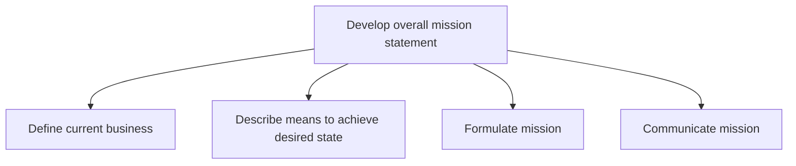
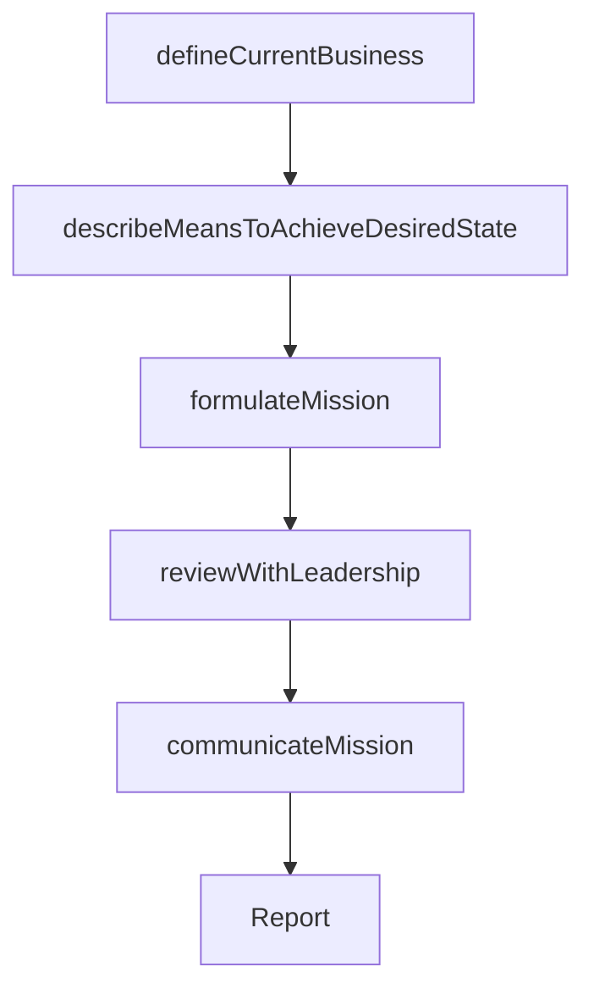

# Develop overall mission statement

> Business-as-Code definition for mission statement development. Models the creation of a concise organizational mission that articulates purpose, target audience, and differentiation, guiding all strategic and operational decisions.

## Overview

Establishing an overarching, compact statement that concisely underscores the mission of the organization. Define and communicate a clear and succinct mission statement, which encapsulates how the organization aims to proceed in order to Establish a strategic vision [10020]. Solicit critical inputs from senior management and strategy executives, and collaborate with marketing or personnel from allied functions.

## Process Hierarchy



## GraphDL

```yaml
develop:
  object: Overall Mission Statement
  actor: CEO
  result: MissionStatement
```

## Actions

| Action | Description |
|--------|-------------|
| defineCurrentBusiness | Articulate the current core business, products, markets, and value proposition |
| describeMeansToAchieveDesiredState | Outline the strategic pathways from current state to desired future |
| formulateMission | Draft a concise mission statement that captures purpose and direction |
| reviewWithLeadership | Validate the mission statement with executive leadership and board |
| communicateMission | Disseminate the approved mission statement across the organization |

## Events

| Event | Description |
|-------|-------------|
| currentBusinessDefined | Core business definition documented and validated |
| meansDescribed | Strategic pathways to desired state outlined |
| missionFormulated | Draft mission statement created and reviewed |
| leadershipReviewCompleted | Executive leadership endorsed the mission statement |
| missionCommunicated | Mission statement disseminated to all stakeholders |

## Searches

| Search | Description |
|--------|-------------|
| getMissionStatement | Retrieve the current organizational mission statement |
| getMissionHistory | Access historical mission statements and revisions |
| getMissionAlignment | Check alignment between mission and business unit strategies |

## Process Flow



## RACI Matrix

| Activity | Responsible | Accountable | Consulted | Informed |
|----------|-------------|-------------|-----------|----------|
| defineCurrentBusiness | VP Strategy | CEO | BusinessUnitLeads | Finance |
| formulateMission | VP Strategy | CEO | CorporateCommunications | Marketing |
| reviewWithLeadership | CEO | BoardOfDirectors | ExecutiveTeam | LegalCounsel |
| communicateMission | CorporateCommunicationsDirector | CEO | HumanResources | AllEmployees |

## Sub-Processes

| ID | Name | Description |
|----|------|-------------|
| 1.2.1.1 | Define current business | Defining the status quo relating to the de facto core of what the business is. Reflect over the fund |
| 1.2.1.2 | Describe means to achieve desired state | Outlining the strategic pathways, capabilities, and resources needed to transition the organization f |
| 1.2.1.3 | Formulate mission | Outlining actionable objectives that effectively set a course to fulfill the organization's vision.  |
| 1.2.1.4 | Communicate mission | Developing and executing a communication strategy to convey the mission statement. Create a universa |

## Related Processes

| Process | Relationship |
|---------|-------------|
| 1.1.4 Establish strategic vision | Upstream - vision provides directional context for mission |
| 1.2.2 Define and evaluate strategic options | Downstream - mission guides strategic option selection |
| 1.2.5 Develop and set organizational goals | Downstream - mission shapes organizational goal setting |

## Related Departments

| Department | Role |
|-----------|------|
| Executive Office | Leads mission definition and approval |
| Strategy | Provides strategic context and competitive positioning |
| Corporate Communications | Crafts mission language and manages dissemination |
| Human Resources | Embeds mission into organizational culture and onboarding |

## Related Occupations

| Occupation | Involvement |
|-----------|-------------|
| CEO | Primary author and champion of the mission statement |
| VP Strategy | Provides analytical foundation and strategic context |
| Corporate Communications Director | Shapes mission language for broad stakeholder resonance |

## KPIs

| KPI | Description | Unit |
|-----|-------------|------|
| Mission Awareness | Percentage of employees who can articulate the mission | % |
| Mission Alignment Score | Degree of alignment between mission and operational priorities | Score (1-10) |
| Mission Review Frequency | Time since last mission statement review or update | Months |

## Usage

```typescript
import { developOverallMissionStatement } from '@headlessly/develop-overall-mission-statement'

const mission = developOverallMissionStatement()

// Define the current business state
const currentBusiness = await mission.defineCurrentBusiness({
  dimensions: ['products', 'markets', 'customers', 'value-proposition']
})

// Formulate the mission statement
const statement = await mission.formulateMission({
  currentBusinessId: currentBusiness.id,
  visionId: 'current-strategic-vision',
  audience: 'all-stakeholders'
})
```
