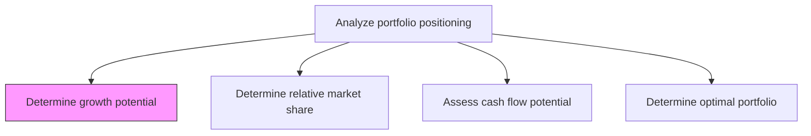
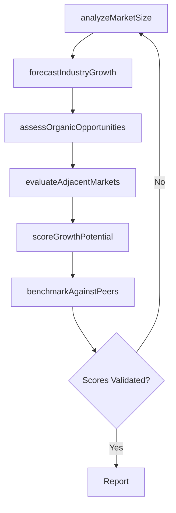

# Determine growth potential

> Business-as-Code definition for growth potential determination. Models the systematic assessment of market growth rates, expansion opportunities, and revenue potential for each business unit or product line within the corporate portfolio.

## Overview

Determining the growth potential of each business unit, product line, or market segment within the organization's portfolio. Analyze market size trajectories, industry growth rates, addressable market expansion, and organic growth opportunities to classify portfolio elements by their potential for future revenue and profit growth. This assessment feeds directly into portfolio positioning frameworks such as the BCG growth-share matrix.

## Process Hierarchy



## GraphDL

```yaml
determine:
  object: Growth Potential
  actor: StrategyAnalyst
  result: GrowthPotentialAssessment
```

## Actions

| Action | Description |
|--------|-------------|
| analyzeMarketSize | Evaluate total addressable market size and growth trajectory for each segment |
| forecastIndustryGrowth | Project industry-level growth rates using economic and demand indicators |
| assessOrganicOpportunities | Identify organic expansion opportunities within existing markets |
| evaluateAdjacentMarkets | Assess growth potential from adjacent market entry or expansion |
| scoreGrowthPotential | Assign a composite growth potential score to each portfolio element |
| benchmarkAgainstPeers | Compare growth trajectories against peer organizations and competitors |

## Events

| Event | Description |
|-------|-------------|
| marketSizeAnalyzed | Total addressable market analysis completed for a portfolio element |
| industryGrowthForecasted | Industry growth rate projections finalized |
| organicOpportunitiesAssessed | Organic growth opportunity assessment completed |
| adjacentMarketsEvaluated | Adjacent market expansion potential evaluated |
| growthPotentialScored | Composite growth potential score assigned to portfolio element |
| peerBenchmarkCompleted | Peer growth trajectory benchmarking completed |

## Searches

| Search | Description |
|--------|-------------|
| getGrowthScores | Retrieve growth potential scores by business unit or product line |
| getMarketSizeData | Access total addressable market size and trajectory data |
| getIndustryForecasts | Retrieve industry growth rate forecasts by segment |
| getGrowthOpportunities | List identified organic and adjacent growth opportunities |

## Process Flow



## RACI Matrix

| Activity | Responsible | Accountable | Consulted | Informed |
|----------|-------------|-------------|-----------|----------|
| analyzeMarketSize | StrategyAnalyst | VP Strategy | Marketing | BusinessUnitLeads |
| forecastIndustryGrowth | Economist | VP Strategy | Finance | CFO |
| assessOrganicOpportunities | BusinessDevelopmentManager | VP Strategy | Sales | ProductTeam |
| scoreGrowthPotential | StrategyAnalyst | VP Strategy | CFO | BoardOfDirectors |

## Related Processes

| Process | Relationship |
|---------|-------------|
| 1.2.10.2 Determine relative market share | Parallel - growth and share jointly classify portfolio elements |
| 1.2.10.3 Assess cash flow potential | Parallel - growth potential informs cash flow projections |
| 1.2.10.4 Determine optimal portfolio | Downstream - growth scores feed portfolio optimization |
| 1.1.1.3 Identify economic trends | Upstream - macroeconomic trends inform growth forecasts |

## Related Departments

| Department | Role |
|-----------|------|
| Strategy | Leads growth potential analysis and scoring |
| Marketing | Provides market size and customer demand data |
| Finance | Supplies revenue forecasts and financial growth projections |
| Corporate Development | Identifies adjacent market entry opportunities |

## Related Occupations

| Occupation | Involvement |
|-----------|-------------|
| Strategy Analyst | Conducts market sizing and growth scoring |
| Economist | Forecasts industry and macroeconomic growth trends |
| Market Researcher | Gathers primary and secondary market growth data |

## KPIs

| KPI | Description | Unit |
|-----|-------------|------|
| Market Growth Rate | Compound annual growth rate of addressable market | % |
| Growth Score Accuracy | Percentage of growth forecasts within acceptable variance | % |
| Opportunity Pipeline Value | Total estimated revenue from identified growth opportunities | USD |
| Forecast Refresh Frequency | How often growth potential assessments are updated | Per Year |

## Usage

```typescript
import { determineGrowthPotential } from '@headlessly/determine-growth-potential'

const growth = determineGrowthPotential()

// Analyze market size for a business unit
const marketSize = await growth.analyzeMarketSize({
  businessUnitId: 'enterprise-saas',
  horizon: '5-years',
  geography: 'Global'
})

// Score growth potential across portfolio
const scores = await growth.scoreGrowthPotential({
  portfolioElementIds: ['enterprise-saas', 'smb-platform', 'data-services'],
  methodology: 'composite-weighted'
})
```
