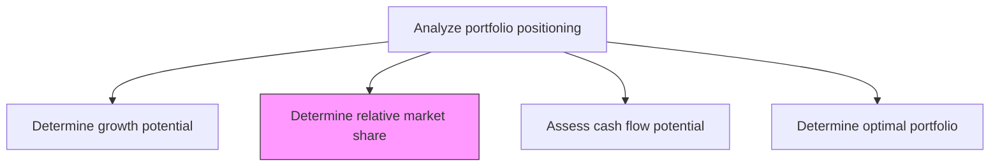
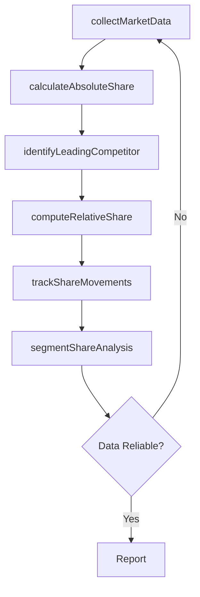

# Determine relative market share

> Business-as-Code definition for relative market share determination. Models the calculation, benchmarking, and tracking of the organization's market share position relative to its largest competitor across each business unit and product line.

## Overview

Determining the relative market share of each business unit or product line by comparing the organization's market share to that of its largest competitor. This metric is a cornerstone of portfolio analysis frameworks such as the BCG growth-share matrix. Calculate share positions using revenue, unit volume, or customer count data, and track share movements over time to identify gaining or declining portfolio elements.

## Process Hierarchy



## GraphDL

```yaml
determine:
  object: Relative Market Share
  actor: MarketResearcher
  result: RelativeMarketShareReport
```

## Actions

| Action | Description |
|--------|-------------|
| collectMarketData | Gather market revenue and volume data from industry reports and internal sources |
| calculateAbsoluteShare | Compute the organization's absolute market share per segment |
| identifyLeadingCompetitor | Determine the largest competitor in each market segment |
| computeRelativeShare | Calculate relative market share as own share divided by leading competitor share |
| trackShareMovements | Monitor changes in relative market share over successive periods |
| segmentShareAnalysis | Break down market share by geography, customer segment, or channel |

## Events

| Event | Description |
|-------|-------------|
| marketDataCollected | Market revenue and volume data gathered and validated |
| absoluteShareCalculated | Absolute market share computed for a business unit |
| leadingCompetitorIdentified | Largest competitor identified for each market segment |
| relativeShareComputed | Relative market share ratio calculated |
| shareMovementsTracked | Period-over-period share movement analysis completed |
| segmentShareAnalyzed | Share breakdown by sub-segment completed |

## Searches

| Search | Description |
|--------|-------------|
| getRelativeMarketShare | Retrieve relative market share ratios by business unit |
| getShareTrends | Access market share trend data over time |
| getCompetitorShareData | Retrieve competitor market share estimates by segment |
| getSegmentBreakdown | Get market share breakdown by geography or customer segment |

## Process Flow



## RACI Matrix

| Activity | Responsible | Accountable | Consulted | Informed |
|----------|-------------|-------------|-----------|----------|
| collectMarketData | MarketResearcher | VP Strategy | Sales | Finance |
| computeRelativeShare | StrategyAnalyst | VP Strategy | MarketResearcher | BusinessUnitLeads |
| trackShareMovements | MarketResearcher | VP Strategy | Marketing | CEO |
| segmentShareAnalysis | StrategyAnalyst | VP Strategy | RegionalManagers | ProductTeam |

## Related Processes

| Process | Relationship |
|---------|-------------|
| 1.2.10.1 Determine growth potential | Parallel - growth and share jointly classify portfolio elements |
| 1.2.10.4 Determine optimal portfolio | Downstream - relative share feeds portfolio optimization |
| 1.1.1.1 Identify competitors | Upstream - competitor identification required for share calculation |

## Related Departments

| Department | Role |
|-----------|------|
| Strategy | Leads market share analysis and competitive benchmarking |
| Marketing | Provides market sizing and customer acquisition data |
| Sales | Supplies revenue data by segment and geography |
| Finance | Validates revenue figures and provides financial baselines |

## Related Occupations

| Occupation | Involvement |
|-----------|-------------|
| Market Researcher | Collects and validates market data from external sources |
| Strategy Analyst | Calculates relative share and interprets positioning |
| Business Intelligence Analyst | Integrates data sources and produces share dashboards |

## KPIs

| KPI | Description | Unit |
|-----|-------------|------|
| Relative Market Share Ratio | Own share divided by leading competitor share | Ratio |
| Share Trend Direction | Whether relative share is gaining, stable, or declining | Category |
| Data Currency | Age of most recent market share data | Days |
| Segment Coverage | Percentage of revenue segments with calculated share data | % |

## Usage

```typescript
import { determineRelativeMarketShare } from '@headlessly/determine-relative-market-share'

const share = determineRelativeMarketShare()

// Compute relative market share for business units
const relativeShare = await share.computeRelativeShare({
  businessUnitIds: ['enterprise-saas', 'smb-platform'],
  metric: 'revenue',
  period: 'FY2025'
})

// Track share movements over time
const trends = await share.trackShareMovements({
  businessUnitId: 'enterprise-saas',
  periods: ['FY2023', 'FY2024', 'FY2025'],
  granularity: 'quarterly'
})
```
