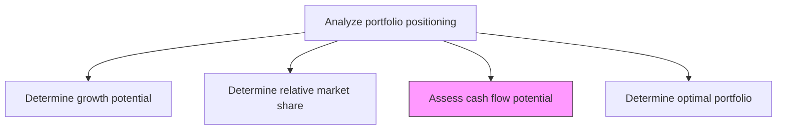
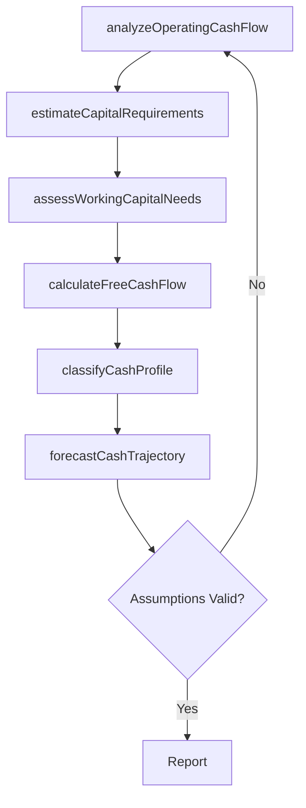

# Assess cash flow potential

> Business-as-Code definition for cash flow potential assessment. Models the evaluation of cash generation capacity, capital requirements, and net cash flow contribution for each business unit within the corporate portfolio.

## Overview

Assessing the cash flow potential of each business unit or product line within the portfolio. Evaluate operating cash generation, capital expenditure requirements, working capital needs, and free cash flow contribution to determine whether a portfolio element is a net cash generator or cash consumer. This assessment is critical for portfolio positioning frameworks and capital allocation decisions.

## Process Hierarchy



## GraphDL

```yaml
assess:
  object: Cash Flow Potential
  actor: FinancialAnalyst
  result: CashFlowPotentialReport
```

## Actions

| Action | Description |
|--------|-------------|
| analyzeOperatingCashFlow | Evaluate operating cash generation capacity for each business unit |
| estimateCapitalRequirements | Project capital expenditure needs for maintaining and growing operations |
| assessWorkingCapitalNeeds | Determine working capital requirements and cycle efficiency |
| calculateFreeCashFlow | Compute free cash flow as operating cash flow minus capital expenditures |
| classifyCashProfile | Categorize portfolio elements as cash generators, self-funding, or cash consumers |
| forecastCashTrajectory | Project future cash flow potential based on growth and margin trajectories |

## Events

| Event | Description |
|-------|-------------|
| operatingCashFlowAnalyzed | Operating cash generation analysis completed for a business unit |
| capitalRequirementsEstimated | Capital expenditure projections finalized |
| workingCapitalAssessed | Working capital requirements evaluated |
| freeCashFlowCalculated | Free cash flow computed for a portfolio element |
| cashProfileClassified | Business unit classified by cash generation profile |
| cashTrajectoryForecasted | Future cash flow trajectory projection completed |

## Searches

| Search | Description |
|--------|-------------|
| getCashFlowProfiles | Retrieve cash flow classification for each portfolio element |
| getFreeCashFlowData | Access free cash flow calculations by business unit and period |
| getCapitalRequirements | Retrieve capital expenditure projections by business unit |
| getCashTrajectoryForecasts | Access multi-year cash flow trajectory projections |

## Process Flow



## RACI Matrix

| Activity | Responsible | Accountable | Consulted | Informed |
|----------|-------------|-------------|-----------|----------|
| analyzeOperatingCashFlow | FinancialAnalyst | CFO | BusinessUnitLeads | VP Strategy |
| estimateCapitalRequirements | FinancialAnalyst | CFO | Operations | Treasury |
| calculateFreeCashFlow | FinancialAnalyst | CFO | Accounting | VP Strategy |
| classifyCashProfile | VP Strategy | CEO | CFO | BoardOfDirectors |

## Related Processes

| Process | Relationship |
|---------|-------------|
| 1.2.10.1 Determine growth potential | Parallel - growth rate influences cash flow projections |
| 1.2.10.4 Determine optimal portfolio | Downstream - cash profiles feed portfolio optimization |
| 1.2.9 Develop financial strategies | Related - cash flow potential informs financial strategy |

## Related Departments

| Department | Role |
|-----------|------|
| Finance | Leads cash flow analysis and financial modeling |
| Strategy | Consumes cash flow data for portfolio positioning |
| Treasury | Provides capital allocation and funding perspective |
| Operations | Supplies operational cost and capital expenditure data |

## Related Occupations

| Occupation | Involvement |
|-----------|-------------|
| Financial Analyst | Conducts cash flow modeling and free cash flow calculations |
| Treasury Manager | Provides funding and capital allocation context |
| Controller | Validates financial data inputs and accounting assumptions |

## KPIs

| KPI | Description | Unit |
|-----|-------------|------|
| Free Cash Flow Margin | Free cash flow as percentage of revenue per business unit | % |
| Cash Conversion Ratio | Operating cash flow divided by net operating profit | Ratio |
| Capital Intensity | Capital expenditures as percentage of revenue | % |
| Cash Flow Forecast Accuracy | Variance between forecasted and actual cash flows | % |

## Usage

```typescript
import { assessCashFlowPotential } from '@headlessly/assess-cash-flow-potential'

const cashFlow = assessCashFlowPotential()

// Calculate free cash flow for each business unit
const fcf = await cashFlow.calculateFreeCashFlow({
  businessUnitIds: ['enterprise-saas', 'smb-platform', 'data-services'],
  period: 'FY2025',
  includeProjections: true
})

// Classify portfolio elements by cash profile
const profiles = await cashFlow.classifyCashProfile({
  portfolioElementIds: ['enterprise-saas', 'smb-platform'],
  categories: ['cash-cow', 'self-funding', 'cash-consumer']
})
```
