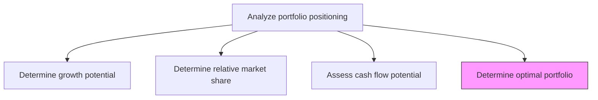
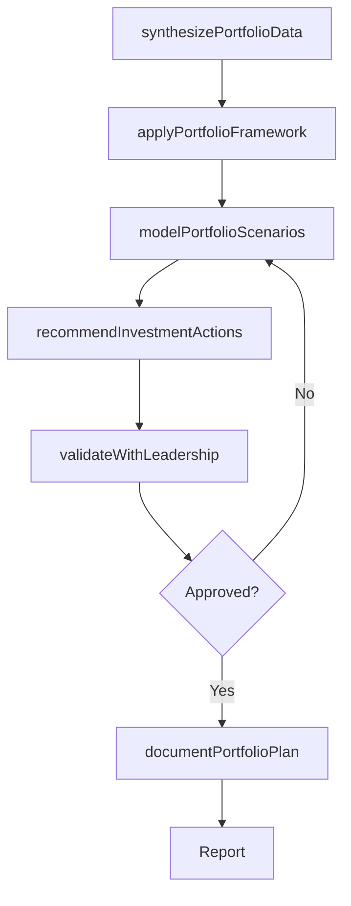

# Determine optimal portfolio

> Business-as-Code definition for optimal portfolio determination. Models the synthesis of growth, market share, and cash flow analyses to define the target portfolio mix that maximizes strategic value and financial returns.

## Overview

Determining the optimal portfolio mix by synthesizing growth potential, relative market share, and cash flow analyses for each business unit or product line. Apply portfolio optimization frameworks to recommend invest, hold, harvest, or divest decisions. Balance strategic priorities such as market leadership, diversification, risk management, and capital efficiency to define the target portfolio that maximizes long-term shareholder value.

## Process Hierarchy



## GraphDL

```yaml
determine:
  object: Optimal Portfolio
  actor: VP Strategy
  result: OptimalPortfolioRecommendation
```

## Actions

| Action | Description |
|--------|-------------|
| synthesizePortfolioData | Combine growth, share, and cash flow data into a unified portfolio view |
| applyPortfolioFramework | Apply BCG, GE-McKinsey, or other portfolio analysis frameworks |
| modelPortfolioScenarios | Simulate alternative portfolio configurations under different assumptions |
| recommendInvestmentActions | Propose invest, hold, harvest, or divest decisions for each element |
| validateWithLeadership | Present optimal portfolio recommendations to executive leadership for approval |
| documentPortfolioPlan | Formalize the approved target portfolio mix and transition roadmap |

## Events

| Event | Description |
|-------|-------------|
| portfolioDataSynthesized | Unified portfolio view assembled from component analyses |
| portfolioFrameworkApplied | Portfolio classification framework applied to all elements |
| portfolioScenariosModeled | Alternative portfolio configurations simulated and compared |
| investmentActionsRecommended | Invest, hold, harvest, or divest recommendations issued |
| leadershipValidationCompleted | Executive leadership approved portfolio recommendations |
| portfolioPlanDocumented | Target portfolio mix and transition roadmap formalized |

## Searches

| Search | Description |
|--------|-------------|
| getOptimalPortfolio | Retrieve the current target portfolio mix and element classifications |
| getInvestmentRecommendations | Access invest/hold/harvest/divest recommendations by business unit |
| getPortfolioScenarios | Retrieve simulated portfolio scenario results |
| getPortfolioTransitionPlan | Access the roadmap for transitioning to the target portfolio |

## Process Flow



## RACI Matrix

| Activity | Responsible | Accountable | Consulted | Informed |
|----------|-------------|-------------|-----------|----------|
| synthesizePortfolioData | StrategyAnalyst | VP Strategy | FinancialAnalyst | Marketing |
| modelPortfolioScenarios | StrategyAnalyst | VP Strategy | CFO | CorporateDevelopment |
| recommendInvestmentActions | VP Strategy | CEO | CFO | BusinessUnitLeads |
| validateWithLeadership | CEO | BoardOfDirectors | VP Strategy | CFO |
| documentPortfolioPlan | StrategyAnalyst | VP Strategy | CorporateDevelopment | Finance |

## Related Processes

| Process | Relationship |
|---------|-------------|
| 1.2.10.1 Determine growth potential | Upstream - growth scores are key input |
| 1.2.10.2 Determine relative market share | Upstream - share positions are key input |
| 1.2.10.3 Assess cash flow potential | Upstream - cash flow profiles are key input |
| 1.2.6 Formulate business unit strategies | Downstream - portfolio decisions shape BU strategies |

## Related Departments

| Department | Role |
|-----------|------|
| Strategy | Leads portfolio optimization analysis and recommendations |
| Finance | Validates financial assumptions and capital allocation implications |
| Corporate Development | Executes portfolio changes including acquisitions and divestitures |
| Executive Office | Approves target portfolio and transition roadmap |

## Related Occupations

| Occupation | Involvement |
|-----------|-------------|
| VP Strategy | Leads portfolio optimization and presents recommendations |
| Strategy Analyst | Models scenarios and prepares portfolio analysis |
| Corporate Development Manager | Plans portfolio transition execution |

## KPIs

| KPI | Description | Unit |
|-----|-------------|------|
| Portfolio Optimization Score | Degree to which current portfolio matches target allocation | Score (1-100) |
| Transition Progress | Percentage of approved portfolio changes executed | % |
| Value Creation Impact | Projected shareholder value impact from portfolio optimization | USD |
| Scenario Coverage | Number of portfolio scenarios modeled and evaluated | Count |

## Usage

```typescript
import { determineOptimalPortfolio } from '@headlessly/determine-optimal-portfolio'

const portfolio = determineOptimalPortfolio()

// Model portfolio scenarios
const scenarios = await portfolio.modelPortfolioScenarios({
  framework: 'BCG-growth-share',
  assumptions: ['base-case', 'optimistic', 'pessimistic'],
  constraints: { capitalBudget: 50000000, riskTolerance: 'moderate' }
})

// Recommend investment actions for each business unit
const recommendations = await portfolio.recommendInvestmentActions({
  scenarioId: scenarios.bestFit.id,
  categories: ['invest', 'hold', 'harvest', 'divest']
})
```
